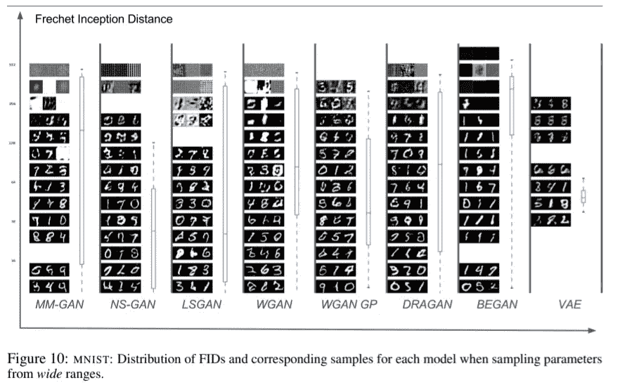
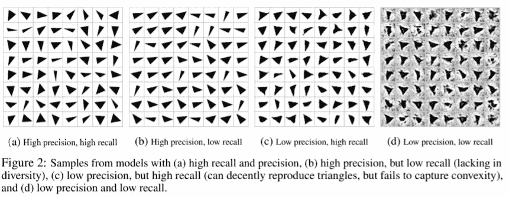
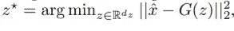
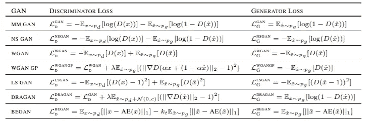
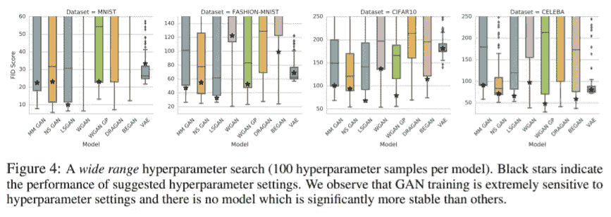
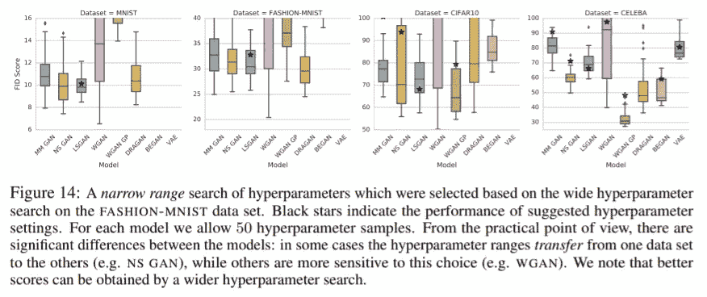
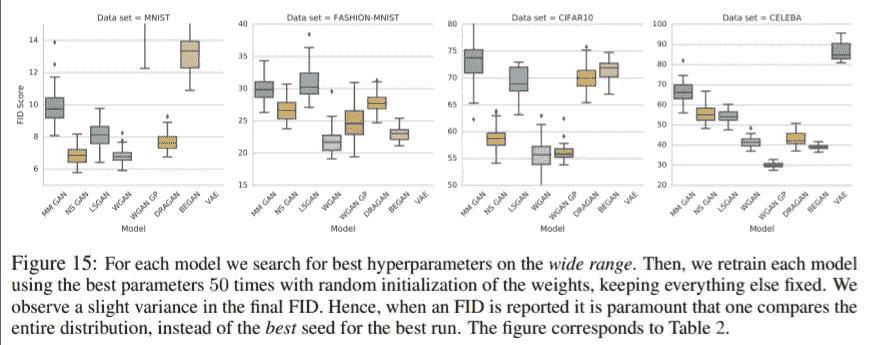
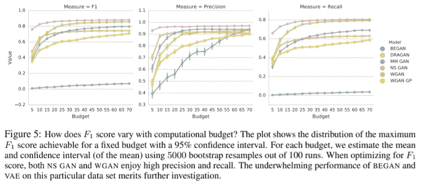

# 所有甘的表现都一样吗？

> 原文：<https://medium.com/codex/do-all-gans-perform-the-same-cc02055091af?source=collection_archive---------12----------------------->

Louis-Etienne Foy 在 [Unsplash](https://unsplash.com?utm_source=medium&utm_medium=referral) 上拍摄的照片

你现在可能已经听说过，生成对抗网络是一个能够从生成器和鉴别器之间的竞争中学习分布的框架。生成器学习生成有希望与真实数据不可区分的样本，鉴别器学习分类给定图像是真的还是假的。自 GANs 发明以来，它们经历了各种各样的改进，被认为是在各种问题中，特别是在生成和重建任务中积极使用的强大工具。

大量工作集中在 GANs 的基本目标上，即 GANs 的培训损失。然而，这项研究表明，令人信服的证据表明，他们并不影响甘的表现。事实上，通过足够的超参数搜索，几乎所有算法都具有随机排名，甚至最近的作品也与 Ian Goodfellow 提出的原始 GAN 表现相似。

这篇论文…

*   在大规模实验中比较了各种 GAN 损耗的性能。
*   提出精度和召回率作为特定领域的性能指标。
*   如果你想得到关于甘训练的见解，直接跳到结论。

[*原文:甘人生而平等？大规模研究*](https://arxiv.org/abs/1711.10337)

## 评估 GANs 的经典方法

GANs 研究中的一个挑战是评估生成图像质量的量化指标。两个常用的度量是初始得分(IS)和弗雷歇初始距离(FID)。这些方法都依赖于在图像识别中训练的分类器。我们将很快讨论这些指标的特征。

它结合了这样的思想:当有意义的对象存在时，标签分布应该具有低熵，并且样本的可变性应该很高。它是基于生成图像的特征分布来计算的。然而，IS 并不被认为是一个合适的*距离，*可能是因为它没有以任何方式纳入真实图像的分布(在论文中没有明确阐述)。

FID 测量预训练分类器网络的特征空间中的统计距离。我们基于真实和虚假图像的均值和协方差将特征视为高斯，并测量两个高斯之间的弗雷歇距离。FID 解决了被称为*类内模式丢弃*的问题，例如，每类仅生成一个图像的模型可以获得好的 IS，但将具有坏的 FID。此外，根据以前的实验，它们对于测量图像质量更可靠。

FID 能靠谱吗？

## 精确度和召回率

FID 和 IS 都不具有检测过度拟合的能力，例如，阻止网络完美地记忆训练样本。我们设计了一种方法来弥补 FID 在评估 GAN 性能方面的不足。

精确度、召回率和 F1 分数是广泛用于评估预测质量的度量。我们用一个数据流形构造了一个玩具数据集，使得从样本到流形的距离可以被有效地计算。我们可以根据到流形的距离直观的评价样本的好坏。如果来自模型分布的样本接近流形，其精度就高，如果生成器能从流形中恢复任何样本，召回率就高。

玩具数据集在上图中被描述为灰度三角形的分布。我们将样本到流形的距离定义为到流形中最近样本的平方欧几里德距离。精度定义为距离低于δ = 0.75 的样本的比率。我们*将来自测试集的* n 个样本转化为潜在向量 z*并计算 x 和 G 之间的距离(z*)。通过反演，我们找到能够最接近地恢复给定图像的潜像，或者精确地，求解下面的方程。召回率被定义为距离低于δ的样本的比率。他们的直觉概念已经在上面解释过了。

反转 G

## 各种甘

gan 的设计和损耗因问题而异，但实验将明确关注无条件图像生成。上面描述的 GANs 可能看起来很相似，因为从理论上讲，生成器和鉴别器都在以某种方式优化彼此相反的目标。然而，它们不仅在如何计算发生器和鉴别器的每个损耗上不同，而且旨在优化根本不同的距离。

原始 GAN(MM GAN)框架近似于生成的和真实分布之间的 JS 散度的优化。WGAN 和 WGAN-GP 在 Lipschitz 平滑假设下最小化 Wasserstein 距离。LSGAN 使皮尔逊χ发散最小化。在分布之间的距离类型和如何近似距离方面，每个 GAN 具有非常不同的理论背景，因为它们在大多数情况下是不可计算的。

关于每项损失如何计算的更多细节，请参考相应的论文。我个人发现他们在理解当前学习甘的方法的背景方面很有见地。

## 试验设计

评估指标必须有效、公平，并且不得增加太多计算。因此，我们使用 FID 分数和精确度、召回率和 F1 作为衡量标准。模型的性能通常因超参数、随机性(初始化)或数据集而异。

为了抵消除损失之外的算法组件的影响，我们

*   对所有型号使用相同的 INFO GAN 架构。(VAE 的 BEGAN 除外，那里使用了自动编码器)
*   为每个数据集执行超参数优化。
*   从随机种子开始。
*   在 4 个中小型数据集(CelebA，CIFAR10，Fashion-MNIST，MNIST)上进行实验。
*   针对多种计算预算进行培训。

根据上图，作者发现超参数搜索是必要的，其中搜索的超参数对最终性能有重大影响。关于超参数搜索过程的细节在原始论文中提供。

## 结论

*   有证据表明，在最先进的 GANs 中*算法差异*并不相关，但超参数搜索有更大的影响。

*   最佳超参数很大程度上取决于数据集。如上图所示，黑星超参数转移到不同的数据集，除了 LSGAN。

*   由于随机种子的存在，最终性能总是有差异的，因此我们必须比较运行的分布，以便进行公平的比较。

*   许多车型的 F1 成绩很差，而且在经过优化后似乎有所改善。