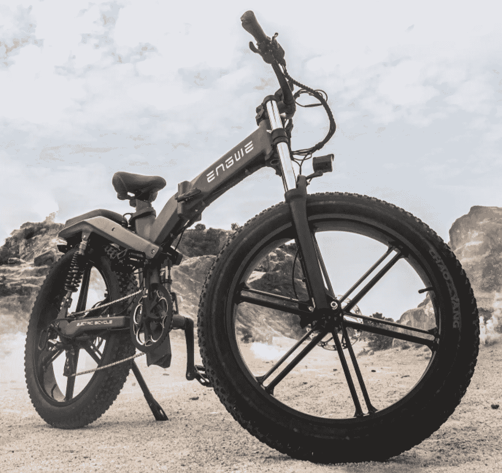

# 我敢再买一辆众筹的电动自行车吗？

> 原文：<https://medium.com/codex/do-i-dare-buy-another-crowdfunded-e-bike-5fe803f18ee4?source=collection_archive---------5----------------------->

## 我还没吸取教训吗？

[ENGWE X26(ENGWE 的媒体)](https://c1.iggcdn.com/indiegogo-media-prod-cld/image/upload/c_limit,w_695/v1655211481/ffi7z7vtda0vwoghptm3.jpg)

我不得不承认，最近在 [Indiegogo](https://www.indiegogo.com/projects/engwe-x26-all-terrain-e-bike-62mile-longest-range#/) 上的一个电动自行车活动非常吸引我。目前的自行车是 ENGWE X26，其特点读起来就像是必备品的清单。

这让我想到一个问题，难道我还没有吸取教训吗？我的最后一次赌博是在火箭自行车上，我写了它…