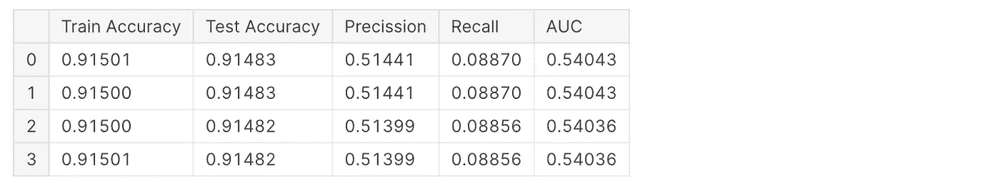

# 我需要调整逻辑回归超参数吗？

> 原文：<https://medium.com/codex/do-i-need-to-tune-logistic-regression-hyperparameters-1cb2b81fca69?source=collection_archive---------1----------------------->

## 我们是否过度致力于优化我们所做的数据科学工作？我们经常试图找到 x，y，z 变量的最佳组合，以找到完美的解决方案。优化任务很有趣，但是它们很容易把我们带到很远的地方，我们最终会花费额外的宝贵时间甚至几天。


[https://pix abay . com/photos/code-programming-hacking-html-we b-820275/](https://pixabay.com/photos/code-programming-hacking-html-web-820275/)

优化领域既广又深。我们不会涵盖所有问题的答案，本文将关注最简单但最流行的算法——逻辑回归。


根据 Kaggle 的调查，最受欢迎的机器学习模型是 logisitc 回归，这是最受欢迎的分类技术—[https://blog . explorative . io/explorative-weekly-update-12-3-d 4 B1 d 0 f 620 b 9](https://blog.exploratory.io/exploratory-weekly-update-12-3-d4b1d0f620b9)

## **超参数调谐**

超参数调整是一种优化技术，是机器学习过程的一个重要方面。一个好的超参数选择可以使你的模型满足你想要的度量。然而，过多的超参数、算法和优化目标会导致无休止的持续优化工作循环。

## 逻辑回归超参数

我们可以在逻辑回归中调整的主要超参数是:求解器、惩罚和正则化强度( [sklearn 文档](https://scikit-learn.org/stable/modules/generated/sklearn.linear_model.LogisticRegression.html))。

**求解器**是优化问题中使用的算法。选项有 *{ '牛顿-cg '，' lbfgs '，' liblinear '，' sag '，' saga'}* ，默认='lbfgs '。

1.  与其他方法相比，它的性能相对较好，并且节省了大量内存，但是，有时它可能存在收敛问题。
2.  `sag`当样本数量和要素数量都很大时，比其他大型数据集的求解器更快。
3.  `saga`稀疏多项式逻辑回归的首选求解器，也适用于非常大的数据集。
4.  `newton-cg`由于使用了 Hessian 矩阵，计算成本很高。
5.  `liblinear`当你有高维数据集时推荐——解决大规模分类问题。

**惩罚(或正则化)**意在减少模型泛化误差，意在抑制和调节过拟合。技术不鼓励学习更复杂的模型，以避免过度拟合的风险。选项有:{'l1 '，' l2 '，' elasticnet '，' none'}，默认='l2 '。但是，有些惩罚可能不适用于某些求解器，下表总结了每个求解器支持的惩罚:


[https://sci kit-learn . org/dev/modules/linear _ model . html # logistic-regression](https://scikit-learn.org/dev/modules/linear_model.html#logistic-regression)

**C(或正则化强度)**必须是正浮点数。正则化强度与惩罚一起工作来调节过度拟合。较小的值指定较强的正则化，而较高的值告诉模型给予训练数据较高的权重。

逻辑回归提供了其他参数，如:class_weight、dualbool(当 n_samples > n_features 时用于稀疏数据集)、max_iter(可以通过更高的迭代次数来提高收敛)等。然而，这些影响较小。

首先，我们为[金融科技数据集](https://www.kaggle.com/datasets/mariiagusarova/prepared-lending-club-dataset)优化逻辑回归超参数。这是一个二元分类任务，目标是预测给定的贷款申请人是否有可能偿还贷款。
*Kaggle 笔记本引用的是* [*这里的*](https://www.kaggle.com/code/gusarovma/hyperparameter-tuning-logistic-regression) *。*

## 基线

在执行超参数调整之前，我们通过用默认参数拟合分类器来建立基线。注意，“sag”和“saga”快速收敛仅在具有近似相同比例的特征上得到保证，因此我们使用 sklearn.preprocessing 中的缩放器对数据进行预处理。

```
from sklearn.model_selection import train_test_split
from sklearn.linear_model import LogisticRegression
from sklearn.metrics import confusion_matrix, precision_score, recall_score, auc,roc_curve
from sklearn.preprocessing import MinMaxScalerloans = pd.read_csv('../input/prepared-lending-club-dataset/mycsvfile.csv')loans = loans[["loan_amnt", "term", "sub_grade", "emp_length", "annual_inc", "loan_status", "dti", "mths_since_recent_inq", "revol_util", "num_op_rev_tl"]]X = loans.drop('loan_status', axis=1)
y = loans[['loan_status']]
y = y.values.ravel()

X_train, X_test, y_train, y_test = train_test_split(X, y, test_size=0.25, random_state=42, stratify=y)

scaler = MinMaxScaler() *#saga solver requires features to be scaled for model conversion*

X_train = scaler.fit_transform(X_train)
X_test = scaler.transform(X_test)

logreg = LogisticRegression()
logreg.fit(X_train, y_train)

y_pred = logreg.predict(X_test)

print('Accuracy of logistic regression classifier on train set: **{:.2f}**'.format(logreg.score(X_train, y_train)))
print('Accuracy of logistic regression classifier on test set: **{:.2f}**'.format(logreg.score(X_test, y_test)))
print('Precision of logistic regression classifier on test set: **{:.2f}**'.format(precision_score(y_test, y_pred)))
```

我们将使用这些指标作为优化工作中任何改进的基线比较。


## 最佳解决者

该模型在训练集和测试集上表现良好，两者都产生类似的 0.79 的精度，并且一眼看去，没有过拟合发生。所以我们从选择这个阶段排除正则化的最佳求解器开始: *{'newton-cg '，' lbfgs '，' sag '，' saga'}。*

`liblinear`暂时被排除，因为它不支持“none”惩罚，如果我们尝试，它会记录一个错误:*惩罚= =“none”:→464 提高值错误(“liblinear 求解器不支持惩罚=“none”)*

```
clf = [
    LogisticRegression(solver='newton-cg',penalty='none',max_iter=1000),
    LogisticRegression(solver='lbfgs',penalty='none',max_iter=1000),
    LogisticRegression(solver='sag',penalty='none',max_iter=1000),
    LogisticRegression(solver='saga',penalty='none',max_iter=1000)
    ]clf_columns = []
clf_compare = pd.DataFrame(columns = clf_columns)

row_index = 0
for alg **in** clf:

    predicted = alg.fit(X_train, y_train).predict(X_test)
    fp, tp, th = roc_curve(y_test, predicted)
    clf_name = alg.__class__.__name__
    clf_compare.loc[row_index, 'Train Accuracy'] = round(alg.score(X_train, y_train), 5)
    clf_compare.loc[row_index, 'Test Accuracy'] = round(alg.score(X_test, y_test), 5)
    clf_compare.loc[row_index, 'Precission'] = round(precision_score(y_test, predicted),5)
    clf_compare.loc[row_index, 'Recall'] = round(recall_score(y_test, predicted),5)
    clf_compare.loc[row_index, 'AUC'] = round(auc(fp, tp),5)

    row_index+=1

clf_compare.sort_values(by = ['Test Accuracy'], ascending = False, inplace = True)    
clf_compare
```

我们在这里观察到的是，无论我们选择什么求解器，模型度量相对于基线的改进都小于 0.001%。


## 比较解决者和惩罚

接下来，我们给所有的解算器添加一个正则化 l2 层，包括`liblinear`

```
clf = [
    LogisticRegression(solver='newton-cg',penalty='l2',max_iter=1000),
    LogisticRegression(solver='lbfgs',penalty='l2',max_iter=1000),
    LogisticRegression(solver='sag',penalty='l2',max_iter=1000),
    LogisticRegression(solver='saga',penalty='l2',max_iter=1000)
    ]clf_columns = []
clf_compare = pd.DataFrame(columns = clf_columns)

row_index = 0
for alg **in** clf:

    predicted = alg.fit(X_train, y_train).predict(X_test)
    fp, tp, th = roc_curve(y_test, predicted)
    clf_name = alg.__class__.__name__
    clf_compare.loc[row_index, 'Train Accuracy'] = round(alg.score(X_train, y_train), 5)
    clf_compare.loc[row_index, 'Test Accuracy'] = round(alg.score(X_test, y_test), 5)
    clf_compare.loc[row_index, 'Precission'] = round(precision_score(y_test, predicted),5)
    clf_compare.loc[row_index, 'Recall'] = round(recall_score(y_test, predicted),5)
    clf_compare.loc[row_index, 'AUC'] = round(auc(fp, tp),5)

    row_index+=1

clf_compare.sort_values(by = ['Test Accuracy'], ascending = False, inplace = True)    
clf_compare
```

我们在结果中观察到一个更大的差异，然而，正如你所看到的，它是微不足道的。


## 比较 C 参数

最后，我们引入 C(默认值为 1)，这是一个惩罚项，旨在抑制和调节过度拟合。我们将指定较小的数字，以获得更强的正则化。

```
clf = [
    LogisticRegression(solver='newton-cg',penalty='l2', C=0.001, max_iter=1000),
    LogisticRegression(solver='lbfgs',penalty='l2',C=0.001, max_iter=1000),
    LogisticRegression(solver='sag',penalty='l2',C=0.001, max_iter=1000),
    LogisticRegression(solver='saga',penalty='l2',C=0.001, max_iter=1000)
    ]clf_columns = []
clf_compare = pd.DataFrame(columns = clf_columns)

row_index = 0
for alg **in** clf:

    predicted = alg.fit(X_train, y_train).predict(X_test)
    fp, tp, th = roc_curve(y_test, predicted)
    clf_name = alg.__class__.__name__
    clf_compare.loc[row_index, 'Train Accuracy'] = round(alg.score(X_train, y_train), 5)
    clf_compare.loc[row_index, 'Test Accuracy'] = round(alg.score(X_test, y_test), 5)
    clf_compare.loc[row_index, 'Precission'] = round(precision_score(y_test, predicted),5)
    clf_compare.loc[row_index, 'Recall'] = round(recall_score(y_test, predicted),5)
    clf_compare.loc[row_index, 'AUC'] = round(auc(fp, tp),5)

    row_index+=1

clf_compare.sort_values(by = ['Test Accuracy'], ascending = False, inplace = True)    
clf_compare
```

在这种情况下，精确度和召回率之间发生了微小的改变，精确度略有提高，但以 AUC 为代价，由于 AUC 不高，我们可以假设这个分类器不比以前的好。


从这三个步骤的实验中，我们可以得出结论，当调整超参数时，我们在建立更好的模型方面没有获得任何实质性的好处，并且具有默认参数的分类器本身足够强。

现在，我们尝试用同样的方法处理心脏病数据集。同样，这是一个二元分类任务，目的是预测一个给定的人的健康状况是否可能导致心脏病。

## 基线

我们从构建基线开始:

```
hd = pd.read_csv('../input/personal-key-indicators-of-heart-disease/heart_2020_cleaned.csv')hd =  hd[hd.columns].replace({'Yes':1, 'No':0, 'Male':1,'Female':0,'No, borderline diabetes':'0','Yes (during pregnancy)':'1' })
hd['Diabetic'] = hd['Diabetic'].astype(int)
cleaner_app_type = {"AgeCategory": {"18-24": 1.0, "25-29": 2.0, "30-34": 3.0, "35-39": 4.0, "40-44": 5.0,
                                  "45-49": 6.0, "50-54": 7.0, "55-59": 8.0, "60-64": 9.0, "65-69": 10.0,
                                  "70-74": 11.0, "75-79": 12.0, "80 or older": 13.0
                                    } }
hd = hd.replace(cleaner_app_type)
hd = hd.drop(columns = ['Race', 'GenHealth'], axis = 1)X = hd.drop('HeartDisease', axis=1)
y = hd[['HeartDisease']]
y = y.values.ravel()

X_train, X_test, y_train, y_test = train_test_split(X, y, test_size=0.25, random_state=42, stratify=y)

scaler = MinMaxScaler() *#saga solver requires features to be scaled for model conversion*

X_train = scaler.fit_transform(X_train)
X_test = scaler.transform(X_test)

logreg = LogisticRegression()
logreg.fit(X_train, y_train)

y_pred = logreg.predict(X_test)

print('Accuracy of logistic regression classifier on train set: **{:.2f}**'.format(logreg.score(X_train, y_train)))
print('Accuracy of logistic regression classifier on test set: **{:.2f}**'.format(logreg.score(X_test, y_test)))
print('Precision of logistic regression classifier on test set: **{:.2f}**'.format(precision_score(y_test, y_pred)))
```


## 最佳解决者

该模型在训练集和测试集上表现良好，并且都产生类似的 0.91 的准确度。让我们看看是否有任何求解器可以显示出明显更好的性能:

```
clf = [
    LogisticRegression(solver='newton-cg',penalty='none',max_iter=1000),
    LogisticRegression(solver='lbfgs',penalty='none',max_iter=1000),
    LogisticRegression(solver='sag',penalty='none',max_iter=1000),
    LogisticRegression(solver='saga',penalty='none',max_iter=1000)
    ]clf_columns = []
clf_compare = pd.DataFrame(columns = clf_columns)

row_index = 0
for alg **in** clf:

    predicted = alg.fit(X_train, y_train).predict(X_test)
    fp, tp, th = roc_curve(y_test, predicted)
    clf_name = alg.__class__.__name__
    clf_compare.loc[row_index, 'Train Accuracy'] = round(alg.score(X_train, y_train), 5)
    clf_compare.loc[row_index, 'Test Accuracy'] = round(alg.score(X_test, y_test), 5)
    clf_compare.loc[row_index, 'Precission'] = round(precision_score(y_test, predicted),5)
    clf_compare.loc[row_index, 'Recall'] = round(recall_score(y_test, predicted),5)
    clf_compare.loc[row_index, 'AUC'] = round(auc(fp, tp),5)

    row_index+=1

clf_compare.sort_values(by = ['Test Accuracy'], ascending = False, inplace = True)    
clf_compare
```

我们了解到没有实质性的区别:



## 比较解决者和惩罚

现在，让我们添加惩罚 l2 层:

```
clf = [
    LogisticRegression(solver='newton-cg',penalty='l2',max_iter=1000),
    LogisticRegression(solver='lbfgs',penalty='l2',max_iter=1000),
    LogisticRegression(solver='sag',penalty='l2',max_iter=1000),
    LogisticRegression(solver='saga',penalty='l2',max_iter=1000)
    ]clf_columns = []
clf_compare = pd.DataFrame(columns = clf_columns)

row_index = 0
for alg **in** clf:

    predicted = alg.fit(X_train, y_train).predict(X_test)
    fp, tp, th = roc_curve(y_test, predicted)
    clf_name = alg.__class__.__name__
    clf_compare.loc[row_index, 'Train Accuracy'] = round(alg.score(X_train, y_train), 5)
    clf_compare.loc[row_index, 'Test Accuracy'] = round(alg.score(X_test, y_test), 5)
    clf_compare.loc[row_index, 'Precission'] = round(precision_score(y_test, predicted),5)
    clf_compare.loc[row_index, 'Recall'] = round(recall_score(y_test, predicted),5)
    clf_compare.loc[row_index, 'AUC'] = round(auc(fp, tp),5)

    row_index+=1

clf_compare.sort_values(by = ['Test Accuracy'], ascending = False, inplace = True)    
clf_compare
```

我们看到，我们在这里也没有得到任何实质性的区别


## 比较 C

最后一步要看的是调整 C:

```
clf = [
    LogisticRegression(solver='newton-cg',penalty='l2', C=0.001, max_iter=1000),
    LogisticRegression(solver='lbfgs',penalty='l2',C=0.001, max_iter=1000),
    LogisticRegression(solver='sag',penalty='l2',C=0.001, max_iter=1000),
    LogisticRegression(solver='saga',penalty='l2',C=0.001, max_iter=1000)
    ]clf_columns = []
clf_compare = pd.DataFrame(columns = clf_columns)

row_index = 0
for alg **in** clf:

    predicted = alg.fit(X_train, y_train).predict(X_test)
    fp, tp, th = roc_curve(y_test, predicted)
    clf_name = alg.__class__.__name__
    clf_compare.loc[row_index, 'Train Accuracy'] = round(alg.score(X_train, y_train), 5)
    clf_compare.loc[row_index, 'Test Accuracy'] = round(alg.score(X_test, y_test), 5)
    clf_compare.loc[row_index, 'Precission'] = round(precision_score(y_test, predicted),5)
    clf_compare.loc[row_index, 'Recall'] = round(recall_score(y_test, predicted),5)
    clf_compare.loc[row_index, 'AUC'] = round(auc(fp, tp),5)

    row_index+=1

clf_compare.sort_values(by = ['Test Accuracy'], ascending = False, inplace = True)    
clf_compare
```

同样，与金融科技数据集一样，我们看到精度和召回指标之间出现了更强的重新洗牌，如果你优化任何特定指标，这可能是一个更好的收益。例如，以心脏病为例，你可能想更好地预测心脏病患者。然而，即使重组，我们看到 AUC 分数下降，这意味着整体分类器性能下降。


有许多可用的算法，研究超参数的意义、影响和优化原因确实需要大量的时间。此外，调优通常是计算要求很高的活动，无论是应用随机搜索还是网格搜索，或者更复杂的方法，都会消耗计算资源。然而，有时增量影响是如此之小。在我们的特殊情况下，考虑到数据集是不平衡的，增量甚至没有意义。

把时间花在更重要的事情上不是更好吗？比如把模型结果和业务指标联系起来，或者优化决策阈值等等？