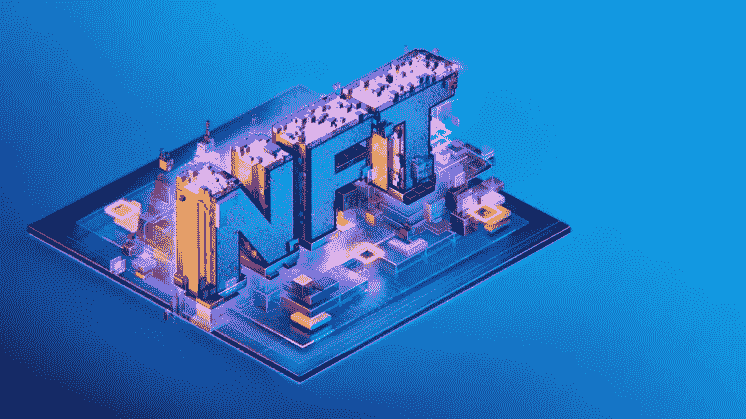

# 不可替代的音乐代币有前途吗？

> 原文：<https://medium.com/codex/do-non-fungible-tokens-nfts-for-music-have-a-promising-future-ab7bbdc76326?source=collection_archive---------6----------------------->

资料来源:Iberdrola

不可替代代币(也称为 NFTs)的兴起是音乐行业刚刚开始的新趋势。我们可以断言，非功能性音乐电视是市场上的新宠。

NFT 交易允许观众对独一无二的媒体内容进行竞价。在拍卖会上，你可以竞拍他们最喜欢的艺术家的画作。

艺术家出售代币和伴随代币的交易目前能够利用他们的地位。因为 NFT 是技术突破，只有时间才能证明它们是否会存在很长时间。

这是一个即将破灭的炒作泡沫，还是 NFTs 能够为音乐人和他们的观众安全、可持续地发挥作用？

让我们仔细看看什么是不可替代的代币(NFT ),以及它们如何影响音乐行业。

# 加密货币与非金融交易系统的关系

NFT 音乐艺术家利用加密货币技术，如比特币或以太坊，来操作。

加密货币兑换商利用加密的数字钱包。

这些钱包里装着他们赚来的数字货币。比特币使用的区块链技术追踪钱包之间的交易。

很明显，没有任何关于曾经存在的所有比特币钱包的记录；比特币区块链中只保存钱包之间的交易。

任何人想要窃取钱包中的货币，必须首先修改任何涉及该货币的先前交易。区块链技术用于保护钱包中存储的货币。

## NFT 贸易的交易

来源:日内交易

涉及加密货币的日间交易既安全又快捷。因为交易中没有中间人，音乐的不可替代代币(NFT)对艺术家和粉丝都有吸引力。

艺人交易的是 NFT 而不是加密货币，安全性更高。

例如，音乐会门票、限量版活动、数字内容、商品和音乐都是可用的例子。粉丝在拍卖中对这些代币出价，最高出价者在赢得拍卖后在他们的数字钱包中进行安全交易，获得内容。

与传统的唱片销售不同，**艺术家可以为他们拍卖的内容筹集资金，并保留 100%的收益**，因为这些交易不需要唱片公司的参与。

Fan 支付费用来换取原创内容，艺术家保留所有收到的钱，而不必将其分发给任何其他人。

# 音乐的 NFTs

了解加密货币和不可替代令牌(NFT)可能是一项耗时且令人沮丧的工作。然而，我们不能忽视加密货币世界中产生和花费的巨额资金。

出售他们的艺术作品、音乐、视频剪辑和图像的数字版本给艺术家带来了数百万美元的收入。他们可以在区块链上销售他们能想到的几乎任何其他数字媒体，包括音乐、电影和书籍。

音乐界的 NFT 是记录在数字账本上的极其罕见的项目。毫无疑问，2020 年将作为严酷的一年被人们铭记，因为现场表演的取消，音乐行业发生了天翻地覆的变化。

由于世界的日益数字化，艺术家们正在寻找新的方式来联系和制作他们的观众。此外， [**NFT 发展公司**](https://risingmax.com/nft-token-development-company) 为您提供了一个具有多种优势的新渠道。

# NFTs 对音乐的好处

## 1.便利性和便携性

NFT 在音乐行业的第一个优势是他们工作起来简单方便。粉丝必须首先创建一个数字钱包，然后参加拍卖，才有机会赢得内容，然后才能下载。

因此，创建成功的内容变得像网上购物一样简单。

## 2.没有调解人

总的来说，音乐行业的中介太多了。

粉丝通过购买专辑、在 Spotify 上播放流媒体和购买商品筹集的资金有一部分归艺术家所有，但大部分归唱片公司或流媒体服务提供商所有。

参与购买音乐会门票的是同一批中间人。尽管唱片公司从门票收入中获利，尽管艺术家也从中受益，但新冠肺炎将在 2021 年终结现场音乐会行业。

## 3.内容和体验

在决定拍卖什么的时候，艺术家们有很大的回旋余地。音乐的 NFTs 本质上可以是数字的和物理的。

艺术家们用专辑、数字艺术、声音片段、商品、音乐会门票和其他不可替代的东西来交换彼此的作品。粉丝们很高兴能够利用这些千载难逢的机会，并愿意为此支付溢价。

供你参考，二月份，DJ 兼音乐制作人 3LAU 通过销售音乐 NFT 在短短 24 小时内赚了 1160 万美元。几天后，加拿大歌手 Grimes 以类似的方式在不到 20 分钟内赚了 580 万美元。

波斯特·马龙在 3 月的第一周拍卖了一辆 NFT 参加啤酒烟枪大战，DJ 史蒂夫·青木在 3 月的第一周赚了 420 万美元。音乐和其他艺术形式的 NFTs 为艺术家开辟了一条新的途径来联系他们的观众和接触新的观众。

他们之所以能够做到这一点，是因为消除了分销过程中的中间商，否则需要数年时间才能收齐。

林肯公园的联合创始人麦克·信田在收到他的一件非传统作品 1 万美元(7000 英镑)的出价后，在一系列推特上表达了他的感谢。他发微博说，

> “即使我把歌曲的完整版本上传到全球的 DSP 上，扣除 DSP、唱片公司和市场营销的费用，我也永远得不到接近 1 万美元的收入”。—麦克·信田

不可能每个艺人都能在 20 分钟内赚到 500 万美元。另一方面，独立音乐人可能会想出新颖的方法来使用音乐的 NFTs，以便更直接地与粉丝交流，促进他们的职业发展。

一个超级粉丝就能彻底改变一个艺术家的命运。如果有人认为你的下一个项目或后台体验值 20，000 到 50，000 美元，那就允许他购买你的数字所有权。

他们不会在 YouTube 或 Spotify 上以艺术家认为其价值的一小部分出售，而是可以获得可观的利润，因为人们更看重数字商品。

## 收尾

面向音乐家的 NFTs 允许艺术家探索新的可能性并与他们的粉丝互动。音乐家总是想出创新的技巧来娱乐他们的听众。

[**NFT 产业**](/codex/nft-the-hype-explained-ed0acdcb8f66) 正处于十字路口，有多种途径可供选择，尤其是在数字化方面。许多艺术家希望从他们的工作中获得更多的报酬，包括经济上的和创造性的。

正如 [**不可替代代币用例**](https://risingmax.com/blog/nft-non-fungible-token-use-cases/) 的情况一样，它有可能像互联网一样改变音乐产业。因此，音乐和其他艺术形式的 NFTs 简直是一个奇迹！