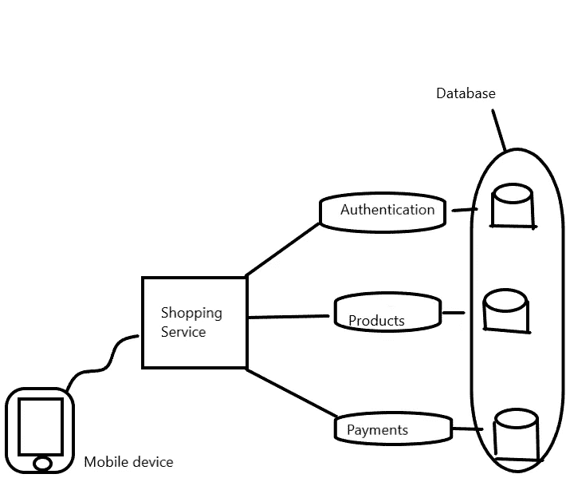

# 不要用微服务架构创建你的副业项目

> 原文：<https://medium.com/codex/do-not-create-your-side-project-with-a-microservice-architecture-fd77143ae643?source=collection_archive---------4----------------------->

你终于做到了！你已经考虑过那个有可能成为独角兽的副业项目，并且你相信你有能力将那个项目变成现实。然后，在您进行研究的过程中，您突然听说一些公司正在从整体架构转向微服务架构。你对这些流行词汇一无所知。您本能地、明智地了解了什么是微服务架构，并学习了如何创建微服务架构。但是现在你看到了这篇文章的标题，你更加困惑了，因为你认为用微服务架构来构建你的项目是一个好主意。

如果你不是我在介绍中描述的那个人，不用担心。我不期望任何人是，但如果你是，嘿！我们可能应该成为朋友，这就是为什么构建微服务架构可能不是一个好主意。

微服务架构背后的宣传

许多公司正在迁移到微服务架构，这是有充分理由的。想象一下，你想创建一个想要扩展到月球的电子商务企业，让我们称之为 DogeCommerce。你需要添加用户认证，客户资料，产品清单和支付解决方案(贝宝，Paystack)。你可以在一个单一的代码库中创建应用程序，所有的功能都在那里，然后把它放到 AWS(亚马逊网络服务)上，然后，砰，它以 10 亿美元的价格上市了，恭喜你！你所构建的是一个整体架构的例子，所有的特性和代码都有一个运行在一个[数据库](https://en.wikipedia.org/wiki/Database)上的[代码库](https://en.wikipedia.org/wiki/Codebase)。

一幅整体架构图，其中所有功能都在一个代码库中

这种架构看起来很理想，而且在很大程度上的确如此！一位智者曾经说过，最好的解决方案往往是最简单的，这也适用于此，但如果整体式设计没有一些缺点，微服务架构就不会是茶。对于初学者来说，使用整体设计部署新功能就像试图一次从车里拿出所有的杂货一样。你会认为这是一个好主意，直到一个塑料表带放弃了，你遇到了严重的麻烦，会让你在周五晚上看你的应用程序，就像:

[单点故障](https://en.wikipedia.org/wiki/Single_point_of_failure)在整体式设计中非常普遍，因此需要一个功能来停止与客户端的通信，以使整个服务器崩溃。这就是微服务架构的用武之地。它让你在搬运杂货时有更多的帮手。微服务是一种架构方法，用于构建高度可伸缩和可维护的应用程序，使公司能够更快地交付产品并具有竞争力。生产团队的中断不会导致整个应用程序崩溃，因为它是松散耦合的。

功能分离的微服务架构示例。

微服务拥有“微型”数据库，客户端连接到不同的设备。这种方法对公司来说有很多好处，尤其是在雇佣新员工的时候。他们不需要花时间去理解如何使用整个代码库和分配给他们的特性。[并行开发](https://www.ibm.com/docs/en/SSRNYG_7.2.0/com.ibm.rational.synergy.prodoverview.doc/topics/s_c_int_parallel_development.html#:~:text=Parallel%20development%20is%20the%20simultaneous,csrc%20and%20library)%20in%20parallel.)也更容易管理。公司可以监控特定功能的负载量，并以最具成本效益的方式将其放大或缩小，这与整体设计不同，后者只是一种总括方法。那么有了这些优势，我为什么不应该用微服务来构建我的十亿美元的边项目呢？在我进入那个之前，我应该驱散一些关于独石设计的谣言。

！所有的客户端都连接到一台机器上

所有客户端需要连接到一台机器的想法意味着只有[垂直缩放](https://www.section.io/blog/scaling-horizontally-vs-vertically/)对于 monoliths 是可能的，但这是不正确的。巨石柱也可以水平扩展。

为什么你应该坚持简单的老式整体式设计

微服务相对于整体服务的优势主要在于与大型团队合作，并且在开始时是一个零和游戏。微服务是在团队扩展到月球的时候，而不是用户扩展到月球的时候。试图在只有两个人工作的时候为你的应用程序构建一个微服务既浪费又愚蠢，因为运行测试和连接会有很多代码重复。它还带来了许多要担心的移动部分，对于一个小团队来说这是不可持续的。构建一个微服务也需要熟练的双手，除非你可能冒着编写[反模式](https://en.wikipedia.org/wiki/Anti-pattern)的风险，这些反模式与你试图实现的一切背道而驰。

感谢您的阅读！如果你喜欢这篇文章，可以考虑为它鼓掌，在 Twitter 上关注我