# 付费用户停留时间更长吗？

> 原文：<https://medium.com/codex/do-paying-users-stay-longer-86737ead01b1?source=collection_archive---------11----------------------->

## Spark 中基于 Logistic 回归和随机森林的音乐流媒体客户流失预测

wayhomestudio 创作的音乐照片—[www.freepik.com](http://www.freepik.com)

你试过 Spotify 吗？甚至可能是 Apple Music 或者 YouTube 来听音乐？Statista 声称，到 2020 年，Q1 的音乐流媒体用户数量已经超过 [4 亿人](https://www.statista.com/statistics/669113/number-music-streaming-subscribers/)。虽然音乐流媒体是一个快速增长的市场，但我敢打赌，我一半以上的朋友和家人已经停止使用至少一个流行的平台。广告可能会在歌曲之间变得过于频繁，订阅费可能会从一年跳到另一年，或者只是个人情况可能会随着时间的推移而改变，以至于人们不再积极使用这些服务。

从商业角度来看，尽可能多地留住有利客户至关重要。因此，对于企业来说，发现可能考虑离开其平台的用户(或专业术语称之为“流失”)并采取有效措施阻止这些用户离开至关重要。虽然探索哪些特定措施可能适用于哪个客户很令人兴奋，例如获得附加功能、价格折扣？—要说服她留下来，流媒体提供商必须超越的第一步是找到这些客户。数据驱动的 it 实践是流失预测，即预测特定用户是否容易流失。

# 目录

1.  项目动机
2.  项目阶段:(2.0)设置环境，(2.1)加载和清理数据集，(2.2)探索数据，(2.3)进一步讨论，(2.4)训练模型，(2.5)评估结果
3.  结论
4.  为了进一步改进
5.  一些更有用的资源

# 1.项目动机

由于其用于企业的客户相关操作，流失预测是机器学习技术在与客户有直接和重复接触的公司中最广泛的应用之一。

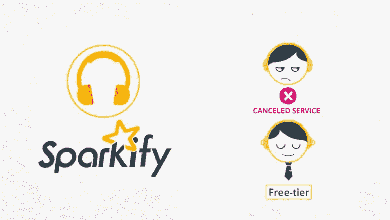

Udacity 的课程视频片段。

Sparkify 是一家虚拟的音乐流媒体服务提供商，提供免费和付费的音乐流媒体平台，具有添加朋友或对歌曲竖起大拇指等功能。Udacity 提供了 Sparkify 客户活动的数据集，作为其 nanodegree 计划的一部分。尽管该公司并不真实，但从技术角度来看，可以在 Sparkify 数据上进行的客户分析仍然有效，并且可以很容易地适应现实生活中的企业。

# 2.项目阶段

## 2.0.设置环境—创建 Spark 会话

虽然所选的数据子集不需要大数据处理，但我在 Spark 中进行了数据辩论，以便能够在稍后对完整的 12GB 数据集进行分析时重用我的代码。那将需要比我的本地电脑更多的计算能力和更大的内存。所以云计算将是合乎逻辑的下一步。然而，由于时间和预算的限制，它不得不暂时留在范围之外。

我建立了一个 SparkContext 作为到我的集群的连接，并创建了一个 SparkSession 作为该连接的接口。这些步骤是在 py Spark shell 中执行的，该 shell 允许我在利用一些 python 功能的同时与 Spark 数据结构进行交互。

为了设置 SparkSession 和进行进一步的分析，我导入了以下 python 包。

导入的库

正如 pyspark.ml 导入所显示的，我对 spark 数据帧使用了 Spark ML 库，尽管 Spark MLlib 也可以在 rdd 上使用。

## 2.1.加载并清理数据集

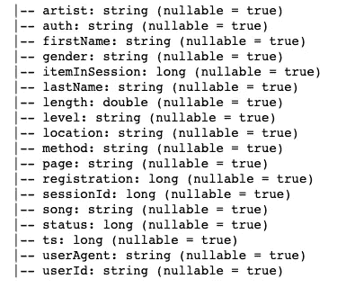

数据集中的要素(按 printSchema)

对于当前的项目，我使用了 12GB 完整数据集的 128MB 子集。数据集包含关于用户的音乐收听事件的记录。数据集中有 **286，500 条记录**和 **18 个不同的属性**字符串、整型(‘long’)和浮点型(‘double’表示双精度浮点型)。

加载后，我评估了表示为 Nan 或 Null 值的**缺失数据**。

检查 nan 和 null 值的脚本

关于 Nan 和空值的调查结果:

*   数据集中没有 Nan(缺失)值。
*   在`userId`和`sessionId`列中没有空值。
*   9 个属性至少有 8，346 个空值。
*   3 个属性至少有 58，392 个空值。

对记录中缺失数据模式的检查显示，数据集包含三种主要类型的记录:

*   音乐收听事件—80%的记录包含`artist`、`length`和`song`的值。这些可能描述音乐收听事件。
*   有些事件(20%)不包含音乐收听数据，这些事件可能是管理性质的，例如升级/降级/取消和注册。
*   有一些事件(占总事件量的 3%)只包含`auth`(如取消、注销)、`itemInSession`、`level`(如免费或付费)、`method`(如 get 或 put)、`page`(如 About / Upgrade)、状态(可能是 HTTP 状态码)数据，超出了`userId`、`sessionId`、`ts`(时间戳)。这些可能是除注册之外的所有管理会话。

我还检查了只包含**“空白”值**的记录。

检查空白("")值的脚本

只有列`userId`包含空白值。检查了这些记录的分类变量的唯一值后，发现空白`userId`通常属于以下类型:

*   `auth`:注销，访客
*   `level`:付费和免费都出现在值中
*   `method`:GET 和 PUT 都出现在值中(后者通常使用`page`登录)
*   `page`:帮助、主页、关于、登录、提交注册、注册和错误

上述值描述的事件可能与站点上的访客视图、注册和登录有关。在没有`userID`的情况下，这些记录不能增加对用户行为(如流失)的理解，也不能为分析提供额外的价值，因此我最终放弃了这些记录。

我还检查了**重复记录**，但是数据集中没有重复记录(参见下面文章中的方法)。

 [## Spark 中的 distinct()与 dropDuplicates()

### Spark 中 distinct()和 dropDuplicates()有什么区别？

towardsdatascience.com](https://towardsdatascience.com/distinct-vs-dropduplicates-in-spark-3e28af1f793c) 

## 2.2.探索数据-描述性分析

我将“客户流失”定义为当用户到达“取消确认”页面时的事件。

然后，我为在其整个生命周期中到达该特定页面的用户创建了一个流失标签(至少在该数据集中表示的部分)。

为用户分配流失标签的脚本

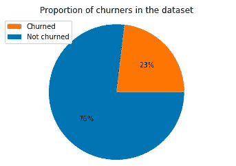

图表 1:流失比例

流失的比例在数据集中约为 23%。由于要准备的模型中的标签(`churnerUser`)是不平衡的，F1 分数将作为比准确性更好的模型评估指标。

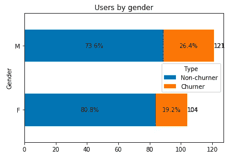

图表 2:按性别分列的流失比例

就性别而言，样本中男性比女性多 16%,男性的流失率比女性高。

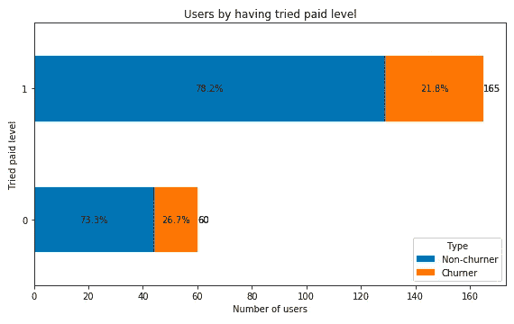

图表 3:尝试过付费级别的客户流失比例

关于服务水平(免费或付费)，大多数用户都尝试过 Sparkify 的付费版本。他们的流失率(21.8%)略低于那些只尝试过免费版本的人(26.7%)。

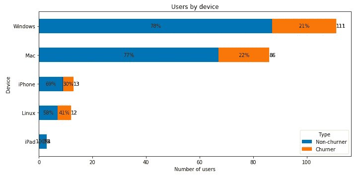

图表 4:按所用设备类型划分的客户流失比例

关于设备，根据每个事件检索的用户代理信息以及在设备和用户级别汇总的信息，93%的用户在桌面上使用 Sparkify(基于操作系统)。不过，在 Windows 或 Mac OS 上使用 Sparkify 的用户的流失率(21-22%)略低于在 Linux 上使用 Sparkify 的用户(41%)。如果样本量不那么小，人们可以得出这样的结论

*   要么是为 Linux 定制的 Sparkify 应用程序(假设 Sparkify 不仅仅是一个 web 应用程序)比 Windows/Mac OS 的应用程序更糟糕
*   或者使用 Linux 设备的用户有着显著不同的需求或习惯，因此他们更容易流失。

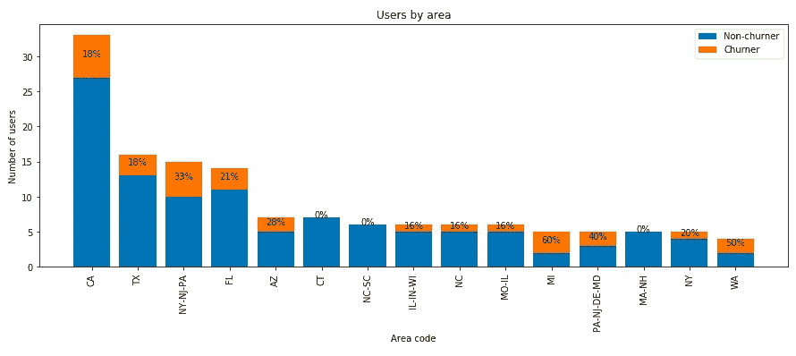

图表 5:按区域划分的用户，按流失行为区分颜色(前 15 个区域)

该数据集对用户的位置进行了分类，分为居住层和更聚合的层，包括美国各州和大都市地区。考虑到样本的小规模，我只应用了更多的汇总水平进行分析。可以观察到，大多数 Sparkify 用户位于人口最多的州/大都市地区，例如加利福尼亚州、德克萨斯州、纽约市和费城大都市地区。这些地区的用户流失比例差异很大(从 0%到 60%)，但这些差异可能仅仅是由于抽样，而不是来自不同地区的用户之间的潜在差异。

## 2.3.进一步争论—特征工程

目标变量(“churnerUser”)指示客户是否已经离开虚构的流媒体公司“Sparkify”。它是一个虚拟的，即有两种状态:1(客户已经搅拌)和 0(客户没有搅拌)。因此，流失预测问题具有二元分类的性质。

我应用了进一步的转换，例如从分类变量中创建虚拟变量，从每个分类值中删除一个，计算某些音乐收听事件值，计算事件和会话长度的最小值、最大值和平均值，以及计算用户访问特定页面的比例(与其所有页面访问相比)。

用户级 Spark 数据帧由 225 行和 63 列组成。这些栏目涵盖以下领域:

*   “churnerUser”:建模部分的未来标签，显示用户在可观察的时间段内是否搅拌了 Sparkify
*   “gender_F”:声明用户是否为女性的假人
*   “tried _ paid”:一个虚拟用户，用于查看用户是否尝试过付费级别(假设有更好的应用程序功能)
*   虚拟设备:用户是否使用过特定的设备类型(Windows、Mac 或 Linux、iPhone、iPad 或 Android)
*   区域假人:用户是否位于前 20 个区域之一(每个区域一个假人)
*   注册和最后事件的时间戳以及成员资格的天数
*   对话计数
*   “visit _ frequency”:spark ify 会员的单位时长会话数(以天计)
*   “最大间隔天数”:两次后续就诊日期之间的最大间隔
*   艺术家和歌曲计数和独特计数
*   每次会话的音乐项目(歌曲)(最小值、最大值、平均值)
*   音乐收听事件和会话的长度(最小、最大、平均)
*   所有页面访问中访问特定页面的比例(每页，除了“取消确认”和“取消”)

## 2.4.训练模型—预测建模

虽然 Scikit-learn 在单机上处理小型或中型数据集时表现良好，但 Spark 的机器学习库(如 **pyspark.ml** 模块)可以支持大型数据集所需的并行计算。尽管当前使用的 128 MB 数据集不需要并行计算，也没有为当前 Spark 上下文设置多个节点，但下面的代码也适用于大型数据集和并行计算。

建模需要进一步的数据转换:

*   删除不必要的 ID
*   向量化
*   规模
*   拆分为训练集和测试集

为建模而进行的数据转换

选定型号:

*   逻辑回归
*   随机森林分类

随机森林应用了两次。在第二次试验中，我增加了预期的最小叶子大小，以查看模型的不良性能是否仅仅是由于过度拟合。

最后，我用网格搜索和交叉验证对模型进行了调优，以潜在地提高它们的性能——尽管模型改进对于如此小规模的数据集有其局限性。

## 2.5.评估结果—确定最佳模型

**F1 得分**是精确度和召回率的调和平均值，因此它使我们能够同时优化模型的精确度和稳健性。而 precision 告诉我们被正确预测的用户比例，而 chunkers 回忆告诉我们成功找到真正的 chunkers 的比例。

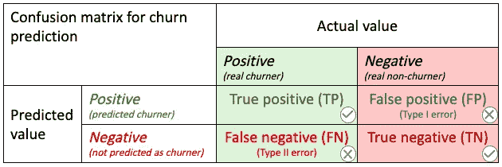

流失标签预测的混淆矩阵—作者图片

尽管 F1 得分是不平衡数据集的首选指标(请记住，只有 23%的用户是翻炒者)，但我计算了模型的所有以下评估者:

*   回忆(或敏感度)= *TP / (TP + FN)*
*   Precision = *TP / (TP + FP)*
*   F1 得分= *2 *精度*召回/(精度+召回)*
*   准确度= (TP + TN) /全部

 [## 3 个最重要的综合分类指标

### 复合分类度量帮助您和其他决策者快速评估模型的质量。他们经常…

towardsdatascience.com](https://towardsdatascience.com/the-3-most-important-composite-classification-metrics-b1f2d886dc7b) 

从业务角度来看，召回在客户流失预测案例中至关重要，因为企业可能希望找到尽可能多的潜在客户，即使一些假阳性结果可能最终出现在预测的客户群中。

对于代码的不同运行，模型评估结果是不同的，因为我没有为训练测试分割或随机森林模型修复种子。

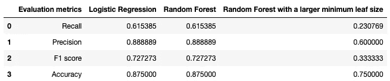

模型性能评估(首次运行)

在脚本的第一次运行时，逻辑回归和第一个随机森林模型表现得同样好，尽管这些模型都没有客观地表现得非常好(召回率为 62%，F1 为 73%)。非常窄的测试数据集(0.2 x 225 = 4.5 条记录)可能解释了完全相同的性能，而样本大小和应用的简单模型导致了较差的模型性能。

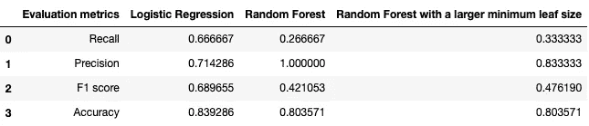

模型性能评估(第二次运行)

在第二次运行上面的脚本时，模型性能结果有些不同(从上面打印的结果中可以看出)。鉴于流媒体业务识别潜在客户并针对他们未来的客户流失采取行动至关重要，我建议选择基于召回指标的模型。作为一个综合指标，使用 F1 分数比使用准确度更合理，因为在我们的情况下标签是不平衡的(在数据集中只有 23%的搅动者)。基于此，逻辑回归似乎是预测客户流失的最佳(在这种情况下最坏)模型。

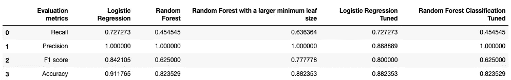

模型性能评估(第三次运行)

在第三次运行时，当我也添加超调模型时，我再次收到了三个主要模型的不同结果。如上表所总结的，超调模型的参数并没有改善逻辑回归模型在主要指标 F1 得分方面的性能(80%,相比之前在逻辑回归情况下达到的 84%)。考虑到分割数据、训练模型和适度样本量的随机性，这些度量的差异可能在统计误差的最大容许范围内。

根据上述模型，评估哪些特征在预测客户流失标签中发挥了关键作用:

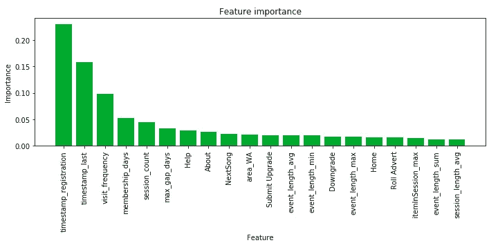

图表 6:基于随机森林模型的要素重要性—顶级要素(首次运行)

一些形式上最重要的功能无助于更好地理解客户行为，例如:

*   `timestamp_registration`
*   `timestamp_last`。

虽然更详细的分析——仅在显著更大的样本上——可以探索该平台早期和后期采用者的行为模式，但在我们的情况下，由于可用数据的范围，相关的功能重要性可能只是一种偏差(当然，非搅动者似乎在给定的时间范围内停留更长时间)。如果搅动者和非搅动者用户群在注册日期方面匹配，这可以被平衡。

看起来合理的最重要的特性如下:

*   `visit_frequency`(用户使用 Sparkify 的频率)——很少使用 Sparkify 的人可能更容易流失。
*   `event_length_min`和`session_length_max`(对于用户来说，一个事件的最小长度是多少)—虽然我们可以假设长时间听音乐的用户对音乐流媒体体验更满意，因此会话的最大长度可能是他们愿意继续使用 Sparkify 的一个指标。另一方面，事件的最小长度不太明显。例如，这可能意味着用户不满意，这是她跳到另一个屏幕的原因，但是这也可能意味着用户可以容易地在应用中导航。
*   `Save Settings`(进入保存设置页面占页面访问量总和的比例)——可能，那些投入时间探索应用泰勒化的人更喜欢它，也更不容易流失。
*   `max_gap_days`(Sparkify 的两次后续访问之间的最大天数)和`session_count`(用户使用 Sparkify 的次数)——这些属性揭示了用户使用 spark ify 的频率。也许，越少使用它的人越有可能流失。

为了更好地理解特征可能对标签结果的影响的可能方向，可以从逻辑回归模型的特征系数的评估中得到提示:

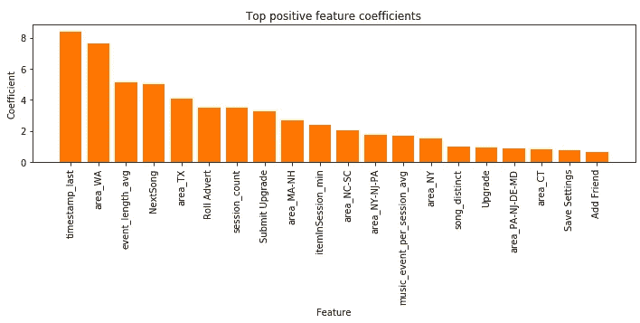

图表 7:最高正特征系数(来自逻辑回归)

在具有正系数的特征的情况下，该特征对于用户的值越大，用户越有可能是搅动者。

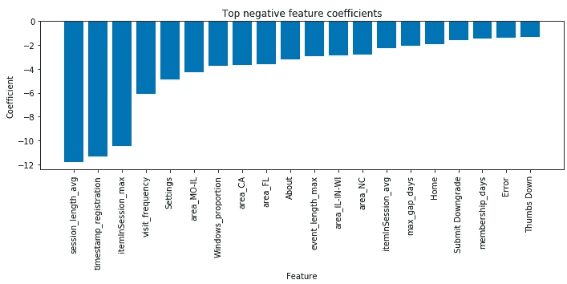

图表 7:最高负面特征系数(来自逻辑回归)

在具有负系数的特征的情况下，特征的绝对值越大，用户是搅动者的可能性就越小。

# 3.结论

探索性数据分析揭示了一些关于谁可能更有可能流失的见解:男性，来自密歇根州和费城-卡姆登-威尔明顿和纽约-新泽西-费城的大都市地区的人，以及 Linux 用户。

> 虽然探索性数据分析表明，尝试过付费版本的用户倾向于减少流失，但模型结果并没有证实这一假设。

用于预测客户流失的模型通常表现不佳。只有三分之二的搅动者被发现使用了表现最好的模型(第二次运行的逻辑回归模型的召回率为 66%)。然而，所准备的 pyspark 代码适用于在更大的数据集中进行分析，这可以极大地改善模型结果。

# 4.为了进一步改进

该项目有多个改进的角度。

*   更大的数据集将能够采样更平衡的数据集，并开发更合理的模型。要设计一个大得多的数据集并在其上训练模型，需要更强大的计算机或云计算资源。
*   扩展模型阵列:例如，提升树模型[往往在流失预测任务](https://www.kdnuggets.com/2019/05/churn-prediction-machine-learning.html)中表现良好(例如 GBT 或 XGBoost)。
*   只有在预测日期和预测的流失日期之间的时间窗口足够长，足以让企业采取行动并使预测的流失者改变主意并留在服务提供商处时，流失预测才与企业相关。更大的数据集将使得能够选择时间段以及搅动者和非搅动者的平衡组成，以探索时间敏感的特征，例如搅动行为的潜在季节性，或者第一周或一个月期间的流行为相对于后期行为的重要性，或者关注在搅动之前的最后一周或一个月期间发生的行为变化。

# 5.一些更有用的资源可以阅读

*   火花数据类型:【https://spark.apache.org/docs/latest/sql-ref-datatypes.html 
*   Spark SQL 中的窗口函数:[https://databricks . com/blog/2015/07/15/introducing-window-functions-in-Spark-SQL . html](https://databricks.com/blog/2015/07/15/introducing-window-functions-in-spark-sql.html)
*   流失预测模型选择最佳实践:[https://journalofbigdata . springer open . com/articles/10.1186/s 40537-019-0191-6](https://journalofbigdata.springeropen.com/articles/10.1186/s40537-019-0191-6)
*   指标评选推荐:[https://towards data science . com/multi-class-metrics-made-simple-part-ii-the-f1-score-ebe 8 b 2c a1](https://towardsdatascience.com/multi-class-metrics-made-simple-part-ii-the-f1-score-ebe8b2c2ca1)