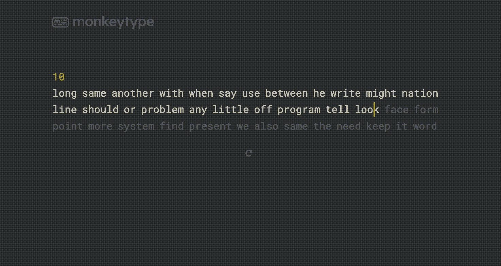
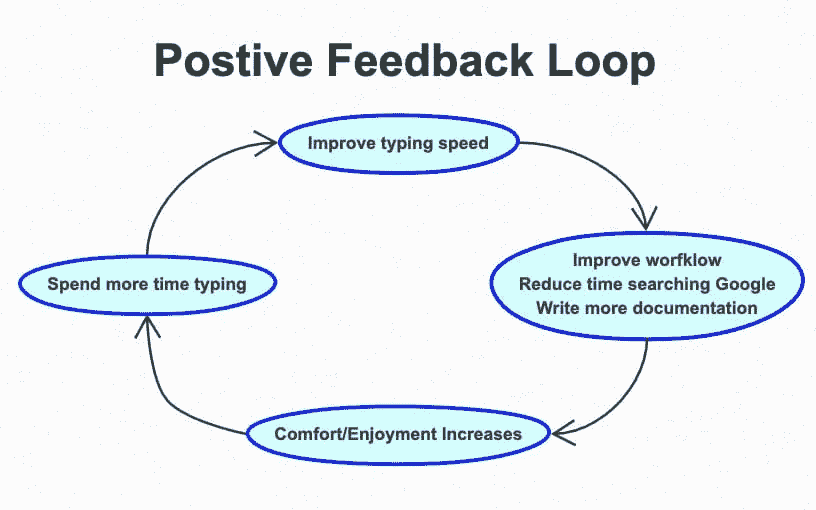

# 程序员需要打字速度快吗？

> 原文：<https://medium.com/codex/do-programmers-need-to-be-able-to-type-fast-2b765181b7a6?source=collection_archive---------21----------------------->

> 是的。但可能不是你所想的原因

有一种普遍的刻板印象，认为所有的程序员打字都非常快。

在电影和电视节目中，任何涉及编码的场景都不可避免地伴随着“黑客”在键盘上疯狂打字。

这导致了许多人的逻辑推论，即快速打字是“擅长”编程的先决条件。

现实与媒体描述的完全不同。“编码”的大部分时间都花在了浏览 StackOverflow 或者茫然地盯着屏幕挠头上——或者至少这是我的经验👀

你不需要为了“编码”而快速打字。但是如果你想成为一个高产的程序员，你就需要。

开发人员的角色不仅限于编写代码。它包括辅助任务，如编写文档和设计文档，与搜索引擎交互，通过聊天与其他开发人员交流问题等。

> 问题不应该是:你需要多快地打字来写代码？
> 
> 你应该问:对于一个整天坐在电脑和键盘前的人来说，你需要多快打字？

**提高你的键盘技能和提高你所选择的编程语言的知识/技能一样有意义。两者都让你作为程序员更有效率。**

在这篇文章中，我讨论了为什么你应该投入时间来提高你的打字速度(剧透:这并不是为了更快地写代码),以及这对你作为开发人员的工作带来的好处。

此外，我分享我的一些顶级技巧，我用它们在几个月内将我的打字速度从 55wpm 提高到超过 110wpm。



使用 MonkeyType.com 的打字测试示例—图片由作者提供

# 写代码不需要快速打字…

## 现代的 ide 消除了编码时快速打字的需要

让我们首先介绍一下显而易见的现代 ide(集成开发环境)。

制表符补全消除了在编写代码时快速键入的需要。你永远也不会比你的制表符补全器打字更快。即使可以，制表符补全还有其他好处，如代码辅助和提示。

一般来说，制表符补全允许您“以思考的速度”进行编码。这极大地减少了认知负荷，因此你可以专注于手头问题的逻辑，而不是打出每个字母的行为。

有了 IDE 中的制表符补全功能，在编写代码时，打字速度不太可能成为思维过程的障碍。

## 大多数时间花在阅读代码上，而不是写代码

> “的确，花在阅读和写作上的时间比远远超过 10 比 1。作为编写新代码工作的一部分，我们一直在阅读旧代码。”
> 
> 罗伯特·c·马丁[干净的代码:敏捷软件工艺手册](https://www.amazon.co.uk/Clean-Code-Handbook-Software-Craftsmanship/dp/0132350882)

开发软件时打字速度不是限制因素。你大部分时间都花在阅读自己或者别人的代码上。最终，如果你能比你的同事更快地完成十行代码，如果你花 20 分钟去调试它，这并不重要。

# …但是你为什么要烦恼呢？

我在说什么？如果不是写代码，为什么打字速度对程序员很重要？

## 以思考的速度写作。增加创造力。

你的打字速度越接近你的思维速度，你就越有创造力。当你想打字和实际做之间没有间隙时，你就不会打断思绪。

程序员在解决问题时，脑子里会有很多盘子在旋转——我喜欢把这看作是你的个人缓存。为了拼凑各种依赖关系来解决问题，需要花费很大的努力才能保持在流程中。思维过程的任何中断都会让你在解决问题的过程中耽误几分钟或几个小时——你必须回到“硬盘”上重新获取所有相关信息。

思考问题应该与在代码编辑器中键入实际字符分开。用尽认知带宽低头看着你的键盘，想着打字可能是生产力和你解决复杂问题能力的杀手。尤其是当你打字的速度比你想象的慢很多的时候。

你应该试着减少任何阻碍你思维的因素，包括打字。

## 减少摩擦。养成更好的习惯。

此外，提高打字速度可以减少摩擦，从而使其他任务变得更容易。

编写文档，在代码中添加注释(例如文档字符串)，编译范围需求文档等。都是需要高效打字的常见任务。它们也碰巧是开发人员任务中不那么光彩的部分，经常得不到应有的关注。

James Clear 写了一本名为[原子习惯](https://www.amazon.co.uk/dp/B01N5AX61W/ref=dp-kindle-redirect?_encoding=UTF8&btkr=1)的好书，解释了与培养良好习惯相关的“摩擦”概念。“摩擦越大，越不可能养成习惯”。打字速度慢，甚至打字时不舒服，对上面提到的任务造成障碍。

> “摩擦越大，越不可能养成习惯。”
> 
> 詹姆士清楚[原子习惯](https://www.amazon.co.uk/dp/B01N5AX61W/ref=dp-kindle-redirect?_encoding=UTF8&btkr=1)

如果你能更快地输入，你就能更容易地为你的代码写注释和详细的文档，因为摩擦减少了——增加了你实际写任何文档的机会。



作者图片:通过提高打字速度的正反馈循环

## 完成更多工作

这是一个简单的算术问题。如果你打字的速度能提高一倍(同时保持准确),那么在撰写文档、电子邮件、闲暇时聊天等方面，你的产出也会翻倍。您还将花费更少的时间来检查和纠正错误，从而节省更多的时间。

不要低估[边际收益](https://jamesclear.com/marginal-gains)的力量。在一天或一年的时间里，一些任务的速度上的微小进步会产生巨大的复合效应。

# 如何提高你的打字速度

在过去的一年里，我努力提高我的打字速度。我的灵感来自于[阿里·阿布达尔](https://aliabdaal.com/how-to-type-faster)和他——相当可笑——每分钟 155 字的打字速度。

一点一点。一天天过去。我能够把我的打字速度从[平均每分钟 50 字提高到大约每分钟 110 字。](https://www.typing.com/blog/typing-speed)

我并不是建议你需要达到 100 wpm(尽管设定目标肯定有助于保持进步的动力)。当我达到 80-90 wpm 时，我开始注意到我的工作流程的速度和舒适度有了明显的提高。

这里是我的五大提高打字速度的技巧🚀。

## 1.学会触摸打字👌

生产力和认知超负荷的最大消耗是当你打字时需要低头看键盘。

学习触摸打字可能会极大地提高你的打字速度和舒适度。

## 2.注重准确性🎯

如果你的准确性很差，快速打字没有什么好处。

准确性和速度一样重要，至少应该达到 95%以上，才不会阻碍你的思维过程。回到正确的话是一个生产力和思维过程杀手。

## 3.生产性拖延😇

提高的最好方法是定期练习。有很多很棒的网站可以帮助你练习打字和测试速度。

在谷歌上搜索“打字测试”会给你提供一些很棒的测试网站。我个人最喜欢的是 monkey type——一个美学用户界面，高度可定制，不会给你发广告。

定期并经常使用这些打字测试来持续练习和测试你的打字速度。我把这些网站作为一种“生产性拖延”的形式，每天无聊的时候在这里或那里花 5 分钟。我很快注意到了有规律的、有意识的练习的好处。

## 4.追踪你的进度📈

追踪你的进步，朝着目标努力。进度跟踪将有助于你保持动力，并随着时间的推移突出你的进步。

大多数打字网站都有一些跟踪进度的功能。或者，你可以自己维护一个进度日志。

警告:与你的“真实世界”表现相比，这些网站会给你一个相当夸张的打字速度数字。

## 5.建立肌肉记忆💪

建立肌肉记忆，尤其是对常用单词的记忆，可以显著提高你的速度，减少打字时的认知负荷。

在理想的情况下，你应该能够看到一个单词，你的手指只是下意识地键入这个单词，而不需要任何认知努力——这与人类通过识别单词模式而不是阅读单个字母来阅读的方式非常相似。

你可以通过下面的练习来建立肌肉记忆:

*   准备好你的手指来打字。不要输入任何东西，只要把你的手指放在正确的键上。
*   试着尽可能快地键入单词
*   在下一个单词前暂停(例如 1 秒钟)
*   从步骤 1 开始重复

不要担心你的整体速度。目前，我只担心输入单词的速度。

这个练习将训练你的手指学习常用单词的击键模式。一旦你熟练了，你会读一个单词，你的手指会下意识地到达正确的位置，你甚至不用思考就能按正确的顺序按键。相信我。真的有用。

# 结论

花时间学习打字更快是我去年做的最好的决定之一。

你不需要快速输入“代码”。你的大部分时间花在阅读和调试上，而不是写代码，此外，现代 ide 中的制表符补全处理了你的大部分击键。

提高打字速度可以减少摩擦和认知负荷，让你“以思考的速度”打字。

这带来了一些好处，比如能够保持“流动”,而不会打断你的思维过程。这也增加了您编写更详细的文档和代码注释的机会。这些边际收益都有助于提高你作为程序员的效率。

所以，毫不奇怪，我最后的建议是:

> 如果你是开发人员，那就要学会提高打字速度。这是一项投资，我保证你不会后悔。**打字速度快是一种超能力。**

```
This post was originally published on my blog: [https://engineeringfordatascience.com/posts/improve_typing_speed_for_programmers/](https://engineeringfordatascience.com/posts/improve_typing_speed_for_programmers/)
```