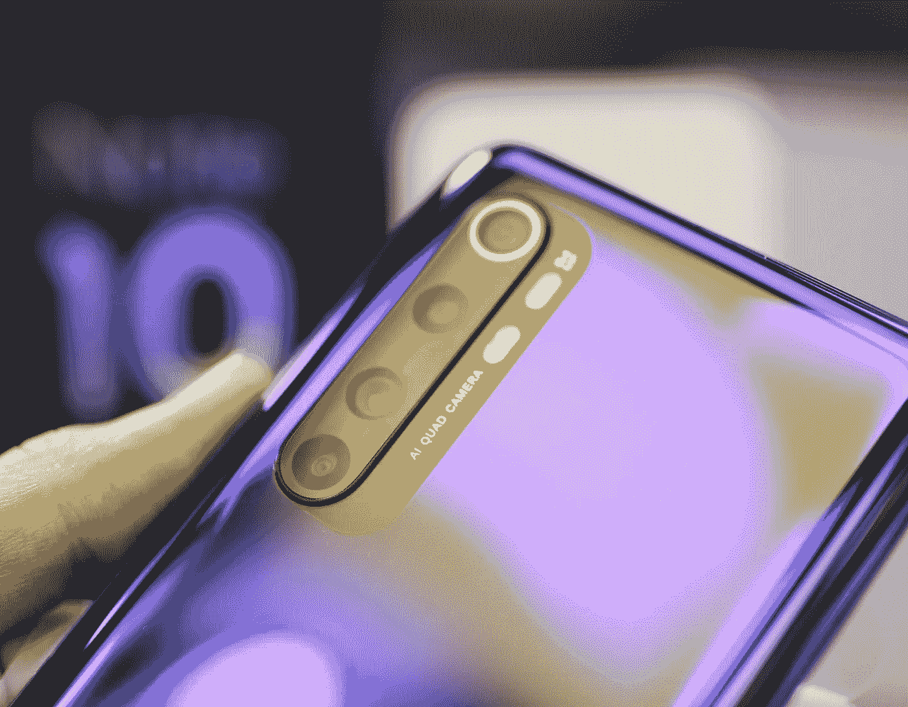

# 我们需要一部有四个摄像头的手机吗？

> 原文：<https://medium.com/codex/do-we-need-a-phone-with-four-cameras-e3d6c9319d27?source=collection_archive---------8----------------------->

## 入门级智能手机中的四摄像头系统

扎娜·拉蒂夫在 [Unsplash](https://unsplash.com/photos/6kVDN0VGj3c) 上的照片

在过去的五年里，智能手机业务变得比以往任何时候都更具竞争力。因此，所有公司都试图通过模仿市场上需求最高的产品来跟随智能手机行业的最新趋势。令人兴奋的一个方面是相机。而在过去，公司之间的竞争是通过…