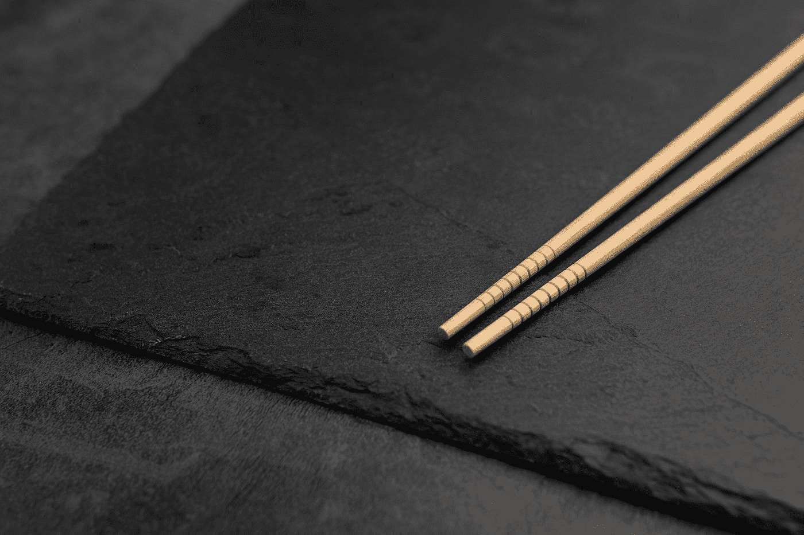

# 你用叉子还是筷子编码？

> 原文：<https://medium.com/codex/do-you-code-with-a-fork-or-chopsticks-b5d4e8097441?source=collection_archive---------8----------------------->

筷子是吃饭的精密工具。它们代表了我在修改代码时的心态。安德拉兹·拉济奇在 [Unsplash](https://unsplash.com?utm_source=medium&utm_medium=referral) 上的照片

我曾经有一个程序员告诉我，我的代码太复杂了，难以理解，所以他重写了整个代码。这对我来说是一个令人惊讶的声明，但我并没有因此而感到困扰或受伤。我心想，这个程序员用叉子编码。我喜欢用筷子编码。他们都完成了任务。

# 🍴叉子

人们用叉子将食物插入叉齿之间，然后将食物送到嘴里食用。食物因为叉子弄的洞而损坏了。叉子的损坏无法逆转，无法将食物恢复原状。如果一个人想把被刺伤的食物放回原来的位置，就需要像盘子边、另一个器皿或你的手指这样的帮助。当使用叉子时，人们只能夹起较大的食物，因为较小的食物更难被叉齿抓住。叉子是一种钝器，几乎不需要技巧或练习。

用 fork 编码的程序员对他们正在处理的源代码执行类似的活动。需要说明的是，他们没有用叉子来打字或移动鼠标光标。使用 fork 编码意味着具有删除或替换代码的破坏性思维。Fork 程序员寻找要刺的代码，以便可以完全删除它，然后用他们“更好”的代码替换。原始源已损坏。根据所做的更改，恢复到原始状态可能很困难。您可能需要版本控制中的备份或恢复命令等工具来恢复原始版本。

# 🥢筷子

人们用筷子吃饭时，会熟练地夹起两根筷子之间的食物。要做好这项活动，需要练习，也可能需要他人给予指导。与叉子不同，筷子不会损坏食物，前提是不要用筷子夹住食物。食物可以恢复到原来的状态和位置，而不需要另一个工具、手指或盘子或碗的侧面。当使用筷子时，人们可以夹起一粒米到一大块鸡肉。筷子是一种精密仪器。

用这个食物的比喻，你可能会明白我的意思。用筷子编码的程序员，在修改软件时更有技巧，更深思熟虑。他们有一种审视和理解的心态，而不是狩猎和破坏。筷子程序员认识到，现有的代码经常经过多次迭代和代码审查，并在生产中经过了战斗考验。代码可能看起来很奇怪，但它确实有效。筷子程序员尊重代码。如果要移除它，应该精确而小心地完成，并想办法让它快速恢复到原来的状态。

叉子和筷子思维模式都可以用来发送和启动代码。我更喜欢做筷子程序员。你是哪一个？