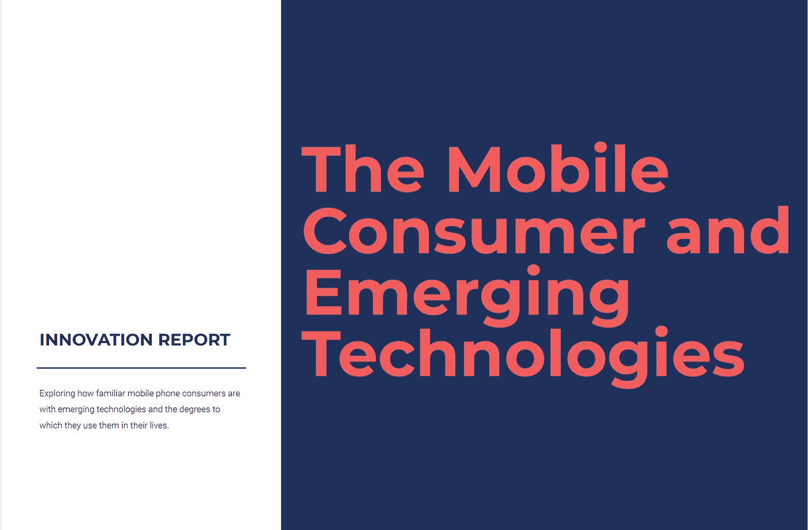

# 你知道人们用手机做什么吗？我知道。

> 原文：<https://medium.com/codex/do-you-know-what-people-do-on-their-phones-i-do-88fd519b01f7?source=collection_archive---------7----------------------->

我的公司最近进行了一项调查，以评估移动消费者对一组特定新兴技术的熟悉程度。测量的技术包括:

*   人工智能
*   增强现实
*   语音助手
*   虚拟现实
*   加密货币
*   物联网
*   5G

在这个过程中，我们学到了很多东西——包括一些令人惊讶的细节，即哪些年龄和收入群体最有可能熟悉特定的新兴技术。这种学习包括了解移动消费者积极使用我们测量的技术的程度。有意思的是，除了 5G，答案似乎不多。

# 活动——你在手机上做什么？

作为调查的一部分，我们询问了人们对之前指定技术的熟悉程度，然后我们询问了他们在手机上执行了哪些活动。我们的目标是了解消费者声称的熟悉程度与他们使用手机的方式有多一致。他们配合得很好。

**图 1 —活动图表**

在这项调查中，有一些问题围绕着选择的技术是否真的是新兴技术——这些技术没有达到创新曲线的顶峰，它们已经被大多数人采用。显然，5G 并不完全符合这一标准，但我们特别包括了这项技术，因为移动运营商已经在它背后投入了如此多的媒体，因此提升了这项技术的知名度，它将成为一项很好的参考技术。

看一下图 1，该图突出显示了消费者的活动，很明显，大多数(但不是全部)消费者已经执行了一些即使在五年前也可能不常见的任务，如在手机上看电影、从外卖服务订餐等。值得注意的是，超过 40%的受访者没有在手机上点餐，不到 40%的受访者没有从电影服务中观看电影。即使是这些常见的任务也有增长的机会。

一旦你越过绿线，机会就变得非常明显。如图表所示，绿线反映了受访者执行的活动低于 50%阈值的情况。本质上，绿线代表了大多数人已经完成和没有完成的任务之间的划分。

这项调查的大多数受访者都没有使用手机控制过家中的设备。这是权利的绿线活动的最高百分比的人做了。大多数人也没有故意和聊天机器人聊天，看直播电视或者用手机在零售店付款。从许多方面来看，这些技术似乎以蜗牛般的速度在创新曲线上行进，从而带来了诸多挑战:

1.  普遍缺乏对有潜力改善/简化他们经常执行的任务的技术的兴趣和采用
2.  人们对使用手机的兴趣减弱，这使得人们更容易长时间地使用手机，因为没有必要升级手机来获取更新的技术；我们的调查证实了这一点，因为大多数人的手机都已经用了两年多了
3.  创新受到阻碍，因为如果消费者对使用技术不感兴趣，手机制造商就没有动力大规模支持这些技术，零售商和其他组织就更没有理由尝试使用这些技术

# 这给我们留下了什么？

这意味着变得有创造力——真正的创新。许多消费者每天都在使用增强现实，却不知道他们正在使用这项技术。人们在 SnapChat、Instagram 和脸书上使用的面部过滤器都是增强现实的变体。类似地，人工智能在执行众多任务时被消费者被动使用。

虽然虚拟现实等依赖硬件的技术可能更难做到，但事实是，增加对这些技术的熟悉和采用需要降低进入壁垒。正如社交媒体公司想出了如何让增强现实变得简单一样，我们必须:

*   **让它变得简单** —通过阻止用户利用这些技术来消除扼杀客户体验的摩擦点。我们告诉自己，技术必须以特定的方式使用。这不是真的。我们可以重写规则。
*   **让它变得有用**——就像面部过滤器一样，用户必须相信这项技术对他们的生活和他们对你的产品/服务的体验有积极的贡献。酷炫的技术并不能打动人。然而，拥有强大价值主张的酷酷确实如此。娱乐加分。
*   **让人们可以接触到**——我们报告中突出的一个元素是新兴技术的熟悉度和使用率与收入之间的关系。值得注意的是，35-44 岁的人和收入超过 7.5 万美元的人通常是最有可能高度熟悉我们测量的新兴技术的第一名或第二名。这是显而易见的，因为他们是最有可能购买新手机并获得这些技术的人。成本是采用的一个重大障碍，我们必须找出我们可以做些什么来最大限度地降低这些成本，以加快采用和使用

有兴趣查看整个报告吗？点击这里下载。是的，你必须输入你的电子邮件地址。我保证不会给你发垃圾邮件。一个男人要吃饭，还要领导帮忙付账。