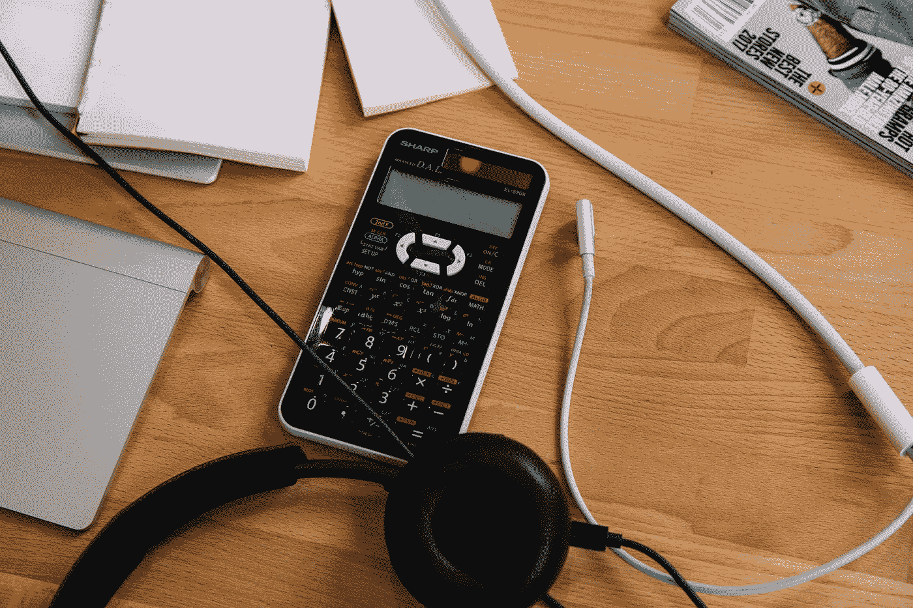

# 做代码需要数学好吗？

> 原文：<https://medium.com/codex/do-you-need-to-be-good-at-math-to-code-ad4e52bcfead?source=collection_archive---------8----------------------->

查尔斯·德鲁维奥拍摄的照片

作为一个初学编码的人，你可能想知道你是否需要擅长数学才能编码。在这篇文章中，我希望澄清这个疑问。

# 编程是一个独立的世界

首先，我想让你知道编码是一个宽泛的术语，它不仅仅指一个单一的概念。我的意思是，你可以用代码做很多事情…