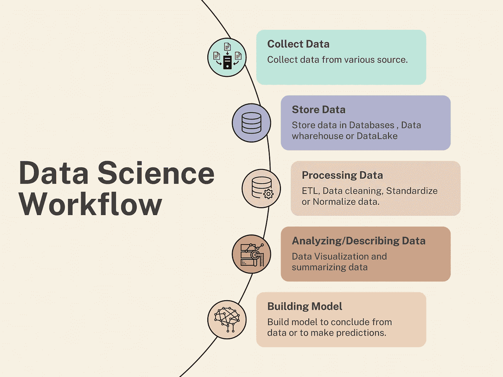
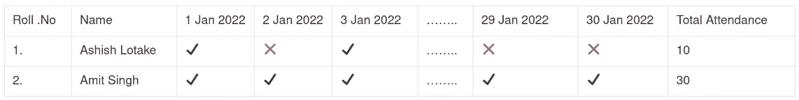
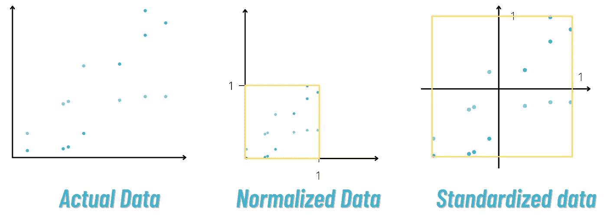
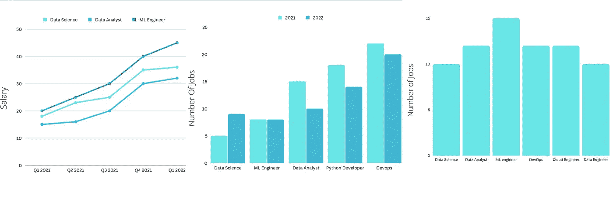
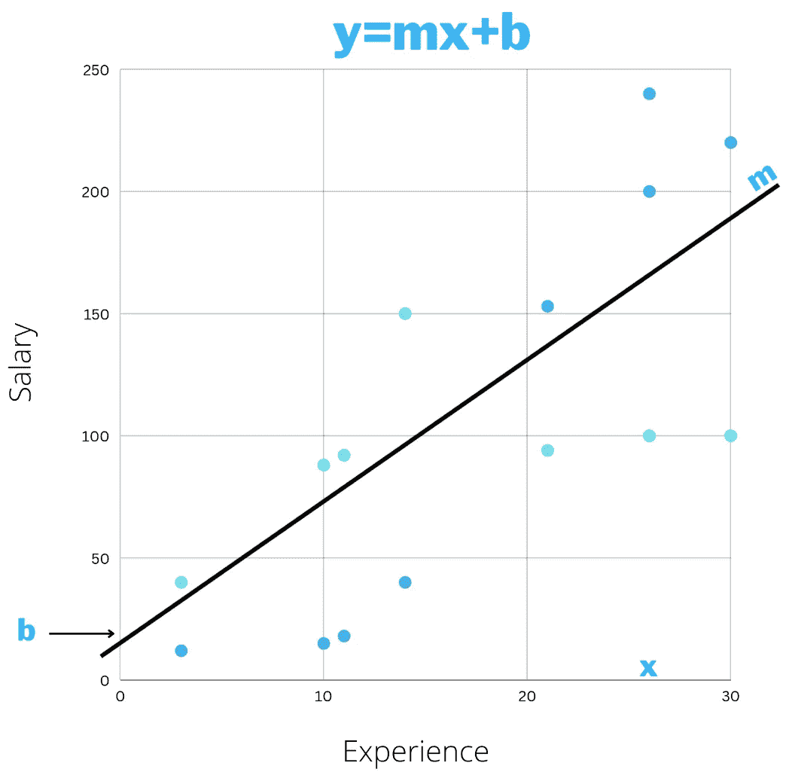
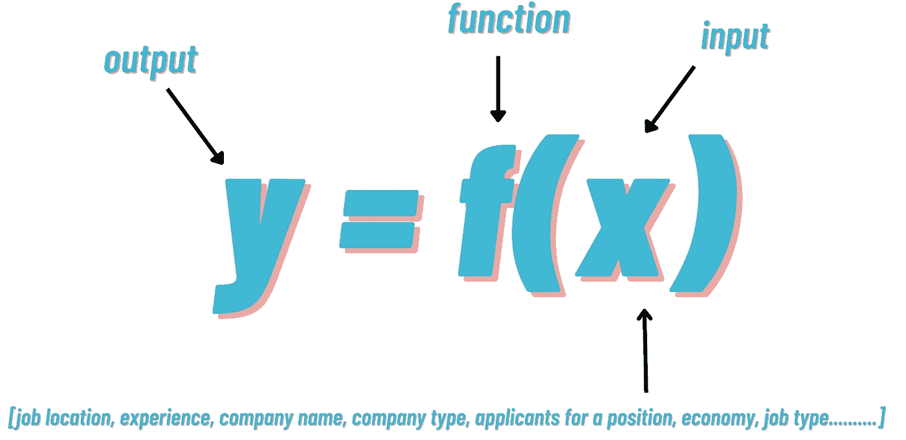
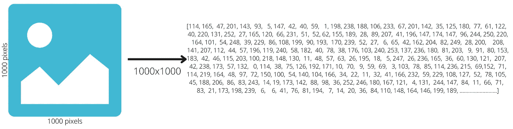
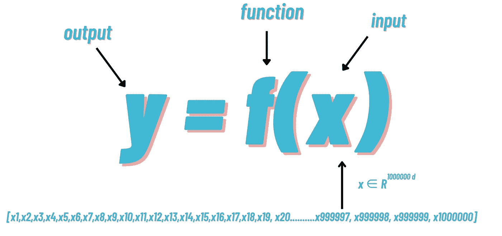

# 你真的知道什么是数据科学吗？

> 原文：<https://medium.com/codex/do-you-really-know-what-is-data-science-6694ce633ddb?source=collection_archive---------3----------------------->

尽管数据科学是非常热门的话题，并被认为是 21 世纪最性感的工作，但我们许多人仍然无法定义数据科学。

# 为什么要定义？

去年毕业后，我和父亲进行了一次谈话

爸爸:-那现在是什么？
*我:——我会学数据科学和机器学习*。
*爸爸:——为什么，什么是数据科学？我:它有最好的就业市场，最好的薪水，我可以在短短一年内轻松找到一份薪水为 XXX 的工作。
*爸爸:——听起来很棒，但是是什么呢？*
*我:-我会和数据打交道*
*爸爸:-太好了，但是什么是数据科学？*
*我:-😵 ………………………..…**

# 各种消息来源说。

> *"* 数据科学将数学和统计学、专业编程、高级分析、人工智能(AI)和机器学习与特定主题专业知识相结合，以揭示隐藏在组织数据中的可操作见解。这些见解可用于指导决策和战略规划。”— [**IBM**](https://www.ibm.com/cloud/learn/data-science-introduction)
> 
> “数据科学是构建、清理和结构化数据集以分析和提取意义的过程。不要与数据分析混淆，数据分析是分析和解释数据的行为。这些流程有许多相似之处，在工作场所都很有价值。”——[**哈佛**](https://online.hbs.edu/blog/post/what-is-data-science)
> 
> “数据科学是一个跨学科领域，它使用统计学和计算机科学中的科学技术来系统地从数据中提取知识。”— [**麻省理工学院开放式课程**](https://openlearninglibrary.mit.edu/courses/course-v1:MITx+HST.953x+3T2020/courseware/b0cd3598ed5940249f6dbbd79707f468/8d8cfbae8dd34fdfb5a019df22cadccc/?activate_block_id=block-v1%3AMITx%2BHST.953x%2B3T2020%2Btype%40sequential%2Bblock%408d8cfbae8dd34fdfb5a019df22cadccc)
> 
> "数据科学是收集、存储、处理、描述和模拟数据的科学*"——***IIT·马德拉斯**

# 学术学了快 1 年的我所理解的。

按作者分类的图片—数据科学工作流

数据科学是从收集数据到建模的几个任务(大约 5 个任务)的组合，这些任务不是具体的，因为它们根据手头的问题而变化。

与构建图像分类器相比，构建假新闻检测器所需的步骤将有明显不同的步骤。

我们将简要介绍每个阶段/步骤。

1.  收集数据
2.  存储数据
3.  处理数据
4.  分析和描述数据
5.  建筑模型

现在，我们中许多已经工作/正在工作或试图获得数据科学家职位的人可能只完成了一个或几个阶段，正如我所说，这取决于手头的问题，我们中的一些人更关心建立模型，一些人更关心分析/描述数据。

出现了许多新术语，如数据工程师、数据分析师或商业智能分析师、机器学习工程师等

**数据工程师** :-大规模收集、存储、分析数据。
**数据或 BI 分析师** :-处理、分析和描述数据。
**机器学习** :-专注于建立模型进行预测。
**数据科学** :-“数据科学是收集、存储、处理、描述和建模数据的科学*。”—IIT·马德拉斯*

# 数据收集

图片来自[manypixels.co](http://manypixels.co)

1.  这取决于我们试图回答什么问题
2.  这取决于我们工作的环境类型，比如我们在 FAANG 工作，比如数据丰富的公司，或者我们在需要收集数据的初创公司工作。

## 为了更好地理解这一点，我将尝试解释作为数据科学家您可能面临的各种情况

给一个用户推荐一个新朋友？我们在拥有社交网络平台的脸书/LinkedIn 公司工作。

*   *在这里，公司已经收集了关于用户的海量数据，这些数据可能存储在关系数据库或非关系数据库中，所以我们只需要编写一个脚本，就可以从这些来源获取数据。*

根据用户对各种工作平台(Linkedin，indeed 等)的兴趣给用户分配工作

*   *现在，在获取 API 表单的情况下，这些来源要么价格昂贵，要么没有 API。因此，这里我们需要编写一个 web 报废脚本，以便从这些来源获取数据，我们需要确保我们在法律上被允许使用这些数据。*

预测哪个政党将赢得选举。

*   *现在，作为数据科学家，我们将通过调查从用户那里收集数据，然后通过各种社交平台收集人们对派对的情绪/态度。*
*   *在这里，我们需要走出舒适区，通过设计一个实验来收集有意义的数据，看看各种获取数据的方法。没有现成的数据。*
*   这里我们需要统计数据来构建实验，并从这些实验中获得洞察力。

# 存储数据

图片来自[manypixels.co](http://manypixels.co)

当我在学校的时候，老师经常用这样的表格记录出勤情况

表格数据示例

我希望你不像我一样！

每次有新学生加入班级，都会创建新的一行。

这就是关系数据库的样子一个表格数据的结构，早期收集的大量数据都是以这种格式存储数据的。

为了从关系数据库中访问数据，我们使用 SQL(结构化查询语言)

**现在想想亚马逊**，亚马逊是一个电子商务平台、视频流平台、在线音频图书平台、云提供商，天知道亚马逊还经营其他什么领域。

现在，在这种情况下，亚马逊不能在一个关系数据库中存储所有消费者数据，所以他们将有多个数据库，每个平台一个。

用户可以在亚马逊提供的所有服务或其中一项服务中拥有一个帐户。

现在，如果你在亚马逊工作，作为一名数据科学家，你需要一种方法来整合所有这些独立的数据库进行分析，这样我们就可以了解用户的情况，从而推荐产品或提供更好的报价。

因此，为了分析这些多个数据库，我们需要将它们存储在类似亚马逊红移的**数据仓库**中。

现在当我们使用 Instagram 这样的平台时，我们发布图像、视频和文本(字幕)语音，而以结构化格式存储这些是不可能的，所以我们以非结构化或半结构化格式(JSON、XML 等)存储这些。

现在，Instagram 拥有数十亿的大量用户，这些非结构化数据正在以高容量、高多样性(图像、视频、语音、图像等数据)和高速度(以非常高的速度生成数据)上传或生成。

于是，一个新名词来了**大数据**

***自书写发展至今，截至 2003 年，5000 年间收集的数据量估计为 5eb。自 2013 年以来，人类每天都在产生相同数量的数据。”***

所以为了存储这些大数据，我们想出了数据湖，比如亚马逊红移。

Hadoop 的一些知识，当我们需要在 HDFS 存储文件的时候。

# 处理数据

图片来自[manypixels.co](http://manypixels.co)

假设我们正在从各种工作门户网站抓取数据，我们编写了一个脚本，它返回一个 JSON 格式，现在这里需要:-

## 抽取、转换、加载至目的端（extract-transform-load 的缩写）

*   从该 JSON/CSV 中提取数据。
*   **T** 转换数据，假设 JSON 中的日期是 Unicode 格式，那么我们需要将其转换成所需的格式 dd-mm-yyyy。
*   **L** oad，熊猫数据框中的数据，或者某个数据仓库

## **数据清理:**

*   **缺失值:-** 假设有些工作没有给出工资或日期，那么我们需要处理这些缺失值。我们将使用各种插补方法来填补这些缺失值。
*   **纠正拼写错误**
*   **找出排除异常值** :-假设有一天一家公司输入了 500，000K 的薪水，而其他公司为同一职位提供了 500，000K，那么 500，000k 就是异常值，我们需要处理这些。

## **标准化和规范化**

作者图像—标准化和规范化的效果

**格式:-** 有些公司给的薪水是 10 万，有些是 10 万，所以我们需要在格式上制作。

我们需要确保数据集中的所有列必须具有相同的比例，我们使用**标准化和规范化**

*   预期工作年限的最小值为 0，最大值为 10
*   薪金的最小值为 100k，最大值为 900k
*   当我们将这些值输入到我们的算法中时，模型将不会很好地执行，因此为了实现良好的性能，我们需要确保所有的值都必须在相同的范围内。
*   **规范化**将确保所有数字列都在 0 和 1 的范围内。
*   **标准化**将确保所有列的平均值和单位方差为零。

## **如何处理大数据？**

图片来自[manypixels.co](http://manypixels.co)

我们需要使用**分布式处理**，这意味着将数据分成更小的块，并将这些块分配给各个服务器/系统，分别处理每个 chuck，最后将它们组合起来。这就是 **Hadoop (Map Reduce)** 发挥作用的地方。

# 分析/描述数据

图片来自[manypixels.co](http://manypixels.co)

查看数据中的列，计算一些静态数据，并绘制数据以找出趋势或关系以及数据中的重要列。

## **数据可视化**

按作者分类的图像-合成数据的绘图示例

我们正在从各种工作门户网站抓取数据。

*   现在，如果想显示哪个部门或哪个职位的工资最高呢？
*   哪些公司的职位空缺数量最多？
*   薪资与经验的相关性。
*   去年与今年的职位空缺

## **汇总数据**

*   某个职位每天发布的典型职位数是多少？→我们可以使用**平均值、**中值和**模式**
*   工资的典型变化是什么？→我们可以用**标准差**和**方差。**

# 建筑模型

图片来自[manypixels.co](http://manypixels.co)

从数据建立模型有两种方法:-

1.  统计建模
2.  算法建模(机器学习和深度学习)

## **统计建模**

建立一个非常简单的统计模型，从数据中得出结论

> 大多数算法在设计时都牢记数据的基本分布遵循正态分布。

我们正在从各种工作门户网站抓取数据。

现在，作为数据科学家，我们希望从这些数据中建立一个模型，来回答各种问题或提出新的见解。

作者图片——工资和经验之间的线性关系

这里我们使用了一个简单的函数 ***y = mx+b*** 。我们还发现，随着经验的增加，工资往往会线性增加，所以现在一名数据科学家可以做出一个强有力的声明→ ***我 99%相信，如果一个人有 15 年以上的经验，他/她可以找到 10 万以上的工作。***

在构建模型时，我们通常会找到潜在的数据分布，对潜在的关系进行建模，并给出稳健的统计分数。在统计建模中，我们更关心为什么某种现象会发生。

## **算法建模(机器学习)**

按作者分类的图像—低维输入

如果我们想要建立一个非常复杂的模型，并且我们的数据不能用简单的直线来表示，为此，我们使用一种称为机器学习的替代方法。

上一段我们总结了一个人的工资只取决于单因素经验。

现在，我们都知道在现实生活中这是不正确的，工资取决于各种因素，如工作地点，公司类型(FAANG，初创公司等)，公司过去的业绩，职位申请人，经济，工作类型(远程或办公室)和其他各种因素。

为了建立一个模型，找到输入和输出之间的关系，我们需要做一些复杂的事情。

***y = f(x)，*** 我们需要一个通用的灵活函数，在这里我们可以给任何输入。

那么机器学习的最终目标是什么:-利用数据和一些优化技术找到函数 ***f*** 。

找到函数 ***f*** 后，我们只需输入 ***x*** 到 ***f*** 并得到输出 ***y*** 。

现在，对于机器学习，我们的主要关注点是试图使预测值尽可能接近我们的原始值。

## **算法建模(深度学习)**

当我们拥有非常高维的数据，并且希望了解输入和输出之间非常复杂的关系时，我们通常倾向于使用深度学习。

按作者分类的图像—图像到矢量

假设我们想使用 MRI 扫描来确定一个人是否患有乳腺癌，假设 MRI 扫描是一个大小为 1000x1000 像素的图像，那么每个图像都使用 1000000 列(像素值)来表示，我们有数千个这样的图像。

作者图片—深度学习高维输入

这里，在 1000000 个像素中，只有 1000 个像素有助于决定癌症是良性还是恶性，但我们不知道，所以我们将所有 1000000 个像素输入深度学习模型，模型输出癌症是良性还是恶性。

## 我想我帮助你更好地理解了“什么是数据科学？”

> **数据科学是收集、存储、处理、描述和建模数据的科学*。***

# 参考

*   [https://www.ibm.com/cloud/learn/data-science-introduction](https://www.ibm.com/cloud/learn/data-science-introduction)
*   [https://online.hbs.edu/blog/post/what-is-data-science](https://online.hbs.edu/blog/post/what-is-data-science)
*   [https://open learning library . MIT . edu/courses/course-v1:MITx+HST . 953 x+3t 2020/课件](https://openlearninglibrary.mit.edu/courses/course-v1:MITx+HST.953x+3T2020/courseware)

*原帖*[*ashishlotake.com*](http://ashishlotake.com)