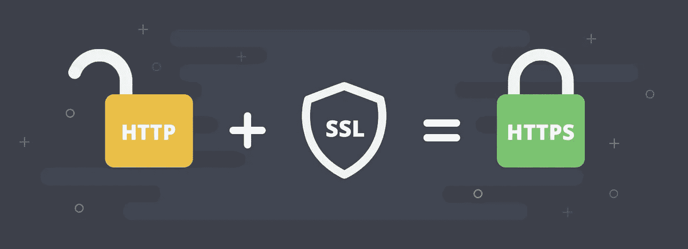
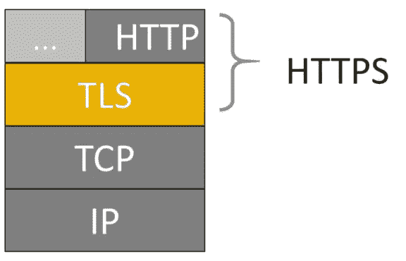
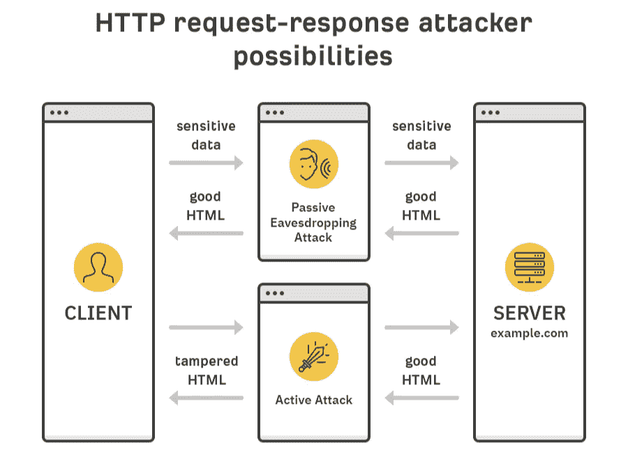
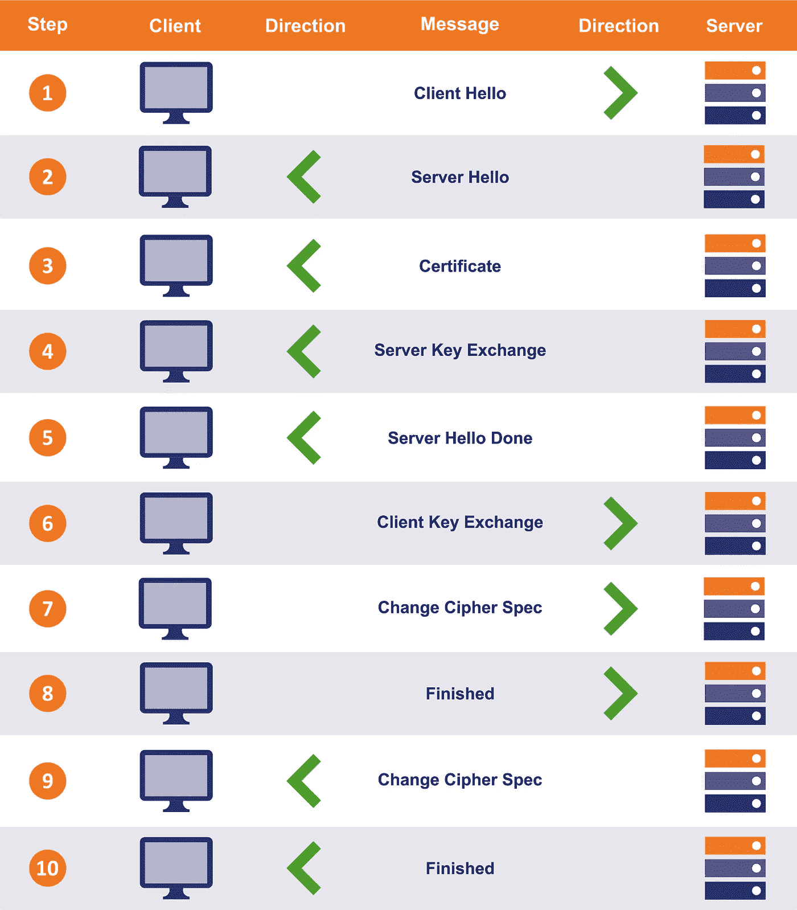
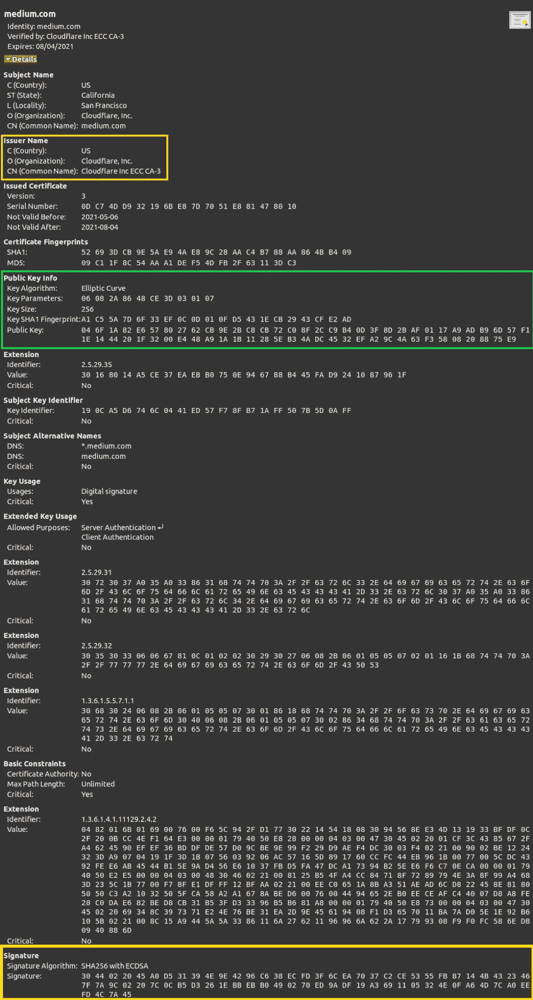
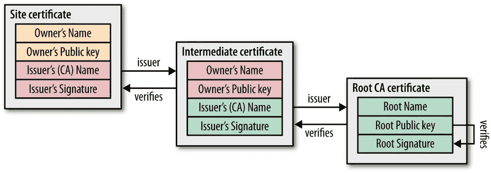
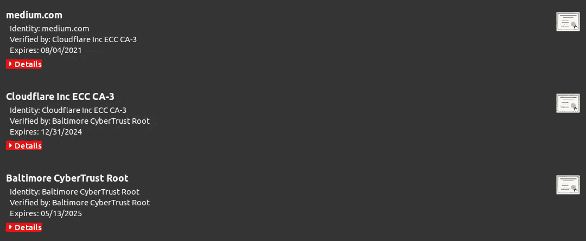

# HTTPS 实际上是如何工作的？

> 原文：<https://medium.com/codex/do-you-really-understand-https-a1da40195335?source=collection_archive---------4----------------------->



图片来自[x-cart.com](https://www.x-cart.com/blog/what-is-https-and-ssl.html)

你们大多数人可能以前听说过 HTTPS。[这篇文章](https://w3techs.com/technologies/details/ce-httpsdefault#:~:text=Default%20protocol%20https%20is%20used%20by%2079.4%25%20of%20all%20the%20websites.)声称目前 79%的网站使用 HTTPS。简而言之，HTTPS 是 HTTP 的加密版本，是两台服务器之间传输数据最常用的协议。为了加强传输数据的安全性，HTTPS 是第 7 层协议，它对传输的数据进行加密。

查看[这一系列文章](/@himanishm07/list/http-0f55a4493736)，了解更多关于 HTTP。

HTTPS 的优点和底层技术，如 TLS、TLS 握手、证书和认证机构都将在本文中讨论。

# 1.什么是 HTTPS

HTTPS 是 HTTP 的安全变体。简单明了地说，HTTPS 就是 HTTP 协议加上数据加密和 SSL/TLS 提供的附加特性。



[来源](https://love2dev.com/blog/how-https-works/)

# 2.为什么是 HTTPS

大多数在线数据交换使用 HTTP。默认情况下，这些数据是不加密的，这使得任何人都有可能通过使用中间人攻击来欺骗源和目的地之间的数据。此外，您收到的信息可能会被篡改，或者恶意行为者可能会代替真正的服务器回答问题。



[来源](https://ahrefs.com/blog/what-is-https/)

为了解决这些问题，HTTPS 用**加密**、**认证**和**完整性**增强了 HTTP 协议。

> 在这一节中，我将提供它如何工作的高级概述，然后在下一节中，我将更详细地介绍底层技术和过程。

**加密:-** HTTPS 通过包括 SSL/TLS 加密来保护通过互联网传输的数据不被第三方截取和读取。[公钥加密](https://www.ssl.com/faqs/what-is-public-key-cryptography/)和 TLS 握手实现了这一点。下面，我们就来说说这些程序。我们将在下面讨论这些过程。

加密前:

```
This is a string of text that is completely readable
```

加密后:

```
ITM0IRyiEhVpa6VnKyExMiEgNveroyWBPlgGyfkflYjDaaFf/Kn3bo3OfghBPDWo6AfSHlNtL8N7ITE
```

**认证:-** 与 HTTP 相反，HTTPS 通过 TLS 协议和 CA 证书使用强大的认证系统。作为建立 HTTPS 连接时 TLS 握手的一部分，服务器发送一系列证书，客户端可以使用这些证书来验证握手是否由所需的服务器完成。如果服务器的证书已经由公认的[认证机构(CA)](https://www.ssl.com/faqs/what-is-a-certificate-authority/) 签署，客户端将确认证书中包含的任何识别信息已经由信誉良好的第三方验证。下面，我们就来说说证书和 CA。

**完整性:-** 由 HTTPS 网络服务器发送给客户的每个文档(如网页、图像、JavaScript 文件或任何其他数据)都包含一个消息摘要，客户可以使用该消息摘要来确定数据在传输过程中未被第三方修改或损坏。HTTPS 协议用**消息认证码(MAC)** 对每条消息进行签名。MAC 算法是一种单向加密哈希函数(实际上是校验和)，其密钥由两个连接对等方在 TLS 握手期间协商。每当发送 TLS 记录时，都会为该消息生成并附加一个 MAC 值。在接收端，接收方根据收到的消息创建另一个 MAC，然后比较两个 MAC 代码以确保消息的真实性。

# **3。深入 TLS**

传输层安全性或 TLS 是一种 [**加密协议**](https://en.wikipedia.org/wiki/Cryptographic_protocol) ，为通过互联网在应用程序之间发送的数据提供端到端的安全性。**虽然 TLS 也可以在 UDP、DCCP 和 SCTP 上实现，但它通常是在 TCP** 之上实现的，以便对 HTTP、FTP、SMTP 和 IMAP 等应用层协议进行加密。

作为目前使用最广泛的协议，TLS1.2 的规范将是本文的主要焦点。其前身(SSL 1.0、SSL 2.0、SSL 3.0 和 TLS 1.1)目前已被弃用，其后继版本(TLS 1.3)正处于采用阶段。

> TLS 实际上为运行在其上的所有应用程序提供了上述 3 种功能:加密、身份验证和数据完整性。在 HTTPS 的情况下，在它上面运行的应用程序是 HTTP。

在通过 TLS 传输应用程序数据之前，必须在客户端和服务器之间建立加密隧道。为此，客户端和服务器必须就 TLS 协议版本达成一致，选择一个密码套件，**创建会话密钥**，并在必要时验证证书。这是 TLS 握手的一部分。

## 3.1.TLS 握手

握手是 TLS 最重要的部分之一，因为这是每个连接开始的地方，也是建立 TLS 技术基础的地方。

> TLS 握手发生在底层网络层握手之上。因此，如果 TLS 工作在 TCP 之上，TCP 握手发生在客户机和服务器之间。一旦完成，TLS 握手就开始了。

TLS 握手完成 3 件主要事情:

*   交换密码套件、TLS 版本和其他参数。
*   认证一方或双方。
*   创建/交换对称会话密钥。

下面提到在握手中发生的步骤。



[来源](https://www.thesslstore.com/blog/explaining-ssl-handshake/#the-tls-12-handshake-step-by-step)

1.  第一条消息称为“ClientHello”该消息列出了客户端的能力，以便服务器可以选择两者将用于通信的密码套件。它还包括一个大的，[随机挑选的](https://www.thesslstore.com/blog/why-all-the-fuss-about-64-bit-serial-numbers/)质数，称为“客户端随机”
2.  服务器用“SeverHello”消息进行响应。在这个消息中，它告诉客户端它从提供的列表中选择了什么连接参数，并返回它自己随机选择的质数，称为“服务器随机”如果客户端和服务器不共享任何共同的能力，[连接不成功地终止](https://www.thesslstore.com/blog/troubleshoot-firefoxs-tls-handshake-message/)。
3.  在“证书”消息中，服务器将其 TLS 证书链(包括其[叶证书和中间证书](https://www.thesslstore.com/blog/root-certificates-intermediate/))发送给客户端。我们稍后将讨论证书和证书链。
4.  这是一条可选消息，仅在某些需要服务器提供额外数据的密钥交换方法(Diffie-Hellman)中需要。
5.  “服务器 Hello Done”消息告诉客户端它已经发送了所有的消息。
6.  然后，客户端提供其对会话密钥的贡献。这一步的细节取决于最初的“Hello”消息中确定的密钥交换方法，通常是 RSA 或 Diffie-Hellman。
7.  “更改密码规范”消息让另一方知道它已经生成了会话密钥，并将切换到加密通信。
8.  然后发送“完成”消息，以指示客户端的握手完成。完成的消息被加密，并且是由会话密钥保护的第一个数据。该消息包含允许每一方确保握手未被篡改的数据(MAC)。
9.  现在轮到服务器做同样的事情了。它解密预主密钥并计算会话密钥。然后，它发送其“更改密码规范”消息，以指示它正在切换到加密通信。
10.  服务器使用它刚刚生成的对称会话密钥发送它的“完成”消息，它还执行相同的校验和来验证握手的完整性。

在这些步骤之后，TLS 握手就完成了。双方现在都有了会话密钥，并将开始通过加密和认证的连接进行通信。

此时，可以发送“应用程序”数据的第一个字节(属于双方将要交流的实际服务的数据，即网站的 HTML、Javascript 等)。

> 在 TLS 1.2 中，每个会话都有完整的握手，而 TLS 1.3 则不是这样。

# 4.深入研究 TLS 证书和身份验证

每个 TLS 连接都必须首先通过身份验证。正如我们在整篇文章中反复提到的，TLS 通过使用证书来提供身份验证。在本节中，我们将首先回顾一些术语，然后看看身份认证过程本身。

## 4.1 证书

那么，首先，什么是证书？

> *证书只不过是一个简单的文档，包含* ***公钥*** *以及创建证书的组织的一些信息。*

让我们以媒体的证书为例



如您所见，证书记录了各种数据。它记录了证书所有者的信息，在本例中是 medium.com。此外，它还标识了签名机构，在本例中是 Cloudfare，Inc.
此外，正如您所看到的，证书允许您访问所有者的公钥。在 TLS 握手的密钥交换期间，可以使用这个公钥。

但是**让我们记住**证书本身不足以为 server (medium.com)提供任何类型的认证。我可以创建自己的证书，将所有者(也就是我)命名为 medium.com，并将其发送回客户端。我们将在下面讨论如何使用证书进行身份验证。

## 4.2 信任链

> 当您从服务器获得证书时，您实际上获得了证书链。



[来源](https://www.oreilly.com/library/view/high-performance-browser/9781449344757/ch04.html)

信任证书链旨在证明特定证书来自可信来源。有了这个证书链，我们将递归地验证每个证书的真实性，直到我们得到根证书。

链条由 3 部分组成:-

**服务器证书:-** 服务器证书是颁发给与客户端通信的特定域的证书。

**中级证书:-** 中级证书像树枝一样从根证书上分叉出来。它们充当受保护的根证书和发布给公众的服务器证书之间的中间人。一个证书链中至少会有一个中间证书，但也可以有多个。

**根证书:-** 根证书是属于发行证书机构的数字证书。在大多数浏览器中，它是预先下载的，存储在所谓的“信任存储”中根证书由证书颁发机构严密保护。

如果证书是合法的，并且链接回客户端浏览器的信任库中的根 CA，用户将知道网站是安全的，基于接口信任指示器。



[来源](/geekculture/story-of-ssl-certificates-161f29df8b65)

在上图中，medium.com 是服务器证书，Cloudfare Inc 是中间证书，Baltimore CyberTrust Root 是根证书。

## 4.3 什么是 CA？

认证机构(CA)是发布符合 ITU-T 的 [X.509 公钥基础设施(PKI)标准](http://www.itu.int/itu-t/recommendations/rec.aspx?rec=X.509)的数字证书的实体。数字证书证明证书所有者的公钥(称为主题)，以及所有者控制受证书保护的域。因此，CA 充当可信的第三方，向客户端(称为依赖方)保证它们连接到由经验证的实体操作的服务器。

在上面解释的证书链中，所有的证书都由一个 CA 签名。服务器证书(medium.com)由认证机构 CloudFare 签署。然后 CloudFare 的证书由 Balitmore CyberTrust 签署。由于 Balitmore CyberTrust 根证书是根证书，所以它是一个自签名证书。

## 4.4 认证

现在我们已经了解了证书的基础知识，让我们来了解身份验证实际上是如何工作的。

以下是服务器认证中涉及的步骤:-

1.  从服务器获取证书链。
2.  从证书链中获取顶级证书。
3.  使用颁发者证书的公钥解密证书的签名。
4.  将解密的签名与证书的公钥进行比较。
5.  遵循过程 2–4，直到您获得根证书。
6.  如果任何一步的比较失败，则验证过程失败。

一旦验证了整个证书链的正确性，我们就可以安全地假设具有给定细节的证书是有效的，并且我们正在与正确的服务器通信。

# 5.摘要

浏览我们在本文中涉及的主题

1.  什么是 HTTPS。
2.  HTTP 的安全限制
3.  HTTPS 如何解决安全限制
4.  TLS 和 TLS 握手
5.  证书、证书链和证书颁发机构。
6.  证书如何用于服务器身份验证。

所以这是我对 HTTPS 的介绍。我确实相信，对于许多概念，需要给出更多的细节，例如与 Diffie-Hellman 的密钥交换、整个 CipherSpec 交换、TLS 证书的产生等等。和 HTTPS 的问题绝对不可能在一页纸内解决。不过，我会在以后的文章中更详细地讨论这些话题，因为这篇文章目前已经超过十分钟了。

与此同时，如果你认为这对你有任何帮助，请鼓掌并跟我来，如果我错过了什么，请发表评论。干杯:)