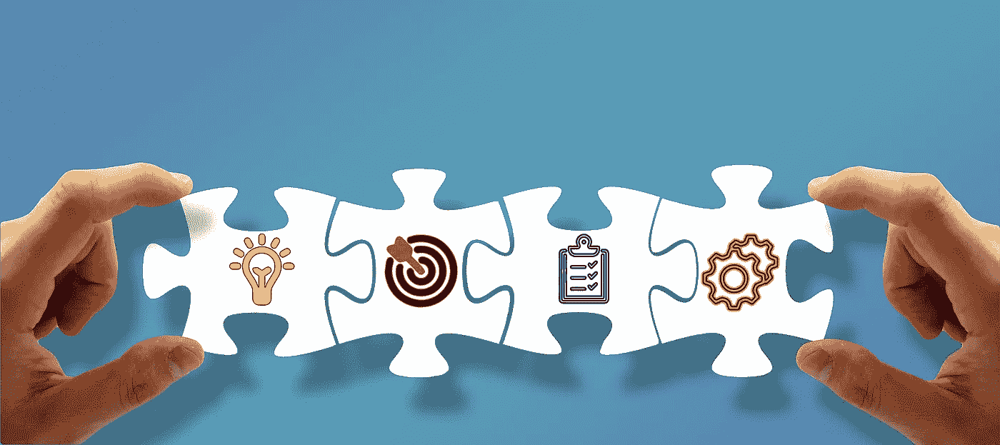

# 三年后你还想做开发者吗？

> 原文：<https://medium.com/codex/do-you-still-want-to-be-a-developer-three-years-from-now-3bfecf595ef?source=collection_archive---------5----------------------->

这是一个在公司频道上问的问题，引起了我的注意！我从事开发工作已经超过 15 年了，我一直很喜欢做一名开发人员。这是一个独特的职位，给你创造和创新的自由，最重要的是，它允许你失败！

当你作为初级开发人员开始工作时，没有人期望你知道！在那里，你可以得到尝试、失败和学习所需的一切支持！但是当你获得了更多的经验，那么期待就来了！

*   你有依赖你的团队成员！
*   低年级学生希望你来指导他们，
*   而学长期望你在短时间内交付高质量的代码。
*   你的产品负责人理所当然地认为你非常了解这个领域。
*   Scrum master 依靠你来帮助他人解决他们的障碍。
*   诸如此类…

把这些负担扛在肩上，就没有失败的余地了。这还不是全部，加上你自己的期望！失败会对你的工作信心产生什么影响？你仍然认为你有足够的经验或知识来完成复杂的任务吗？当你获得更多经验时，对失败的恐惧会变得更糟。

*如果作为一名高级开发人员失败是很困难的，那么现在作为一个团队的领导者，失败变得更加困难！*

作为一名团队领导，你的失败更多地与团队的整体表现联系在一起。如果你失败了，很可能你的团队也会失败。不仅期望团队领导引导和帮助团队走上正确的道路，而且这个角色让他对其他人的失败更加负责。

除了责任，还有信任！每个人都信任团队领导，包括开发团队、经理、业务所有者和 scrum masters 等。当你说或做某件事时，很可能会反映在团队决策中。因此，如果你犯了一个错误，要么提供不准确的信息或误解一个主题，要么提出一个技术解决方案，导致你的产品出现愚蠢的缺陷，所有这些都会直接严重影响你的团队！你可能会逃过一两次，但是如果第三次犯错，你将会失去团队的信任！

当团队中没有人怀疑他们的领先优势时，你不会想在那里！

但是，你如何在不经历失败的情况下学习一门令人兴奋的新学科呢？这是开发人员的全部乐趣所在。这就是我成为开发人员的原因，去学习，去体验新事物，去打造新产品。为此，我需要失败；然而，随着我在工作中获得越来越多的经验，我发现失败的空间越来越小，学习的时间越来越少，我越来越失去作为一名开发人员的乐趣。

不止于此！作为一名建筑师，你面临着更多的责任！现在整个项目取决于你的决定！架构决策很难做出，更改成本也很高！建筑师甚至得到更少的失败空间！

那么 3 年后我还想做开发者吗？

嗯，当我想到它时，它让我想起 Edsger Dijkstra 的故事，1952 年，在离这里不到 30 公里的阿姆斯特丹国家数学和计算机科学研究所，Dijkstra 作为这个星球上第一批开发人员之一学习和工作！1955 年，在边读书边做开发者仅 3 年后，他选择了自己长期的职业！他决定成为一名开发商。考虑到当时没有开发人员的工作！没有人承认它是一种职业。他们认为这是一种爱好！

1957 年，当他要结婚的时候。在你的结婚仪式中，陈述你的职业是强制性的。然而，当时的政府不接受开发人员作为一个职业，没有人对这个职业很苛刻！相反，他宣布了一个不同的职业来克服障碍。

Dijkstra 以最高的数学成绩通过了大学，他本可以在其他领域有很多机会，但他成为了一名开发人员，也是计算科学最有影响力的人物之一

他决定做开发者的原因是什么？

我引用《干净的建筑师》一书中的话:

> Dijkstra 得出结论，编程的智力挑战比理论科学的智力挑战更大

是的，是编程挑战让他着迷。克服困难后的胜利感或努力解决困难时的精神满足感。尤里卡效应的快乐，被称为“啊哈！瞬间”。我自己就在那里，我熟悉这种感觉。其他所有开发人员，无论是开发小型 web 应用程序还是价值数百万美元的企业应用程序，都熟悉这种感觉，并且能够理解 Dijkstra 的感受。

我要做 3 年的开发者吗？

是的，如果你仔细看看 Dijkstra 的故事，以及他为什么不能在 3 年后离开编程。在没有人认可编程是一种职业的时候，他选择了做一名开发者。他是最早意识到处理计算机挑战的乐趣和满足感的人之一。

今天，我们作为他的继任者开发商分享相同的。那么，期望呢？作为一名高级开发人员、团队领导或架构师，我会失败吗？

嗯，答案是，看情况！当然，当你有了经验，当你阅读或观察别人的成功和失败时，你不应该经常失败。你不能犯别人犯过的错误。作为一个有经验的专业人士，研究行业内别人的经验，从中吸取教训，而不是自己去经历失败。

但是拥抱失败是至关重要的！在你的团队中进行讨论很重要，告诉他们失败可能会发生，也将会发生。不仅仅是大三学生，即使是团队中最有经验的人也会失败。失败没有错。这是发展和学习过程的一部分。当你让你的团队加入时，期望就会改变。你有更多的空间以你喜欢的方式面对挑战，并把快乐带回工作中。但是你必须和你的团队一起做。失败，一起学习，一起提高！

我们没有人知道未来会给我们带来什么，所以没有人可以肯定地预测未来，但只要我获得一个失败和学习的机会，面对有趣的挑战，感受到克服那些挑战的喜悦，我就会成为一名开发者。