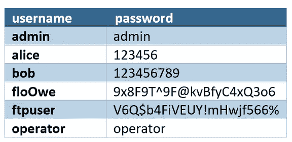
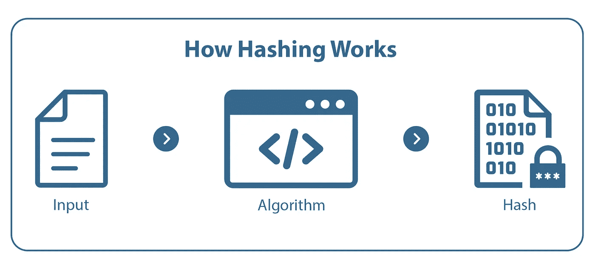
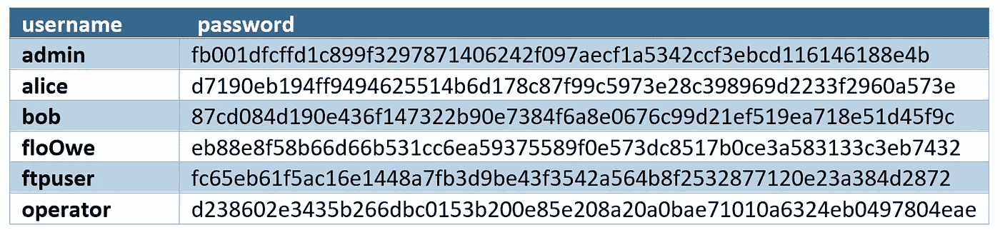
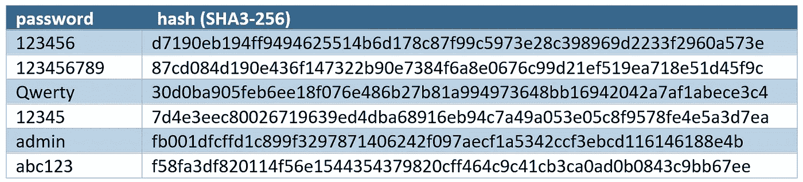
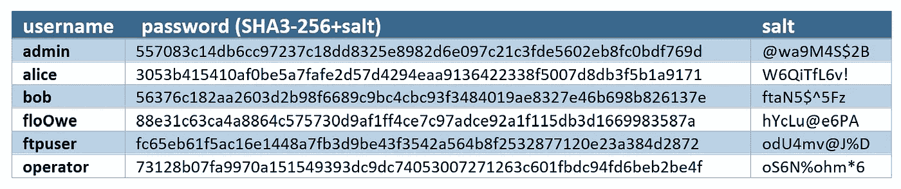
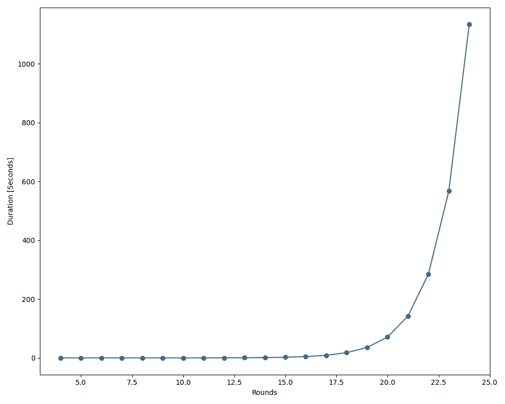

# 你安全地储存密码吗？

> 原文：<https://medium.com/codex/do-you-store-passwords-secure-86a407f55a4?source=collection_archive---------16----------------------->

## 如果您开发任何关于用户和密码管理的东西，请记住以下信息。


杰森·黑眼在 [Unsplash](https://unsplash.com?utm_source=medium&utm_medium=referral) 上的照片

管理用户时，一个重要的步骤是以安全的方式存储他们的密码。在下面的文章中，将解释安全存储密码的主要原则。

# 纯文本密码

存储密码的最早版本是使用明文密码。以纯文本格式存储密码的问题是，能够访问您的数据库的攻击者能够访问所有密码。当您的数据库泄漏时，也会出现同样的问题。以下示例显示，像 floOwe 这样具有强密码的用户也会受到这种攻击。由于许多用户对他们拥有的所有帐户使用相同的密码，所以一个以纯文本形式存储密码的提供商可能会导致很大的安全问题。



# 散列法

更安全地存储密码的第一步是使用散列算法。哈希算法用于生成唯一且固定长度的字符串，称为哈希。哈希函数最重要的特点是，哈希值的计算很容易，但是计算过程是逆向的，所以从哈希到密码很难。因此，散列函数是单向函数。这导致了这样一个事实，即有权访问数据库的攻击者不能从散列值中计算出密码。



散列法

关于散列的更多细节可以在我上一篇关于密码学概念的文章中找到:

[](/@eklatzerToGo/5-cryptography-concepts-you-should-know-9b2681067a35) [## 你应该知道的 5 个密码学概念

### 尽管不是每个人都必须是网络安全专家，但每个人都应该至少知道这 5 个概念。

medium.com](/@eklatzerToGo/5-cryptography-concepts-you-should-know-9b2681067a35) 

对上表中的密码进行哈希运算后，可以存储哈希值(哈希函数:SHA3–256):



使用哈希密码的用户数据

这个解决方案看起来非常安全，因为密码不能从散列中计算出来。仅散列密码的一个问题是，存在所谓的*彩虹表*。彩虹表是一个预先计算好的普通密码的散列列表。下图显示了一些最常见密码及其相应哈希值的彩虹表示例:



彩虹桌

这强调了强密码的重要性，因为彩虹表包含了足够的条目来涵盖所有简单和短的密码。因此，密码要求至少应该是:

*   **≥** 10 位字符
*   至少一个大写字母和一个小写字母
*   至少一个数字
*   至少一个特殊字符

## 盐和胡椒

当你加入一点盐和胡椒时，一切都会变得更好。这也是用于存储密码哈希的情况。两者都是字符序列，在计算哈希之前添加到密码中。不同之处在于，salt 是为每个用户随机生成的，并与用户数据一起存储。Pepper 对所有用户都是唯一的，必须作为秘密保存在配置文件中。

下面的例子展示了 pepper 的用法:

```
Password: 123456
**Hash of the password**: d7190eb194ff9494625514b6d178c87f99c5973e28c398969d2233f2960a573ePepper: Q&9db&82Y
Value that is hashed: 123456Q&9db&82Y
**Hash of the password and pepper**:
57a2bed7b1f301dd2a91f409d9b75cbec00203a63c5191b3807700094f299d7e
```

使用 pepper 的优势在于，攻击者需要首先找出值，因为它不是存储在与用户数据相同的位置。在找出胡椒之后，必须计算一个新的彩虹表来得到胡椒的散列值。

salt 是为每个用户生成的，并且必须存储起来，以便在用户想要登录时验证输入。以下示例显示了一个用户表，这些用户的散列密码带有其 salts:



带有散列密码和盐的用户数据

如果攻击者能够访问包含用户数据的数据库，他必须为每个用户生成彩虹表。

为了获得最高级别的安全性，可以使用盐和胡椒的组合，因为这可以产生两种优势。

# 如何选择哈希算法？

现在有一长串散列算法。尽管它们都可以用来散列密码，但有些更适合这个用例。尽管 MD5 不再安全，但它将用于说明为什么像 MD5 这样的哈希算法不应再用于密码:

```
import hashlib
import timeNUMBER_OF_HASHES = 1000000

passwords = []
for _ in range(NUMBER_OF_HASHES):
    passwords.append(generate_random_password().encode())

start_time = time.time()
for password in passwords:
    result = hashlib.md5(password)

duration = (time.time() - start_time)

print("%ss for %s hashes" % (duration, NUMBER_OF_HASHES))
```

这导致一百万次散列的计算时间为`0.414`秒。

如今，当你询问密码散列算法时，你很可能会得到一个答案，那就是`bcrypt`。这是一种哈希算法，通常用于哈希密码，因为它具有以下特征:

*   计算时间长
*   高内存使用率
*   工作因素

最后一个属性非常重要。当使用 bcrypt 散列输入时，可以定义工作因子。如果选择较高的工作系数，计算需要较长的时间和更多的资源。这一点非常重要，因为有一种攻击叫做暴力破解。对于蛮力攻击，攻击者尝试所有的可能性，如果计算时间更长，速度就会变慢。下面的图表显示了工作因子从 4 到 24 时，我的系统的单个 bcrypt 散列的计算时间:



bcrypt 不同工作因子的计算时间

因此，可以根据运行散列算法的系统来选择工作因子。工作因子应始终至少如此之高，以使每个哈希的计算时间大于 250 毫秒。对于我的系统，这将是至少 12 的工作因子。

如果你觉得这篇文章和这个系列很有用，请与你的朋友分享，留着以后再看👏甚至是 5️⃣0️⃣

如果你对软件开发和 IT 领域的其他话题感兴趣，请跟我来💯