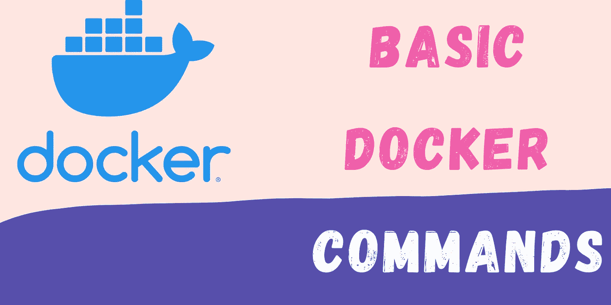

# Docker 基本命令

> 原文：<https://medium.com/codex/docker-basics-commands-cb956c4ef2ef?source=collection_archive---------5----------------------->

## 使用各种 Docker 命令管理容器。

Docker 命令

Docker 习惯于在隔离的环境中运行软件应用程序。我们可以在一台计算机上运行同一个应用程序的多个实例。比方说，我们可以在同一台计算机上毫无问题地运行 Python 版本 2 和 3。我们可以在映像中打包所有依赖的库(基本应用程序+配置细节)。我们称之为…