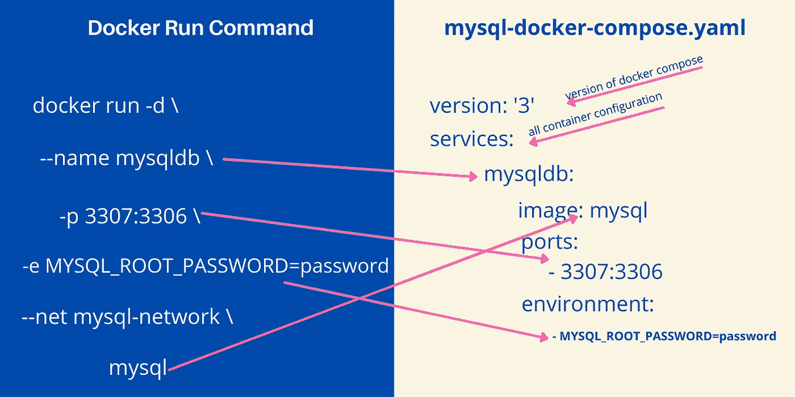

# 码头工人撰写解释

> 原文：<https://medium.com/codex/docker-compose-explained-3954baf495ec?source=collection_archive---------2----------------------->

## 了解如何为 Docker 容器创建 YAML 文件，并使用 docker-compose 创建容器。

Docker 撰写示例

Docker 容器是使用命令行工具中的 docker 命令创建的，例如 Windows 的命令提示符和 Mac、Linux 的终端。当您开始学习 Docker 时，使用命令行工具是很容易的。但是，如果您正在创建一个复杂的…