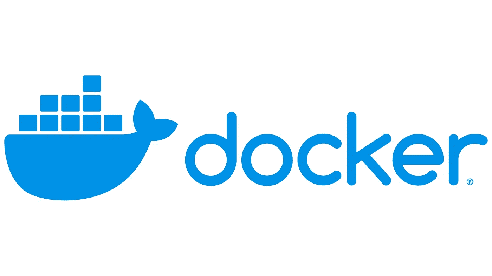
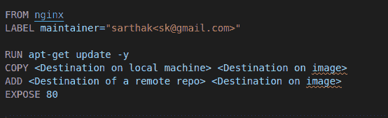
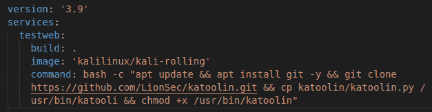

# 码头工人——鲸鱼的复仇

> 原文：<https://medium.com/codex/docker-revenge-of-the-whale-7ebd6a6f4488?source=collection_archive---------9----------------------->



我们留下了一些 docker 命令和 docker 的基础知识。现在，让我们像鲸鱼一样深入研究它，并回来掌握 docker。

留给我们讨论的主题有

1.  Docker 文件
2.  Docker 撰写
3.  一些有用的命令

现在，如果我们可以用一行命令创建容器，为什么我们还需要一个文件呢？如果您必须部署 10 个容器，您会将该命令写 10 次吗？如果我在创建文件后必须在容器中运行一些命令，那么该文件的配置会怎么样呢？我不会做 10 次，一次又一次，这是不明智的，如果你是愚蠢的，你可以，但如果你像我一样精明，那么我们将需要像 DockerFIle 和 Docker Compose 更大的枪。

首先，我们来讨论 DockerFile。如果我通俗地说，Dockerfile 是用来创建图像的。我在以前的博客中讨论过图像，如果你不知道什么是图像，看在上帝的份上，看看以前的博客或者谷歌一下，随便你怎么想。简而言之，我们可以用这个 DockerFile 文件创建自定义图像。

我们怎么写？好问题，如果你想说的话，它遵循一定的模式和一定的暗语。因此 DockerFIle 组件包括。

1.  从
2.  奔跑
3.  维护者
4.  复制
5.  注意缺陷障碍 (Attention Deficit Disorder)
6.  揭露
7.  工作方向
8.  煤矿管理局
9.  入口点
10.  包封/包围（动词 envelop 的简写）

太多了？嗯，它们很简单，让我给你分解一下。

“FROM”告诉 docker 引擎获取一个图像，比如 ubuntu、arch、kali、OpenSUSE 等等。“FROM”在 docker 文件中总是排在第一位。

“RUN”告诉 docker 引擎在映像中运行一些命令，假设您想要更新存储库或下载一些东西。

“维护者”基本上是图像创建者的作者名。那是你！对，就是你。

“复制”从本地系统复制文件到镜像，你必须提供目标路径后，它只是复制它。

“添加”类似于复制，但它提供了一个额外的功能，该功能是您可以从互联网上下载，然后将其包含在您的映像中。“复制”不允许这样。

“EXPOSE”用于暴露映像中的端口。暴露端口意味着我们希望在映像上打开一个特定的端口，以便它可以与 internet 或外部网络通信，例如，HTTP 的端口 80 或 ssh 的端口 22 等。

“WORKDIR”用于设置创建容器的工作目录。

“CMD”执行命令，但在容器创建期间

“入口点”类似于 CMD，但优先级高于 CMD。所以无论你在 ENTRYPOINT 中写什么都会被优先考虑

“ENV”环境变量

现在举一个 Docker 文件的例子，为了方便起见，我们将保持它的简单。



这是 docker 文件的样子。如上所述，您可以向其中添加更多组件。现在，让我们讨论 docker-compose。

创建这个 docker 文件后，您可以转到 docker 文件所在的路径，然后运行这个命令

```
docker build -t <image name>
```

现在，你的形象会建立起来。集装箱现在怎么样了？按需旋转容器的文件叫什么？Docker compose 是来拯救世界的。Docker compose 是 Docker 引擎的一部分，作为一个子实用程序，它可以一次旋转许多具有不同配置的容器。Docker 合成文件是用 YAML(另一种标记语言)编写。YAML 很容易写和理解。docker-compose 文件如下所示。



版本定义要使用的 docker 引擎版本。在服务下，我们写下容器名，就像这里一样，它被命名为 test web。在这个构建下，我们给出了构建容器的路径。意味着使用当前目录。图像标签说明了它的作用。命令也是 shell 代码或启动后希望在容器中运行的任何内容。

compose 文件的主要优点是，如果你想要更新容器，假设你想要新的配置，或者在容器中添加/删除一些东西，docker-compose 可以很容易地做到这些。您只需在文件中进行正确的更改，然后运行该命令再次构建一个新的容器。

```
docker-compose up -d — build
```

请记住，该命令将在合成文件所在的目录中运行。根据惯例，文件的名称是“docker-compose . YAML ”, docker 文件的名称是 docker file，没有任何扩展名。

现在我们已经介绍了 docker-compose 和 Dockerfile，该轮到您使用它们了，并探索更多，这两者在为微服务创建系统时都有巨大的潜力来帮助您。

先简单讨论一下 docker hub，它就像 GitHub 一样，docker hub 包含 docker 容器的映像，就像 GitHub 包含代码和软件一样。Docker hub 有两种存储库，私有的和公共的。私有和公共这两个标题足以告诉你这些存储库的本质到底是什么。

如果你想从你创建的容器制作一个图像，我们可以使用这个命令

```
docker commit <container name> <image name>
```

然后，您可以从查看新创建的图像

```
docker images
```

如果你想看到图像的不同，我们可以使用这个命令

```
docker diff <image 1> <image 2>
```

现在让我们来看看现实场景中一些有用的命令。

停止所有正在运行的容器:

```
docker stop $(docker ps -a -q)
```

删除所有停止的容器:

```
docker rm $(docker ps -a -q)
```

删除所有图像:

```
docker rm -f $(docker images -q)
```

这就是码头工人的全部。让我们在下一篇博客中介绍一些网络。技术的基石。

安静点。