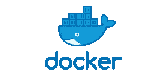
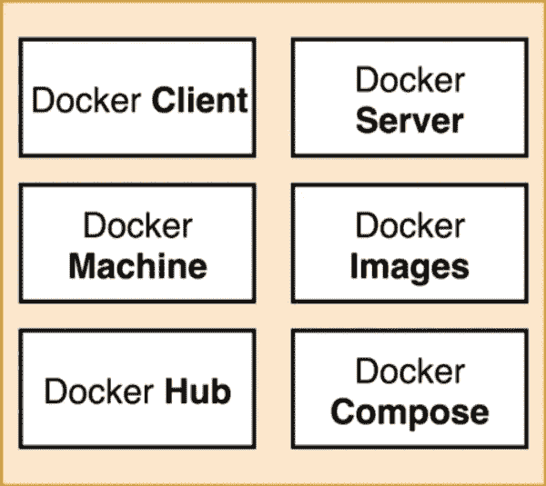
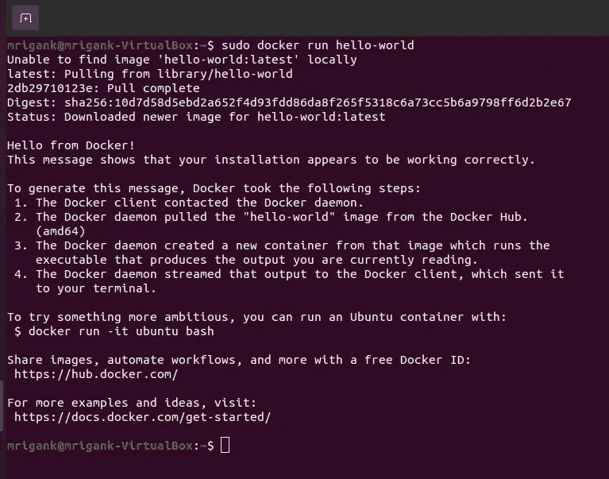
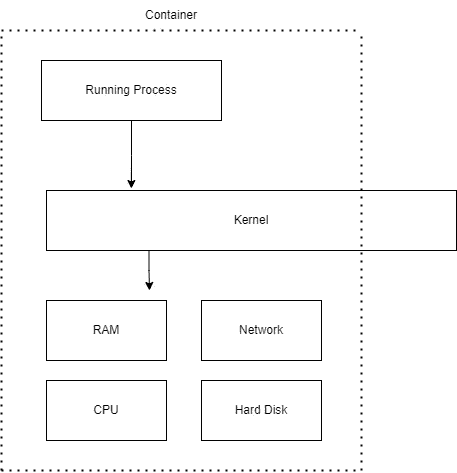
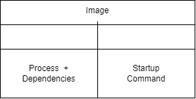
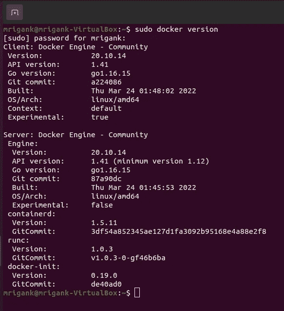

# Docker 系列第 1 部分

> 原文：<https://medium.com/codex/docker-series-part-1-88c649c532d2?source=collection_archive---------17----------------------->

# 为什么要用 docker？

在童年时代，我们每个人都在自己的电脑上安装了游戏和许多软件，然后面临一些依赖问题，就像我过去遇到的许多 DLL 文件丢失和许多其他问题。然后我们解决这个问题，重新运行程序安装，再次出现错误。经过这样 10 到 20 个周期，花了将近 1 到 2 个小时在安装过程中，我们终于可以享受它了。简言之，Docker 正试图解决这个问题。Docker 使安装和运行软件变得更早，而不用担心安装或依赖。

# Docker 是什么？

Docker 是一个围绕创建和运行容器的生态系统。Docker 生态系统包含 Docker CLI、Docker server、client 和 hub 等。

Docker 生态系统

要理解 Docker 容器的概念，我们首先要理解图像。当我们安装操作系统时，我们还会下载操作系统的映像文件，然后使用软件使其可引导。该软件会在该可引导设备中安装所有依赖项。同样，Docker 映像包含安装特定软件所需的所有依赖项和设置。简单地说，容器是 Docker 图像的运行实例。

# 在 Ubuntu 上安装 Docker

我们本地机器中的 Docker 主要自带 Docker 生态系统的两个必备部分: ***Docker CLI*** 和 ***Docker Server。*** 当我们在 Ubuntu 命令行的帮助下向 Docker 发出命令时，即 Docker 客户端或 CLI 发出命令，然后是 Docker 服务器，它起着核心作用，因为 Docker 服务器负责创建映像、管理服务器、上传映像和运行容器等。

 [## 在 Ubuntu 上安装 Docker 引擎

### Docker Desktop for Linux Docker Desktop 帮助您在 Mac 和 Windows 上轻松构建、共享和运行容器，就像您做…

docs.docker.com](https://docs.docker.com/engine/install/ubuntu/) 

# 运行第一幅图像

所以让我们更清楚地看看这一步发生了什么:

1.  Docket 客户端连接到 Docker 服务器，Docker 服务器在本地查找图像***“hello-world”***
2.  当在本地没有找到映像时，Docker 服务器连接到 Docker Hub，一个公开托管的映像的存储库，并找到和下载 ***hello-world*** 映像。
3.  获取图像并将其存储在本地的图像缓存中，然后创建图像的容器，该容器显示输出***“Hello from Docker！”*** 。

# 什么是容器？

容器是一组运行特定进程或进程组的资源。RAM、网络、CPU、硬盘等的一部分。，与容器对齐。

图像

docker 使用名称空间和控制组为每个进程的 RAM、CPU 等创建单独的空间。名称空间和控制组的概念是 linux 操作系统所固有的。那么 docker 是如何在 Windows 或者 MacOS 操作系统上运行的呢？实际上他们在幕后使用 linux 虚拟机。

点击此处进入 [***Docker Part 2 系列***](/codex/docker-series-part-2-13f85b9cd444) ***。***