# Docker 系列第 2 部分

> 原文：<https://medium.com/codex/docker-series-part-2-13f85b9cd444?source=collection_archive---------9----------------------->

[***Docker 系列第一部***](/codex/docker-series-part-1-88c649c532d2)

# Docker 命令

Docker run 命令用于从映像创建和运行容器。

*   ***docker 运行镜像名称***

该命令的一个细微变化是

*   ***docker 运行图像-名称覆盖-命令***

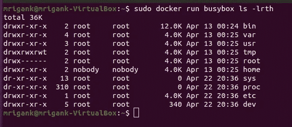

***注意:*** *被覆盖的命令应该是针对镜像的文件系统，否则会显示错误。我们不能在 hello-world 映像上运行 ls 或 Linux 命令，因为它只是一个用特定编程语言编写的程序。*

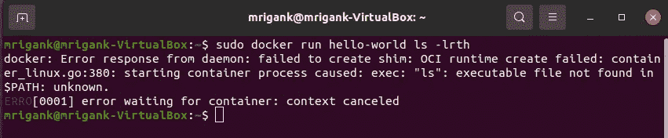

Docker run 命令是 docker create 和 docker start 两个命令的组合。

*   ***docker create image-name→***这将创建一个图像的容器并返回容器 Id。
*   ***docker start container Id***→这将启动具有给定容器 Id 的容器，但不会在屏幕上显示该容器生成的任何输出。

让我们更好地理解 docker 创建并从这个图像开始:

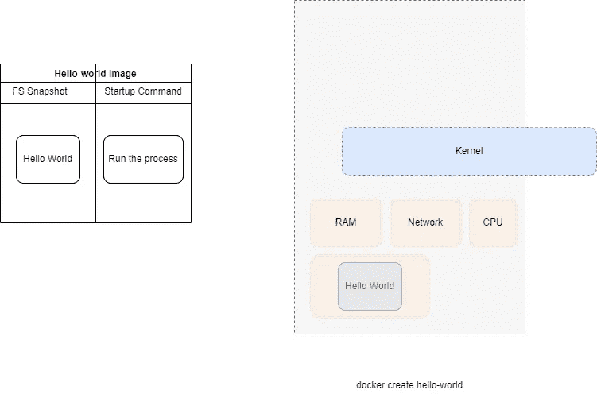

容器创建

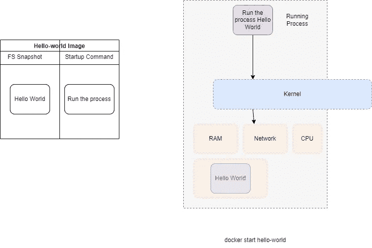

集装箱起点

*   ***docker start-a container Id→***这将使用给定的容器 Id 启动容器，并打印容器中运行映像的输出。

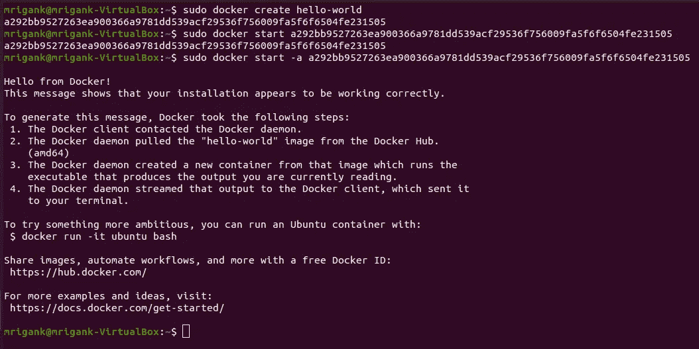

*   ***docker ps →*** 该命令列出了所有当前正在运行的容器

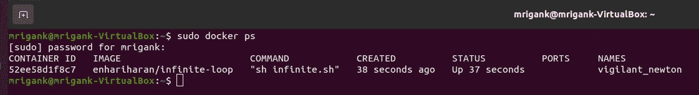

*   ***docker PS--all→***该命令列出了系统上所有最新的流道容器。

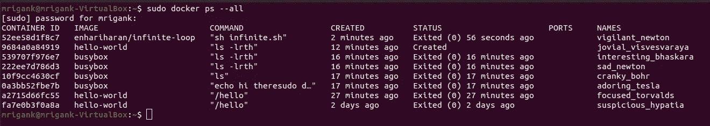

***注意→****PS 命令输出中最重要的部分是容器 Id，因为我们经常喜欢使用单个容器。*

退出的容器可以再次启动。这些容器没有被删除，它们仍然存在；退出的是这些容器中正在运行的进程。可以使用带有容器 Id 的 docker start 命令重新启动这些容器。

***注意:*** *当我们重新启动这些容器时，最初创建这些容器时使用的命令不能被覆盖。*

*   ***docker 系统 prune →*** 退出的容器也会占用磁盘空间，所以最好在没用的时候清理掉。该命令还将删除所有容器和本地构建的图像缓存。

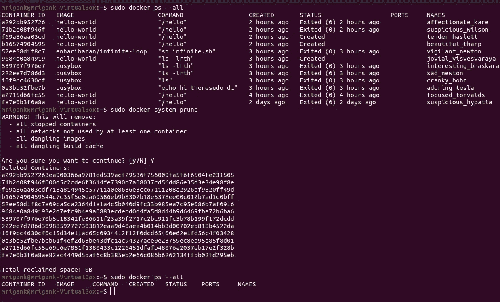

*   ***docker logs container id→***该命令将在启动后打印特定容器的所有日志。

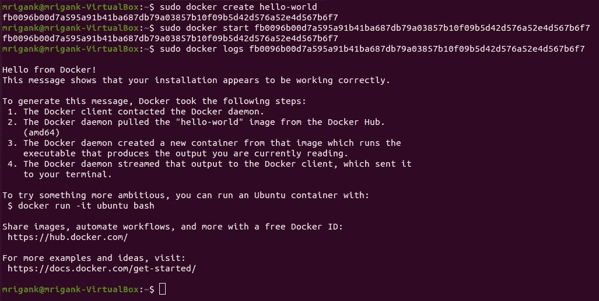

有两个命令用于停止容器

*   ***docker stop container id→***该命令通过给 docker 容器 10 秒钟的宽限期来停止它，在此期间它可以进行一些清理，保存一些文件，然后自行停止，但如果容器在 10 秒钟内没有停止，则会自动执行 docker kill 命令。这个命令向容器进程发送一个 SIGTERM 消息。
*   ***docker kill container id→***该命令向容器进程发送 SIGKILL 消息。这个命令立即停止 docker 容器。

有时我们想向一个容器发出多个命令。在处理 Redis 容器时，我们可能希望打开 Redis 服务器和 Redis CLI；然后，我们必须向正在运行的 Redis 容器发出多个命令。

*   ***docker exec-it container id 命令→*** 这个命令帮助我们在一个容器内运行多个命令。

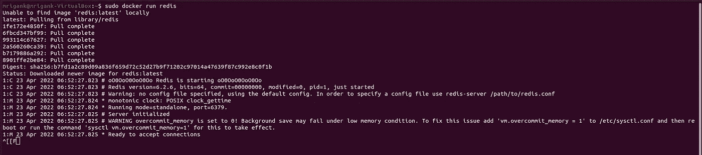

Redis 服务器

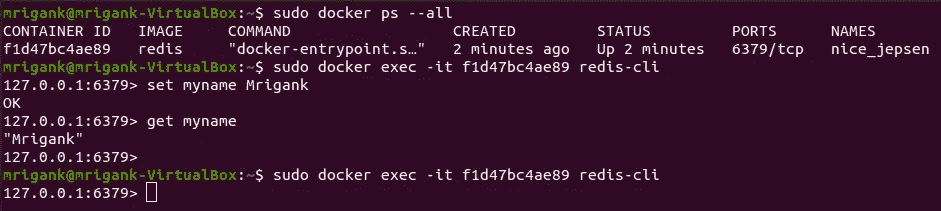

Redis-CLI

我们在上面的 docker exec 命令中使用了-it 标志；我们来了解一下它的用途。Linux 环境中的每个进程都有三个通道 STDIN 接受标准输入，STDOUT 和 STDERR 在屏幕上显示预期的输出。-it 标志是两个标志-i 和-t 的组合，用于 crux 中的 STDIN 和-t 的-i 标志以更格式化的方式显示输入的文本。

docker exec 是一个强大的命令，它的一个更常见、更强大的用途是打开容器的终端或外壳。

*   ***docker exec-it container id sh***

另一个具有相同效果的命令是:

*   **docker run-it image-name sh**