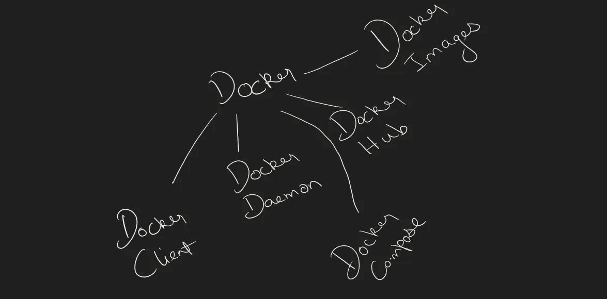

# 码头工人:开始

> 原文：<https://medium.com/codex/docker-the-beginning-4c452b769033?source=collection_archive---------7----------------------->


是的，它正在发生，Docker，你所需要的是启动容器和微服务，并使用最强大的工具。你听说过特洛伊古城吗？如果没有，你应该读一下，你的思想会像特洛伊一样被摧毁，但是当然不会有任何伤亡。

先说 Docker。等等！那是马林吗？不要！是鲸鱼吃了他，为什么它背上背着一堆东西？等等，那是莫比·迪克的画像吗？不，不是的。鲸鱼正在运送容器，这就是 docker，一个容器旋转工具。别问我为什么鲸鱼？我可以问你为什么麦当劳里的小丑，然后我们可以就这些来来回回。(附:如果你不知道马林，谷歌一下)

什么是容器？为了理解这一点，我们必须回过头来理解什么是虚拟机。虚拟机是一个系统，其中所有的部件和螺栓都是虚拟初始化的。我这么说是什么意思？通俗地说，这意味着它只是一台机器，它的存在只是为了让我们可以在一个系统上运行多个系统，而没有双重启动的麻烦。所以基本上，我可以在 windows 上运行 Linux，反之亦然。任何系统都可以通过这种方法运行。一些著名的虚拟机工具有 Hyper-V、VirtualBox、VMware 等等。那么现在，集装箱呢？这完全像一个虚拟机，但有所不同。因此，虚拟机的基础是我们定义它最初将获得的资源，在启动虚拟机后，您不能增加或减少这些资源。假设您想要一台 Ubuntu 虚拟机，您的基本计算机的硬件配置是 8GB RAM、英特尔 i5 第七代处理器 4 核和集成显卡，您的虚拟机中有 2 个内核和 4GB RAM，但最初您想要 4GB RAM，但现在工作量很小，您想要分配 2GB RAM，现在您必须关闭该计算机并重新分配资源，这是一个问题，如果您在该计算机上运行实时服务，我们无法总是重启设备并重新分配资源。

因此，容器在此提供了帮助，我们在传统虚拟机中预分配资源，我们不在容器中这样做，它只是直接从硬件中获取所需的资源，不多也不少。这些容器的基准是它们可以直接访问硬件，而在传统虚拟机中，我们必须先分配资源，然后虚拟机才能使用这些资源。Docker 是一套平台即服务(PAAS)模型，使用操作系统级虚拟化，而 VMware/VirtualBox 使用硬件级虚拟化

所以，现在我们已经弄清楚了什么是容器，让我们来看看 docker 的作用。Docker 运行这些容器，并为它们在您的系统上运行创建一个虚拟空间。它创建网络适配器和更多的东西来确保你的容器运行没有中断。现在 docker 又多了一个叫做 docker-compose 的部分，让我们把它留到下一次，不要担心，我会告诉你一切，让你开始使用 docker 和容器。



Docker 生态系统包含:

1.码头客户

2.Docker 守护程序/服务器

3.码头枢纽

4.Docker 图像

5.Docker 撰写

现在让我们稍微详细地讨论一下这些组件。

# Docker 守护进程

1.Docker 守护程序在主机操作系统上运行

2.它负责运行容器

3.Docker 守护进程可以与其他守护进程通信

# 码头客户

我们通过 docker 客户端与 docker 交互

1.docker 客户机使用命令和 REST API 与 Docker 守护进程通信

2.当客户机在 docker 客户机终端上运行任何服务器命令时，客户机终端将这些 docker 命令发送给 docker 守护程序。

# Docker 图像

Docker 映像是用于创建 docker 容器的只读二进制模板。创建 docker 图像有几种方法。

1.从 docker hub 获取图像

2.从 docker 文件创建图像

3.从现有的 docker 容器创建图像

# 码头枢纽

管理和存储 docker 映像的 Docker 注册表被称为 docker hub。有两种类型的注册表

1.公共登记处

2.私人登记处

名称本身就足以知道这些注册表代表什么。

# 码头工人的安装

Docker 是 Linux 的原生版本，我将带您完成 Linux 本身的安装过程。尽管你可以在任何你喜欢的操作系统上运行 Docker。

你要做的就是这个:

```
sudo apt-get updatesudo apt-get install docker docker-engine docker.io containerd runc
```

现在，如果您在此命令中遇到错误，请参考以下链接:

[在 Ubuntu | Docker 文档上安装 Docker 引擎](https://docs.docker.com/engine/install/ubuntu/)

现在 docker 已经设置好了，让我们开始吧

# Docker 命令

首先，让我们复习一些简单的命令

要查看系统中的 docker 图像

```
docker images
```

要从 docker hub 中查找图像

```
docker search <image name>
```

下载图像

```
docker pull <image name>
```

运行容器

```
docker run -it --name <container name> <image name> <entry-point>
```

让我们进一步讨论这个命令，把它分成几个部分

所以 docker run 很明显我们想要运行容器，在这之后-它在这里"-i "和"-t "是写在一起的独立命令，"-i "代表交互，"-t "代表打开终端然后来"--name "表示容器的名称，然后是图像名称。那么，什么是切入点呢？入口点是容器将从中启动的文件或二进制文件。假设你想从 bash 开始，那么我们就写/bin/bash，如果你有配置文件，那么你就把它添加到那里

完整的命令如下所示

```
docker run -it –name ilovedocker ubuntu /bin/bash
```

试试这个，很有趣

启动容器

```
docker start <container-name> OR <container-ID(first 4 characters)>
```

进入一个运行的容器

```
docker attach <container-name> OR <container-ID(first 4 characters)>
```

要查看所有容器

```
docker ps -a
```

若要仅查看运行中的容器

```
docker ps
```

停止集装箱

```
docker stop <container-name> OR <container-ID(first 4 characters)>
```

要删除容器

```
docker rm <container-name> OR <container-ID(first 4 characters)>
```

要删除图像

```
docker image rm <Image-name>
```

我认为这就足够了。尝试使用这些命令。

我很快会回来继续我的博客。

保持好奇！

谢了。