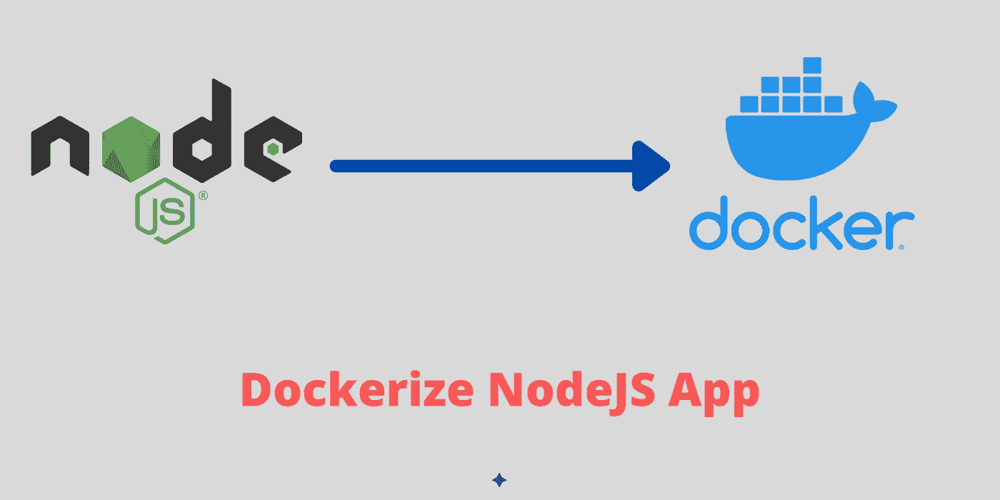

# Dockerfile 解释| Dockerize NodeJS 应用程序

> 原文：<https://medium.com/codex/dockerfile-explained-dockerize-nodejs-application-411dadbc3412?source=collection_archive---------1----------------------->

## 了解如何为自定义 NodeJS 应用程序创建 Docker 映像。

Dockerize NodeJS 应用

你开发了一个应用程序。并且您测试了应用程序。一切正常。现在您想要部署应用程序。您计划使用 Docker 部署应用程序，然后您必须将所有代码打包成 Docker 映像。您可以运行 Docker 映像…