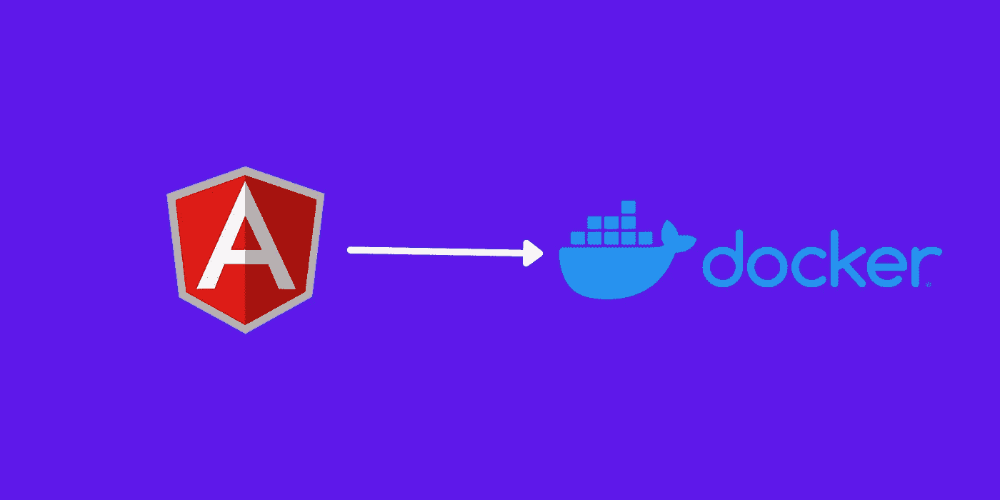

# 对接角度应用

> 原文：<https://medium.com/codex/dockerize-angular-application-69e7503d1816?source=collection_archive---------0----------------------->

了解如何使用 Dockerfile 为您的 Angular 应用程序创建 Docker 映像，并将 Docker 映像推送到 Docker Hub。

对接角度应用

Angular 是一个非常流行的 JavaScript 框架，用于设计和开发 web 应用程序。Angular 由谷歌团队开发和维护。许多组织在他们的网络应用中使用 Angular。Angular 应用是如何部署在云服务器上的？。通常，我们生成…