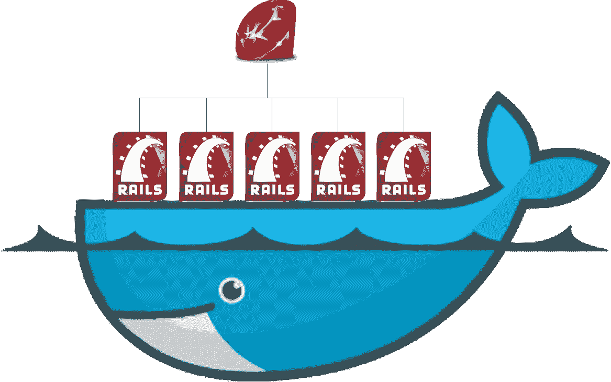
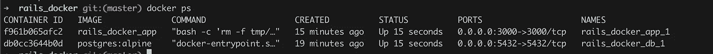
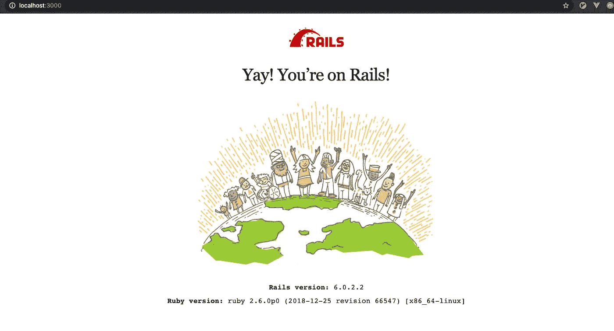
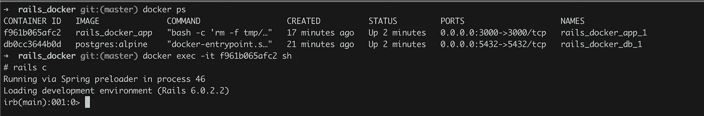

# 将您的 Ruby on Rails 应用程序归档

> 原文：<https://medium.com/codex/dockerize-ruby-on-rails-application-3f4c5b345862?source=collection_archive---------3----------------------->

## [法典](http://medium.com/codex)



# Docker 有什么用，为什么有用？

Docker 允许你将一个应用或服务及其所有的依赖项打包成一个标准化的单元。该单元通常被标记为 Docker 图像。

本质上，Docker 允许你在主机操作系统(Ubuntu，Mac，Windows)上安装容器，而不需要进行复杂的配置。

# 安装 Docker

从 https://www.docker.com/[下载并安装 Docker](https://www.docker.com/)

# 创建 Rails 应用程序

```
rails new rails_docker -d postgresql
cd rails_docker
bundle install
rails server
```

目前，当我们访问 localhost:3000 时，它是从我们的本地机器上运行的，而不是从 docker 映像上运行的。

# 为导轨设置 Docker

在项目的根目录下创建一个 Dockerfile，并添加以下内容。

注意:我目前使用的是 Rails 6.0.2.2 和 Ruby 2.6.0。

```
FROM ruby:2.6.0-slimRUN apt-get update -qq \
  && apt-get install -y \
  # Needed for certain gems
  build-essential \
  # Needed for postgres gem
  libpq-dev \
  # Others
  nodejs \
  vim-tiny \   
  # The following are used to trim down the size of the image by removing unneeded data
  && apt-get clean autoclean \
  && apt-get autoremove -y \
  && rm -rf \
  /var/lib/apt \
  /var/lib/dpkg \
  /var/lib/cache \
  /var/lib/log# Changes localtime to Singapore
RUN cp /usr/share/zoneinfo/Asia/Singapore /etc/localtimeRUN mkdir /rails_dockerWORKDIR /rails_dockerCOPY Gemfile /rails_docker/GemfileCOPY Gemfile.lock /rails_docker/Gemfile.lockRUN bundle installADD . /rails_dockerCMD bash -c "rm -f tmp/pids/server.pid && rails s -p 3000 -b '0.0.0.0'"
```

Dockerfile 是一个人类可读的 shell 脚本，它执行以下操作:

*   从 [DockerHub](https://hub.docker.com/) 获取 ruby 2.6.0-slim，这是基本映像，它有一个轻量级的操作系统叫做 slim with ruby 2.6.0
*   运行依赖关系
*   将图像时区更改为新加坡(或根据您需要的时区进行更改)
*   在映像中创建一个 rails_docker 目录，并将其设置为工作目录
*   将项目中的 Gemfile 和 Gemfile.lock 复制到 rails_docker 目录映像中
*   在映像中运行捆绑包安装
*   在 localhost 中使用 shell 命令运行 rails 应用程序:3000

为了运行这些命令，请使用

```
docker build .
```

构建过程完成后，运行“docker images”来查看您刚刚构建的 docker 映像列表。

来运行 Rails 应用程序。标记构建的 docker 映像，并在 localhost:3000 中运行它

```
docker tag <image-id> rails_docker:v1.0.0docker run -it -p 3000:3000 rails_docker:v1.0.0 bundle exec rails server -b 0.0.0.0 -p 3000
```

# 使用 docker-compose 运行 Rails 应用程序

我们现在在 Docker 上有了一个运行中的 Ruby on Rails 应用程序。

我们可能还想使用其他服务，如 Postgres、Redis、Sidekiq。为此，我们可以使用 [docker-compose](https://docs.docker.com/compose/)

在我们项目的根目录下创建一个**docker-compose . yml***。*

```
*version: '3'
services:
 db:
  image: postgres:alpine
  restart: always
  volumes:
   - ./tmp/db:/var/lib/postgresql/data
  ports:
    - "5432:5432" app:
  build: .
  restart: always
  command: bash -c "rm -f tmp/pids/server.pid && rails s -p 3000 -b '0.0.0.0'"
  volumes:
   - .:/rails_docker
   - bundle_path:/bundle
  ports:
   - "3000:3000"
  depends_on:
   - dbvolumes:
  bundle_path:*
```

*在这个配置文件中。我们定义了两种服务:*

*   *Postgres 是我们的数据库。它目前使用的图像来自 DockerHub。它目前运行在主机操作系统的端口 5432 上*
*   *依赖于数据库并在端口 3000 上运行的 Rails 应用程序*

*我们还为 always 添加了重启标志，这样即使我们重启了主机操作系统，docker 映像仍将运行。*

*运行`docker-compose up`后，使用`docker ps`列出所有正在运行的 docker 图像*

****

*使用 http:localhost:3000 访问 Rails 应用程序*

*我们还需要改变我们的`database.yml`来连接我们的 postgres 形象。*

```
*default: &default
  adapter: postgresql
  encoding: unicode
  pool: <%= ENV.fetch("RAILS_MAX_THREADS")    %>development:
  <<: *default
  database: rails_docker_development
  host: db
  username: postgres
  port: 5432*
```

*主机现在指向`db`,因为我们的 postgres 运行在 db 服务中*

*我们还需要手动运行`rake db:create db:migrate`,使用*

```
*docker-compose run app rake db:create*
```

*您也可以使用这个命令通过修改最后一部分来捆绑安装。*

*使用`docker-compose up`运行应用程序*

*现在，您应该能够在 localhost:3000 中看到 rails 应用程序了*

# *运行 Rails 控制台*

*作为我们开发的一部分，通过`rails console`访问我们的数据库也很重要*

*为此，运行`docker ps`并使用`docker exec -it <container_id> sh`访问应用程序图像*

*这将访问工作目录。您也可以使用`ls.`列出所有文件夹*

*使用`rails console`访问镜像中的 Rails 控制台*

**

# *将图像分发到 DockerHub*

*在 DockerHub 上发布图片。运行以下命令*

*   *在 Dockerhub 中创建帐户*
*   *创建仓库*
*   *在本地机器上运行`docker build -t <username>/<container_image> .`*
*   *使用`docker push <username>/<container_name>`将其推送到 Dockerhub Repo*
*   *要提取此图像，请运行` docker pull <username>/<container_name></container_name></username>*