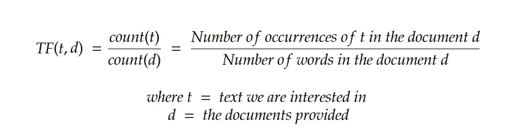

# 使用 TF-IDF 的文档索引

> 原文：<https://medium.com/codex/document-indexing-using-tf-idf-189afd04a9fc?source=collection_archive---------1----------------------->

TF-IDF 代表词频逆文档频率，它是一个词在一系列文档中出现频率的度量。这是一个理解和实现都非常简单的概念。其使用案例包括:用于文本分类、书写中的错误检测、文档排序、搜索引擎/信息检索以及诸如 ATS 系统中的关键字匹配的 NLP 任务的加权。

TF-IDF 中有两个元素


通过利用 TF-IDF，出现最频繁的单词将比那些出现频率较低或根本不出现的单词排名更高。由此出发，共享具有相似频率的单词的文档可以被认为是彼此相似的，或者可以包含相似类型的内容。

重要的是要记住，TF-IDF 应该是文本预处理的辅助工具。像其他类型的数据一样，在进行任何处理之前，重要的是将你的文本删除或转换成更实用、更真实的形式。文本内处理我们通过以下方式实现:

**删除停用词和标点符号**

英语中的停用词由情态动词、代词、介词和某些形容词组成。这些停用词和标点符号不会增加文档上下文的价值，因此会导致确定文档的真实相似性的问题。例如，如果两个文档中出现相同频率的昏迷、问题和代词“I ”,那么这两个文档会相似吗？

根据所提供的信息，我真的无法判断，这就是我在前面的声明中的意思，“这些停用词和标点符号不会给文档的上下文增加价值。”我们可以把去除这些停用词比作去除其他类型数据中的噪声。

**词干**

在英语中，大多数单词都有一个词根或词根，它们是从这个词根或词根引申出来的，不同的意思是根据时态和上下文来确定的。词干提取的目的只是让动词和形容词回到它们原来的词干形式。这样做的最终目标是在将要处理的所有文档中创建一种统一感。

**计算 TF**



**计算 IDF**


**计算 TF-IDF**


让我们看一个实际的例子，假设我们有以下文档:


正如我们前面讨论的，我们需要对数据进行一些预处理。在我们的例子中，我们做了以下工作:删除停用词，删除标点符号，并将所有单词转换为小写。


我们在所有文档中使用的唯一单词是:名称、naftal、汽车、现代、驾驶、索纳塔和车型。让我们确定在不同文档中出现的频率。


让我们将这些行的数据标准化，使每个文档的数据总和为 1，从而生成最终的 TF 表。


现在让我们来计算 IDF 值，记住我们需要做的就是找到文档数量与单词出现总数之比的对数。让我们以“名字”这个词为例。它只在文档一中出现过一次，而没有在其他三个文档中出现过。其 IDF 将是:


其他单词的计算 IDF 值如下:


最终的 TF-IDF 表如下


请注意，上表代表了我们的预期，更频繁出现的单词在它们出现的文档中具有更高的 TF-IDF 值。

使用如下所示的 Sklearn 库，可以在 Python 中轻松完成这个过程。

```
**from** **sklearn.feature_extraction.text** **import** TfidfVectorizer# Assume there are n documents each with some text. Corpus is a list that holds the text from each of these documents.The Vectorizer will generate a matrix similar to the one above.corpus = [
    Document 1 Text,
    Document 2 Text,
    Document 3 Text,
    ....
    Document n Text
]
vectorizer = TfidfVectorizer()
```

我希望这篇文章有助于提供更多关于什么是 TF-IDF 以及如何实现它的背景信息。