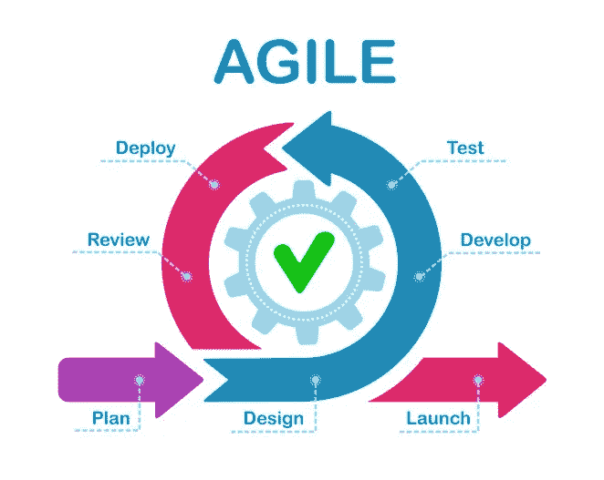
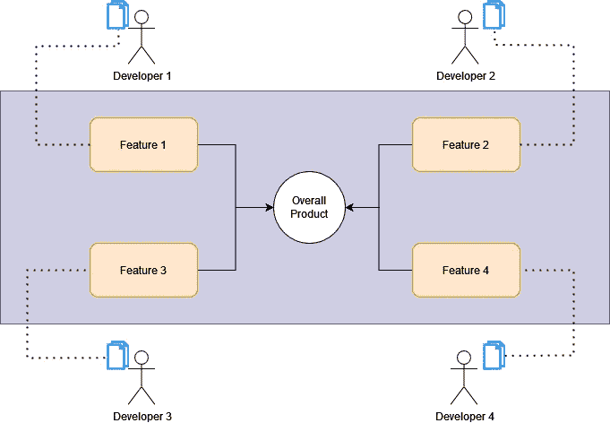

# 用文档建立团队

> 原文：<https://medium.com/codex/documentation-how-to-build-a-team-1d698ced4a36?source=collection_archive---------16----------------------->

## 技术文献实用指南

建立高效团队

> 本文旨在概述一组原则，如果遵循这些原则，将会把质量文档与您的团队现有的工作流联系起来，从而创建可伸缩的软件、专业的产品和高效的软件工程师。

# 介绍

来自全球、不同行业、不同学科的软件工程师有不同的工作描述和工作流程——但是几乎一致分享一个共同的痛苦:缺乏高质量的文档。本文旨在概述一组原则，如果遵循这些原则，将会把质量文档与您的团队现有的工作流联系起来，从而创建可伸缩的软件、专业的产品和高效的软件工程师。

# 为什么是文档？

从根本上说，当项目团队的设计目标被清楚地陈述时，他们会更加专注。例如，咨询行业的软件工程师经常被丢到一个现有的项目中。无论咨询师的经验如何，在这个过程中都有一个学习曲线。当文档库建立后，新加入的成员可以很容易地消化现有的代码库，从而理解正在进行的过程。

创作文档本身是一项乏味的任务。作为作者写文档没有立竿见影的好处，何必呢？文档往往需要大量的前期工作，直到软件生命周期的后期才能提供明显的好处。可以认为是一种投资。想想项目会支持多久:1 年？5 年？10 年？现在想一想，一个代码特性的作者可能要解释多少次那个特性在这段时间里是如何工作的。作为文档的作者，我们只需编写一次文档，但在整个生命周期中，它可能会被阅读数百次或数千次。一些好处如下:

*   **它有助于制定一个 API** :如果你不能解释它，你可能没有优化设计它。
*   **它提供了一个历史记录**:通过一个文档，人们可以轻松地构建 1-2 年前编写的代码，而不用担心破坏下游的应用程序。
*   一个更专业的最终产品:一个拥有良好文档的产品通常是一个很好的产品维护的指示器。
*   **会提示更少的问题**。如果你必须不止一次地解释某件事，记录下这个过程通常是有意义的。

# 敏捷的神话

在[敏捷宣言](https://agilemanifesto.org/)中，核心原则之一被明确表述为:

> 综合文档之上的工作软件。

多年来，这一宣言引发了有趣的解读。有些甚至不需要文档。最初的作者澄清说，他们的原则意味着“也就是说，虽然右边的项目有价值，但我们更重视左边的项目。”简而言之，与其花时间在过于详细的前期文档上，不如“去做”。

**图 1** 敏捷生命周期:([https://www . techopedia . com/definition/22193/software-development-life-cycle-SDLC](https://www.techopedia.com/definition/22193/software-development-life-cycle-sdlc))

敏捷方法意味着“文档不重要”，这是一个神话。敏捷是一种使项目更加动态的哲学，因为项目在一段时间内不可避免地会改变需求范围。敏捷开发方法中没有什么固有的东西阻止我们创建项目所需的那么多文档。敏捷建议文档应该“足够好”,而不是浪费时间。**为了不浪费时间，问下面一组基本问题:**

*   需要这份文件做什么？
*   文档的目标受众是谁？
*   目标受众将如何使用这些文档？作为参考？作为手册？
*   生产需要多长时间？

# 作为代码的文档

在创作软件产品时，有个看板*(吉拉有人吗？)*用于概述任务，将所有权分配给开发者。这个过程是一个可靠的最佳软件生产方法。但是文档呢？团队中谁负责在这个工作流程中生成文档:业务分析师、技术主管、经理？文档应该被视为代码——因此——由*软件工程师*与代码一起生成。

尽管技术领导和经理可以自己制作文档，但是如果更多的开发人员加入到项目中，这种策略就不能很好地扩展。业务分析师可以随着项目进行扩展，但是可能很难准确地描述随着每个特性变化而发生的技术过程。这让工程师们自己编写文档。

回到原点，Kan-ban 板用于将所有权分配给正在创建的任务。**需要在开发人员之间明确说明相同的文档分布，以防止文档变得陈旧和难以维护**。

***图 2*** *开发者分发文档所有权*

所有权的清晰性允许开发人员将文档合并到他们现有的工作流中，同时防止重复的文档。文档通常与代码紧密耦合，因此本质上应该被视为代码。这意味着它应该:

*   具有对称的结构
*   置于源代码管理之下
*   拥有明确的所有权
*   定期评估(或以某种方式测试)

# 行业难题

当项目最初开始时，文件的跟踪是无缝和可管理的。文档被添加到 Microsoft Teams 文件夹结构中，附加到吉拉的用户故事中，或者托管在其他第三方应用程序上。随着时间的推移，文件夹结构变得更加复杂。人们离开了。文件变得过时或丢失。然后，新的开发人员加入到一个项目中，并且永远不会被呈现这些丢失的文档，或者不能确认呈现给他们的文档是否过时或准确。不久之后，sprint burn down 图表变得越来越停滞不前，sprint 目标无法实现。糟糕的文档库会导致低效的入职流程、利益相关方之间的重复对话以及“一人知晓一切”的效果。

显然，这种情况不会发生在每个项目上，但确实会发生在某些项目上。如何缓解这个问题？通过在 **Markdown(.md)** 。近年来，Markdown 已经成为编写技术文档的首选方式。用 markdown 编写的文档可以上传到一个源代码控制库 *(github，azure devops)* ，是轻量级的，可以轻松编辑，最重要的是一致性。当文档需要修改时，协作随着缺陷的出现而更加明显。总的来说，在源代码控制中维护文档的过程为开发人员提供了他们已经习惯的类似体验。这种技术利用现有的工作流，而不是试图创建一个新的工作流。

# 结论

本实用指南的简要总结是通过演示以下内容来提高对文档的认识:

*   文档的好处
*   产生有意义文件的步骤
*   灌输所有权的策略
*   维护文档的工具

文档是容易查看的东西。客户最终想要的是高质量的产品，而不是一堆文档。优质产品不会凭空出现，而是一个旅程。通向高质量产品的旅程始于质量团队，它可以建立在文档的基础上。

# 参考

本文的灵感来自 Titus Winters、Tom Manshreck 和 Hyrum Wright 的著作:[*Google 的软件工程，从超时编程中吸取的教训。*](https://read.amazon.com/kp/embed?asin=B0859PF5HB&preview=newtab&linkCode=kpe&ref_=cm_sw_r_kb_dp_90ZSH2FE9Y3XQHFSVW20)