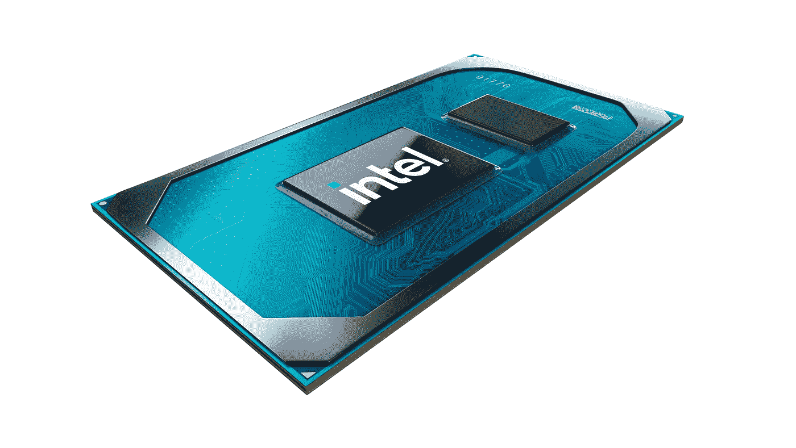
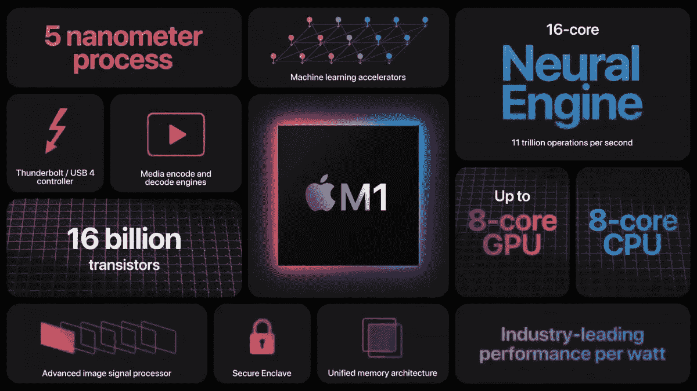
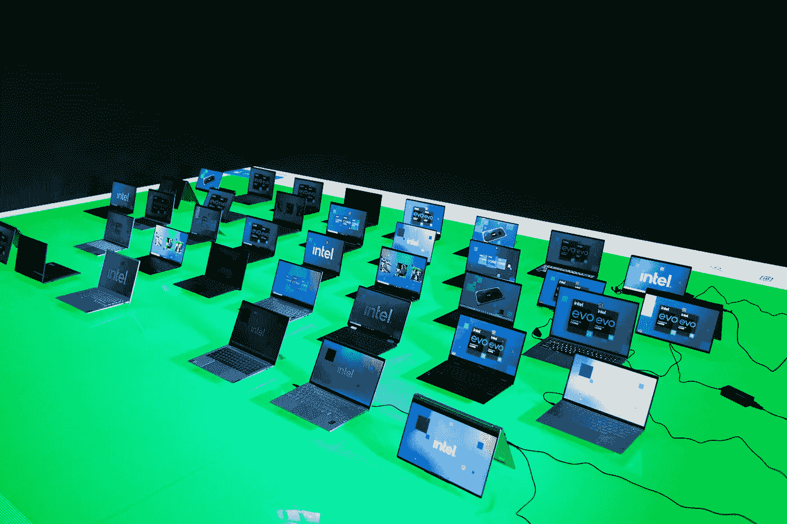

# 新领导层是否应该改变投资英特尔的想法？

> 原文：<https://medium.com/codex/does-a-new-ceo-give-intel-a-fighting-chance-560cbaf1ef51?source=collection_archive---------7----------------------->

## [法典](/)

## 市场对此可能是错误的。

对于科技爱好者来说，这是相当不错的一周，英特尔、AMD 和 Nvidia 在今年的[电子消费展(CES)](https://www.youtube.com/watch?v=CGzINV4MXrQ) 上发布了几款新产品。但真正推动市场的并不是任何科技公告。

上周，我写了一篇文章，讲述了英特尔如何无法与来自 AMD、高通以及最重要的苹果公司的竞争冲击相抗衡。在过去的几年里，英特尔的 10 纳米芯片的推出已经推迟了几次，这在很大程度上是由于他们的制造工艺的问题[。当他们今年终于开始推出 10 纳米芯片时，给消费者带来的额外价值充其量只是增量。](https://realmoney.thestreet.com/investing/technology/intel-s-10-nanometer-challenges-spell-a-tougher-fight-against-amd-and-others-15478453)

与此同时，AMD 已经以较低的价格推出了或多或少与英特尔不相上下的台式机处理器，并且他们在今年的 CES 上宣布的笔记本电脑处理器也在效仿。

更糟糕的是，苹果厌倦了英特尔的不断拖延，早在 10 月份就宣布他们将在 2022 年前完全淘汰笔记本电脑中的英特尔处理器。两个月前，他们展示了自己的 M1 芯片，这是他们强大的 iPhone 和 iPad 芯片的变体，经过修改可以在 Mac 上运行，在马力和功耗方面带来了前所未有的好处。

# 大变动。

随着几个新的竞争对手紧随其后，英特尔的股票在过去的一年中表现不佳。2020 年 12 月，该指数再次跌至疫情低点，而该行业的其他股票几乎每个月都创出新高。

一段时间以来，变革的必要性已经很明显了。早在 12 月份，投资者就开始给英特尔写公开信，要求其外包制造业务。英特尔是否会听取还有待观察，肯定有传言证实了这一点，但潜在的好处还不清楚。

英特尔似乎也明显需要变革，本周他们宣布了领导层的变动。他们的首席执行官将由一名工程师和 VMware Pat 的前首席执行官取代。盖尔辛格。

这次领导层变动无疑是朝着正确方向迈出的一步，但这真的足以拯救一艘正在下沉的船吗？市场显然是这么认为的。消息公布后，英特尔的股票上涨了 10%，AMD 的股票下跌了 5%。

# 够不够？

不管市场怎么想，领导层的变动不会改变竞争的状态。芯片行业在很大程度上已经向前发展，英特尔被甩在了后面。

TSMC 和三星已经推进到 5 纳米，到明年将达到 4-3 纳米，而英特尔仍在 10 纳米。但是问题不仅仅是因为他们在纳米竞赛中处于最后。这是因为该领域正在看到超越纳米尺寸的令人难以置信的进步，而英特尔却不见踪影。

抛开英特尔完全错过移动芯片这条船让 ARM 在性能和能耗上超越 x86 芯片的事实来看。过去几年里，我们在芯片技术上看到的许多进步都是因为架构的变化。ARM 芯片现在配备了差异化和专业化的高性能和高能效内核、集成显卡、统一 RAM 以及专门的神经引擎。苹果的 ARM 处理器为 Mac 提供了英特尔通过年复一年的增量改进永远无法提供的性能和能耗。

不过最重要的一点是，自从 iPhone 4 中使用的 A4 芯片发布以来，苹果已经使用这些芯片十年了。他们从一开始就围绕这些芯片制造设备，每一次迭代都增加集成度。即使英特尔现在进入 ARM 竞争芯片，他们也要花上几年的时间来设计、制造芯片，最重要的是获得 Windows 的支持。与此同时，在库比蒂诺，一切都是内部设计的，芯片、操作系统和电脑。对于英特尔来说，太多的事情需要跨不同的公司同时到位，这使得这项任务几乎不可能完成。

最后，我认为高通更适合满足 Windows 电脑对 ARM 处理器的需求，我在一周前的文章中对此做了更多阐述。

 [## 微软设计他们自己的芯片将带来芯片行业有史以来最大的变革！

### 英特尔即将被废黜。

medium.com](/swlh/microsoft-designing-their-own-chips-will-bring-the-chip-industrys-biggest-shake-up-ever-66fa0d48aec5) 

在我看来，在今年的 [CES 上，英特尔再次表现不佳](https://www.youtube.com/watch?v=9ffyhJ85VMM)。他们宣布了几款新的处理器，带来了大部分的渐进式改进。AMD 的改进很难跟上，AMD 每年都在飞跃，所有这些都处于未来几年将充斥笔记本电脑市场的潜在革命性新一波 ARM 芯片的边缘。

# TL；速度三角形定位法(dead reckoning)

到目前为止，我不认为仅仅是领导层的变动就足以证明英特尔股票在过去一周的上涨是合理的，除非该公司宣布了一款在方向上有一些根本性变化的产品。他们需要的不一定是能够与 AMD 竞争的产品，而是传统上用于手机的 ARM 处理器的快速崛起，以及电脑的广泛采用。