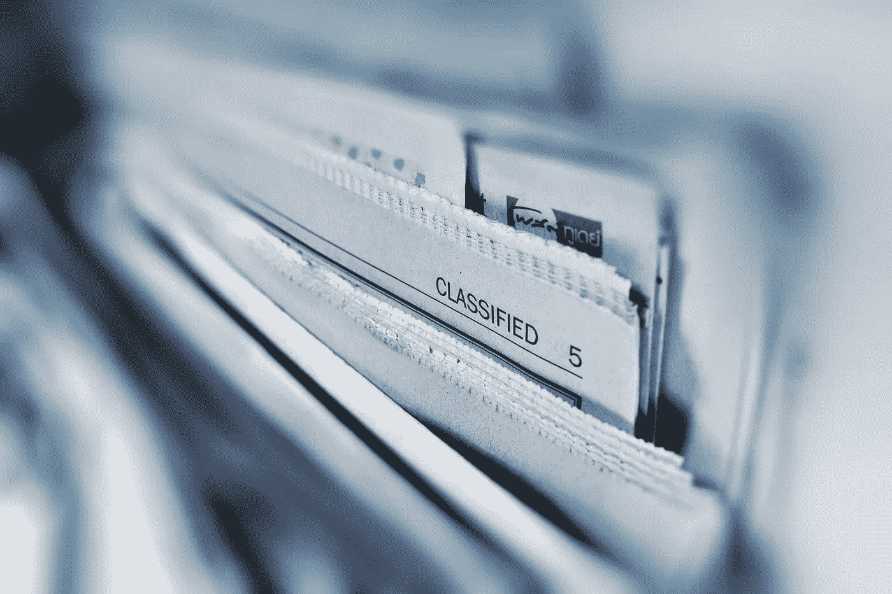

# 苹果重视你的隐私吗？

> 原文：<https://medium.com/codex/does-apple-value-your-privacy-8c31bbf604b4?source=collection_archive---------22----------------------->

## 数据保护墙背后的故事

由 [Unsplash](https://unsplash.com/photos/bSlHKWxxXak) 上的[absolute vision](https://unsplash.com/@freegraphictoday)拍摄

你听说过自由手机吗？如果你没有，那也没关系，因为这是一个骗局。该产品是一场灾难，但它有一个迷人的故事。故事开始于国会大厦外，当时唐纳德·特朗普的支持者转向暴力，以推翻选举结果。当时，特朗普的支持者交流并鼓励其他人加入他们…