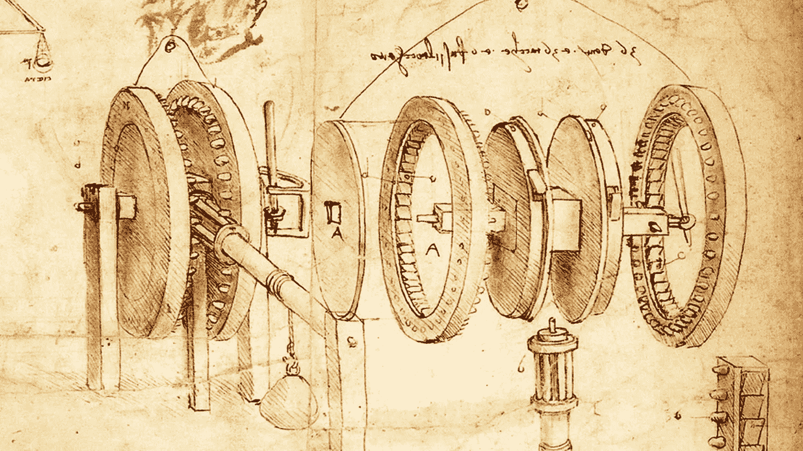

# 艺术、奢侈和无聊的乐趣能推动创新吗？

> 原文：<https://medium.com/codex/does-art-luxury-and-frivolous-fun-drive-innovation-cae918fbdbde?source=collection_archive---------9----------------------->

## 创新的本质是什么？看似漫无目的、轻佻的活动能有效用吗？

我们正处于机器学习革命的中期。在过去的几天里，我一直在开发一个使用语音识别的应用程序。我不禁被这种能力所震撼…