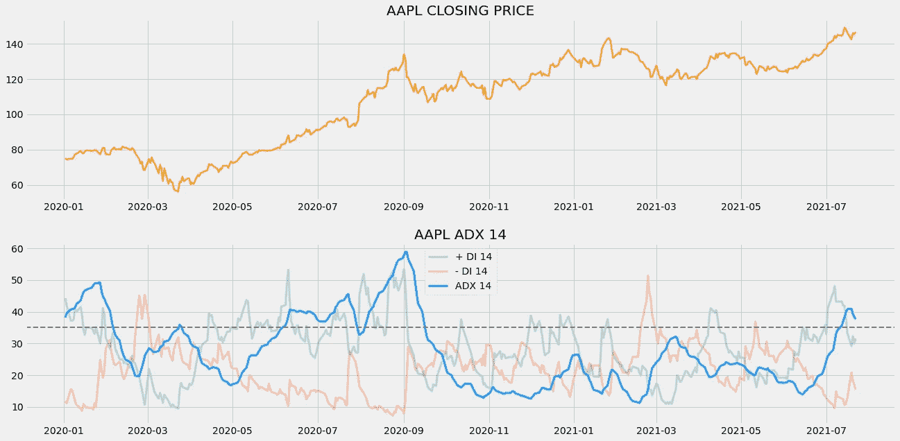
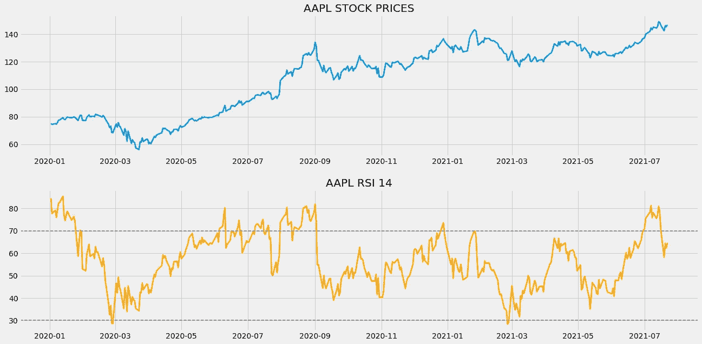
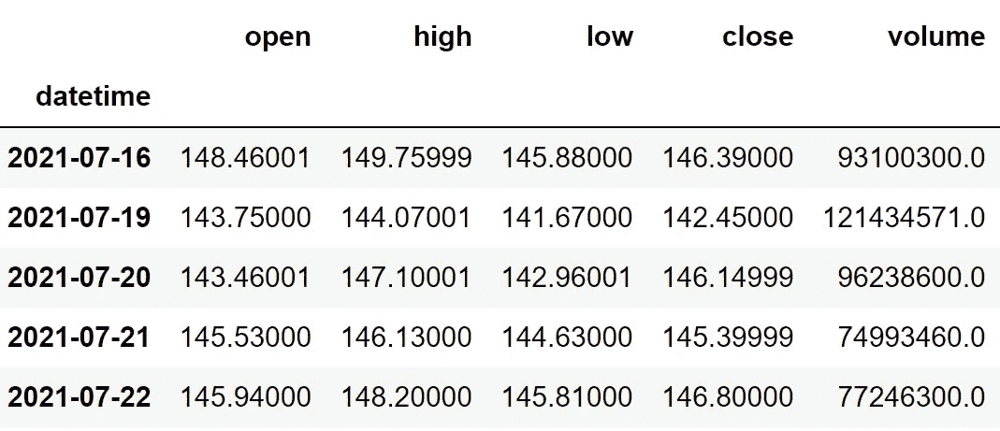

# 结合 ADX 和 RSI 是否创造了更好的盈利交易策略？

> 原文：<https://medium.com/codex/does-combining-adx-and-rsi-create-a-better-profitable-trading-strategy-125a90c36ac?source=collection_archive---------2----------------------->

## 让我们用 Python 来找出答案吧


照片由[萨贾德·诺里](https://unsplash.com/@sajad_sqs9966b?utm_source=medium&utm_medium=referral)在 [Unsplash](https://unsplash.com?utm_source=medium&utm_medium=referral) 上拍摄

技术指标的使用从来没有随着时间的推移而下降，但利用这些指标盈利是不确定的，因为它的一个主要缺点是揭示错误的交易信号。这比你想象的要糟糕得多，因为你可能会因为跟随这些信号而在错误的时间进入市场，并面临巨大的损失。但这并不意味着技术指标已经过时。我们只需要改变我们使用它的方式。减少错误信号数量的最好方法之一是在交易策略中增加一个与另一个指标相反的指标。

在本文中，我们将使用两个著名的技术指标，即平均方向指数(ADX)和相对强度指数(RSI)来建立一个交易策略，并使用 Python 在真实市场数据上测试它，以查看它是否能获得大量利润。事不宜迟，让我们进入文章吧！

在继续之前，如果你想在没有任何代码的情况下回溯测试你的交易策略，有一个解决方案。这是[的后验区](https://www.backtestzone.com/)。这是一个平台，可以免费对不同类型的可交易资产的任意数量的交易策略进行回溯测试，无需编码。点击这里的链接，你可以马上使用这个工具:[https://www.backtestzone.com/](https://www.backtestzone.com/)

# 平均方向指数

ADX 是一种技术指标，广泛用于衡量市场趋势的强度。现在，ADX 并不衡量趋势的方向，无论是看涨还是看跌，而只是代表趋势有多强。所以，为了确定趋势的方向，ADX 结合了一个正方向指数(+DI)和一个负方向指数(-DI)。顾名思义，+DI 衡量的是市场的看涨或正趋势，同样地，-DI 衡量的是市场的看跌或负趋势。所有组件的值都限制在 0 到 100 之间，因此充当振荡器。ADX 的传统设置是 14 作为回看周期。

为了计算 ADX 的值，以 14 为回看周期，首先确定正向(+DM)和负向(-DM)运动。通过查找当前高点和前一个高点之间的差值来计算+DM，类似地，通过查找前一个低点和当前低点之间的差值来计算-DM。它可以表示如下:

```
**+DM** = **CURRENT HIGH** - **PREVIOUS HIGH**
**-DM** = **PREVIOUS LOW** - **CURRENT LOW**
```

然后，计算以 14 为回望期的 ATR。现在，使用计算的方向移动和 ATR 值，计算正方向指数(+DI)和负方向指数(-DI)。要确定+DI 的值，将正向移动(+DM)的指数移动平均线(EMA)以 14 作为回望期，所得值除以之前计算的 14 天 ATR，然后乘以 100。这同样适用于确定-DI，但不是采用+DM 的 14 日均线，而是考虑了负向移动(-DM)。计算+DI 和-DI 的公式可表示如下:

```
**+DI** **14** = **100** * [ **EMA 14** ( **+DM** ) / **ATR 14** ]
**-DI** **14** = **100** * [ **EMA 14** ( **-DM** ) / **ATR 14** ]
```

下一步是使用+ DI 和-DI 来计算方向指数。它可以通过将+ DI 和-DI 之差的绝对值除以+DI 和-DI 之和的绝对值乘以 100 来确定。计算方向指数的公式可表示如下:

```
**DI 14** = | (**+DI 14**) - (**-DI 14**) | / | (**+DI 14**) + (**-DI 14**) |  * **100**
```

最后一步是利用确定的方向指数值计算 ADX 本身。ADX 的计算方法是，将之前的方向索引值乘以 13(回望周期-1)，再加上方向索引，然后乘以 100。计算 ADX 值的公式可表示如下:

```
**ADX 14** = [ ( **PREV DI 14** * **13** ) + **DI 14** ] * **100**
```

ADX 不能照原样使用，而是需要用该指标的创始人韦尔斯·怀尔德(Welles Wilder)自己创建的定制移动平均线来平滑。这就是计算 ADX 的值的整个过程。现在，让我们分析一张图表，其中苹果的股价与其 ADX 14 读数一起绘制。



作者图片

上面的图表分为两个面板:上面的面板显示苹果的收盘价，下面的面板显示 ADX 的成分。与组件一起，绘制了一条灰色虚线，它只是在 35°水平绘制的 ADX 的阈值。正如我之前所说，ADX 并不跟踪趋势的方向，而是跟踪趋势的强度，在图表中可以多次看到，当市场显示出强劲的趋势(上涨或下跌)时，ADX 线会上升，当市场必然会盘整时，ADX 线会下降。这与两条方向指标线的情况相同。我们可以看到，当市场表现出强劲的上升趋势时,+DI 线上升，在下降趋势时下降，反之亦然。

ADX 不仅用于量化市场趋势的强度，而且成为识别区间市场(股票在特定的高低水平之间来回移动，显示零动量的市场)的便捷工具。当两条线越来越近时，市场就开始波动，同样，两条线之间的距离越宽，市场就越趋向于波动。那些第一次接触 ADX 图表的人可能会感到困惑，因为每条线的运动与市场的运动是成正比的。

# 相对强度指数

在继续之前，让我们先了解一下在股票交易领域，振荡指标意味着什么。振荡指标是一种技术工具，它构建了一个基于趋势的指标，其值介于高波段和低波段之间。交易者使用这些波段和构建的基于趋势的指标来识别市场状态，进行潜在的买卖交易。同样，振荡指标被广泛用于短期交易，但是在长期投资中没有限制。

由 j . Welles Wilder(ADX too 的创始人)于 1978 年创立并发展，相对强弱指数是一种动量振荡器，交易者使用它来识别市场是处于超买还是超卖状态。在继续之前，我们先来探讨一下什么是超买和超卖。当一种资产不断被交易者买入，推动其走向极度看涨的趋势，并注定要盘整时，市场被认为处于超买状态。类似地，当交易者不断卖出某项资产，将其推向熊市趋势并趋于反弹时，市场被视为处于超卖状态。

作为一个振荡器，RSI 的值被限制在 0 到 100 之间。使用相对强度指数评估市场状态的传统方法是，RSI 读数为 70 或以上表明超买状态，类似地，RSI 读数为 30 或以下表示市场处于超卖状态。这些超买和超卖也可以根据你选择的股票或资产来调整。例如，一些资产可能具有 80 和 20 的恒定 RSI 读数。所以在这种情况下，你可以将超买和超卖水平分别设为 80 和 20。RSI 的标准设定是 14 作为回望期。

就价值解释而言，RSI 听起来可能更类似于随机振荡器，但它的计算方式却大不相同。RSI 的计算包括三个步骤。

*   **计算资产损益的指数移动平均线(EMA):**关于指数移动平均线的一句话。EMA 是一种移动平均线(MA ),它自动为最近的数据点分配较大的权重(除了重要性之外),而为遥远过去的数据点分配较小的权重。在这一步，我们将首先计算资产的回报，并将收益与损失分开。使用这些分开的值，可以计算指定数量的期间的两个 EMA。
*   **计算资产的相对实力:**资产的相对实力是通过将资产的收益的指数移动平均值除以资产的损失的指数移动平均值来确定的。它可以用数学方法表示如下:

```
**RS = GAIN EMA / LOSS EMA**where,
RS = Relative Strength
GAIN EMA = Exponential Moving Average of the gains
LOSS EMA = Exponential Moving Average of the losses
```

*   **计算 RSI 值:**在这一步，我们将利用上一步计算的相对强度值来计算 RSI 本身。要计算给定资产在指定时间段内的 RSI 值，我们需要遵循一个公式:

```
**RSI = 100.0 - (100.0 / (1.0 + RS))**where,
RSI = Relative Strength Index
RS = Relative Strength
```

这就是计算 RSI 的整个过程。就像我们如何分析 ADX 图表来建立对指标的理解一样，我们也将对 RSI 做同样的事情。



作者图片

上面的图表分为两个面板:上面的面板是苹果的收盘价，下面的面板是计算出的苹果的 RSI 14 值。在分析用 RSI 值绘制的面板时，可以看到计算值的趋势和移动与苹果的收盘价相同。所以，我们可以认为 RSI 是一个方向性指标。一些指标是非方向性的，这意味着它们的运动将与实际的股票运动成反比，这有时会使交易者困惑，也很难理解。

在观察 RSI 图时，我们可以看到，RSI 图甚至比市场更早地揭示了趋势反转。简单地说，RSI 在实际市场出现之前显示下跌趋势或上涨趋势。这说明 RSI 是先行指标。领先指标只不过是一种考虑到数据序列的当前值来预测未来变化的指标。RSI 作为领先指标有助于及时警告交易者潜在的趋势反转。领先指标的反义词叫做滞后指标。滞后指标是通过考虑数据序列的历史值来表示当前值的指标。

# 交易策略

现在我们已经在 ADX 和 RSI 指标上建立了一些基本的直觉。让我们讨论一下这篇文章中我们将要实施的交易策略。这个策略将会非常独特。如果当前 ADX 读数高于 35，当前 RSI 读数低于 50，当前+DI 小于当前-DI，我们就做多(买入股票)。同样，如果当前 ADX 读数高于 35，当前 RSI 读数高于 50，并且当前+DI 大于当前-DI，我们就做空(卖出股票)。我们的策略基本上是反向 ADX 常规策略和 RSI 线交叉策略的组合，并做了一些小的调整。该策略可以表示如下:

```
**ADX > 35** AND **RSI < 50** AND **+DI < -DI** ==> **BUY SIGNAL**
**ADX > 35** AND **RSI > 50** AND **+DI > -DI** ==> **SELL SIGNAL**
```

就是这样！我们的理论部分到此结束，让我们进入编程部分，我们将首先使用 Python 从头构建指标，构建讨论的交易策略，对苹果股票数据进行回溯测试，最后将结果与 SPY ETF 的结果进行比较。来做点编码吧！在继续之前，关于免责声明的一个注意事项:本文的唯一目的是教育人们，必须被视为一个信息，而不是投资建议等。

# 用 Python 实现

编码部分分为以下几个步骤:

```
**1\. Importing Packages
2\. Extracting Stock Data from Twelve Data
3\. ADX Calculation
4\. RSI Calculation
5\. Creating the Trading Strategy
6\. Creating our Position
7\. Backtesting
8\. SPY ETF Comparison**
```

我们将按照上面列表中提到的顺序，系好安全带，跟随每一个即将到来的编码部分。

## 步骤 1:导入包

将所需的包导入 python 环境是一个不可跳过的步骤。主要的包是处理数据的 Pandas，处理数组和复杂函数的 NumPy，用于绘图的 Matplotlib，以及进行 API 调用的请求。二级包是数学函数的 Math 和字体定制的 Termcolor(可选)。

**Python 实现:**

```
**# IMPORTING PACKAGES** 
import numpy as np
import pandas as pd
import matplotlib.pyplot as plt
import requests
from math import floor
from termcolor import colored as cl

plt.style.use('fivethirtyeight')
plt.rcParams['figure.figsize'] = (20,10)
```

现在我们已经将所有需要的包导入到 python 中。我们用十二数据的 API 端点来拉一下苹果的历史数据。

## 步骤 2:从 12 个数据中提取股票数据

在这一步中，我们将使用 twelvedata.com[提供的 API 端点提取苹果的历史股票数据。在此之前，关于](https://twelvedata.com/)[twelvedata.com](https://twelvedata.com/)的一个说明:十二数据是领先的市场数据提供商之一，拥有大量针对所有类型市场数据的 API 端点。它非常容易与十二数据提供的 API 进行交互，并且拥有有史以来最好的文档。此外，确保您在[twelvedata.com](https://twelvedata.com/)上有一个帐户，只有这样，您才能访问您的 API 密钥(使用 API 提取数据的重要元素)。

**Python 实现:**

```
**# EXTRACTING STOCK DATA** 
def get_historical_data(symbol, start_date):
    api_key = 'YOUR API KEY'
    api_url = f'https://api.twelvedata.com/time_series?symbol={symbol}&interval=1day&outputsize=5000&apikey={api_key}'
    raw_df = requests.get(api_url).json()
    df = pd.DataFrame(raw_df['values']).iloc[::-1].set_index('datetime').astype(float)
    df = df[df.index >= start_date]
    df.index = pd.to_datetime(df.index)
    return df

aapl = get_historical_data('AAPL', '2010-01-01')
aapl.tail()
```

**输出:**



作者图片

**代码解释:**我们做的第一件事是定义一个名为‘get _ historical _ data’的函数，该函数将股票的符号(‘symbol’)和历史数据的起始日期(‘start _ date’)作为参数。在函数内部，我们定义了 API 键和 URL，并将它们存储到各自的变量中。接下来，我们使用“get”函数提取 JSON 格式的历史数据，并将其存储到“raw_df”变量中。在对原始 JSON 数据进行清理和格式化之后，我们将以干净的 Pandas 数据帧的形式返回它。最后，我们调用创建的函数从 2010 年开始提取苹果的历史数据，并将其存储到‘AAPL’变量中。

## 步骤 3: ADX 计算

在这一步中，我们将按照之前讨论的方法计算 ADX 的值。

**Python 实现:**

```
**# ADX CALCULATION** 
def get_adx(high, low, close, lookback):
    plus_dm = high.diff()
    minus_dm = low.diff()
    plus_dm[plus_dm < 0] = 0
    minus_dm[minus_dm > 0] = 0

    tr1 = pd.DataFrame(high - low)
    tr2 = pd.DataFrame(abs(high - close.shift(1)))
    tr3 = pd.DataFrame(abs(low - close.shift(1)))
    frames = [tr1, tr2, tr3]
    tr = pd.concat(frames, axis = 1, join = 'inner').max(axis = 1)
    atr = tr.rolling(lookback).mean()

    plus_di = 100 * (plus_dm.ewm(alpha = 1/lookback).mean() / atr)
    minus_di = abs(100 * (minus_dm.ewm(alpha = 1/lookback).mean() / atr))
    dx = (abs(plus_di - minus_di) / abs(plus_di + minus_di)) * 100
    adx = ((dx.shift(1) * (lookback - 1)) + dx) / lookback
    adx_smooth = adx.ewm(alpha = 1/lookback).mean()
    return plus_di, minus_di, adx_smooth

aapl['plus_di'] = pd.DataFrame(get_adx(aapl['high'], aapl['low'], aapl['close'], 14)[0]).rename(columns = {0:'plus_di'})
aapl['minus_di'] = pd.DataFrame(get_adx(aapl['high'], aapl['low'], aapl['close'], 14)[1]).rename(columns = {0:'minus_di'})
aapl['adx'] = pd.DataFrame(get_adx(aapl['high'], aapl['low'], aapl['close'], 14)[2]).rename(columns = {0:'adx'})
aapl = aapl.dropna()
aapl.tail()
```

**输出:**


作者图片

**代码解释:**我们首先定义一个名为“get_adx”的函数，它将股票的高点(“高点”)、低点(“低点”)和收盘数据(“收盘”)以及回望期(“回望”)作为参数。

在函数内部，我们首先计算+ DM 和-DM，并分别存储到“正 DM”和“负 DM”中。接下来是 atr 计算，我们首先计算三个差值，并定义一个变量“TR”来存储确定的差值中的最高值，然后，我们计算 ATR 值并将其存储到“ATR”变量中。

使用计算出的方向移动和 ATR 值，我们正在计算+ DI 和-DI，并将它们分别存储到“正 DI”和“负 DI”变量中。在前面讨论的公式的帮助下，我们正在计算方向指数值并将它们存储到“dx”变量中，并将这些值应用到 ADX 公式中以计算平均方向指数值。然后，我们定义了一个变量‘adx _ smooth’来存储 ADX 的平滑值。最后，我们将返回并调用该函数，以 14 作为回望周期来获取 Apple 的+ DI、-DI 和 ADX 值。

## 步骤 4: RSI 计算

在这一步中，我们将使用之前讨论过的 RSI 公式计算 14 作为回望期的 RSI 值。

**Python 实现:**

```
**# RSI CALCULATION** 
def get_rsi(close, lookback):
    ret = close.diff()
    up = []
    down = []

    for i in range(len(ret)):
        if ret[i] < 0:
            up.append(0)
            down.append(ret[i])
        else:
            up.append(ret[i])
            down.append(0)

    up_series = pd.Series(up)
    down_series = pd.Series(down).abs()

    up_ewm = up_series.ewm(com = lookback - 1, adjust = False).mean()
    down_ewm = down_series.ewm(com = lookback - 1, adjust = False).mean()

    rs = up_ewm/down_ewm
    rsi = 100 - (100 / (1 + rs))
    rsi_df = pd.DataFrame(rsi).rename(columns = {0:'rsi'}).set_index(close.index)
    rsi_df = rsi_df.dropna()

    return rsi_df[3:]

aapl['rsi_14'] = get_rsi(aapl['close'], 14)
aapl = aapl.dropna()
aapl.tail()
```

**输出:**


作者图片

**代码解释:**首先，我们定义一个名为‘get _ RSI’的函数，它以股票的收盘价(‘close’)和回望期(‘lookback’)作为参数。在这个函数中，我们首先使用 Pandas 包提供的 diff 函数计算股票的回报率，并将其存储到 ret 变量中。这个函数基本上是从以前的值中减去当前的值。接下来，我们在“ret”变量上传递一个 for 循环，以区分收益和损失，并将这些值附加到相关变量(“up”或“down”)。

然后，我们使用 Pandas 软件包提供的“ewm”函数计算“上涨”和“下跌”的指数移动平均值，并将它们分别存储到“上涨 _ewm”和“下跌 _ewm”变量中。使用这些计算出的 EMA，我们按照之前讨论的公式确定相对强度，并将其存储到“rs”变量中。

通过利用计算出的相对强度值，我们按照公式计算 RSI 值。在做了一些数据处理和操作后，我们以熊猫数据框的形式返回计算出的相对强度指数值。最后，我们调用创建的函数来存储 Apple 的 RSI 值，14 作为回顾期。

## 步骤 5:创建交易策略:

在这一步中，我们将在 python 中实现所讨论的平均方向指数和相对强度指数组合交易策略。

**Python 实现:**

```
**# TRADING STRATEGY** 
def adx_rsi_strategy(prices, adx, pdi, ndi, rsi):
    buy_price = []
    sell_price = []
    adx_rsi_signal = []
    signal = 0

    for i in range(len(prices)):
        if adx[i] > 35 and pdi[i] < ndi[i] and rsi[i] < 50:
            if signal != 1:
                buy_price.append(prices[i])
                sell_price.append(np.nan)
                signal = 1
                adx_rsi_signal.append(signal)
            else:
                buy_price.append(np.nan)
                sell_price.append(np.nan)
                adx_rsi_signal.append(0)

        elif adx[i] > 35 and pdi[i] > ndi[i] and rsi[i] > 50:
            if signal != -1:
                buy_price.append(np.nan)
                sell_price.append(prices[i])
                signal = -1
                adx_rsi_signal.append(signal)
            else:
                buy_price.append(np.nan)
                sell_price.append(np.nan)
                adx_rsi_signal.append(0)
        else:
            buy_price.append(np.nan)
            sell_price.append(np.nan)
            adx_rsi_signal.append(0)

    return buy_price, sell_price, adx_rsi_signal

buy_price, sell_price, adx_rsi_signal = adx_rsi_strategy(aapl['close'], aapl['adx'], aapl['plus_di'], aapl['minus_di'], aapl['rsi_14'])
```

**代码解释:**首先，我们定义一个名为‘adx _ RSI _ strategy’的函数，它将股票价格(‘prices’)、ADX 读数(‘ADX’)、+DI 读数(‘PDI’)、-DI 读数(‘ndi’)和相对强弱指数读数(‘RSI’)作为参数。

在该函数中，我们创建了三个空列表(buy_price、sell_price 和 adx_rsi_signal ),在创建交易策略时会将这些值追加到这些列表中。

之后，我们通过 for 循环实施交易策略。在 for 循环内部，我们传递某些条件，如果条件得到满足，相应的值将被追加到空列表中。如果购买股票的条件得到满足，买入价将被追加到“buy_price”列表中，信号值将被追加为 1，表示购买股票。类似地，如果卖出股票的条件得到满足，卖价将被追加到“sell_price”列表中，信号值将被追加为-1，表示卖出股票。最后，我们返回附加了值的列表。然后，我们调用创建的函数并将值存储到各自的变量中。

## 步骤 6:创建我们的职位

在这一步中，我们将创建一个列表，如果我们持有股票，该列表将指示 1；如果我们不拥有或持有股票，该列表将指示 0。

**Python 实现:**

```
**# POSITION** 
position = []
for i in range(len(adx_rsi_signal)):
    if adx_rsi_signal[i] > 1:
        position.append(0)
    else:
        position.append(1)

for i in range(len(aapl['close'])):
    if adx_rsi_signal[i] == 1:
        position[i] = 1
    elif adx_rsi_signal[i] == -1:
        position[i] = 0
    else:
        position[i] = position[i-1]

adx = aapl['adx']
pdi = aapl['plus_di']
ndi = aapl['minus_di']
rsi = aapl['rsi_14'] 
close_price = aapl['close']
adx_rsi_signal = pd.DataFrame(adx_rsi_signal).rename(columns = {0:'adx_rsi_signal'}).set_index(aapl.index)
position = pd.DataFrame(position).rename(columns = {0:'adx_rsi_position'}).set_index(aapl.index)

frames = [close_price, adx, pdi, ndi, rsi, adx_rsi_signal, position]
strategy = pd.concat(frames, join = 'inner', axis = 1)

strategy
```

**输出:**


作者图片

**代码解释:**首先，我们创建一个名为‘position’的空列表。我们传递两个 for 循环，一个是为“位置”列表生成值，以匹配“信号”列表的长度。另一个 for 循环是我们用来生成实际位置值的循环。

在第二个 for 循环中，我们对“signal”列表的值进行迭代，而“position”列表的值被附加到满足哪个条件上。如果我们持有股票，头寸的价值仍为 1；如果我们卖出或不持有股票，头寸的价值仍为 0。最后，我们正在进行一些数据操作，将所有创建的列表合并到一个数据帧中。

从显示的输出中，我们可以看到，在前四行中，我们在股票中的位置保持为 1(因为交易信号没有任何变化)，但是当交易信号代表买入信号(-1)时，我们的位置突然变为 0。我们的头寸将保持-1，直到交易信号发生一些变化。现在是时候实现一些回溯测试过程了！

## 步骤 7:回溯测试

在继续之前，有必要知道什么是回溯测试。回溯测试是查看我们的交易策略在给定股票数据上表现如何的过程。在我们的例子中，我们将对苹果股票数据的 ADX 和 RSI 组合交易策略实施回溯测试过程。

**Python 实现:**

```
**# BACKTESTING** 
aapl_ret = pd.DataFrame(np.diff(aapl['close'])).rename(columns = {0:'returns'})
adx_rsi_strategy_ret = []

for i in range(len(aapl_ret)):
    returns = aapl_ret['returns'][i]*strategy['adx_rsi_position'][i]
    adx_rsi_strategy_ret.append(returns)

adx_rsi_strategy_ret_df = pd.DataFrame(adx_rsi_strategy_ret).rename(columns = {0:'adx_rsi_returns'})
investment_value = 100000
number_of_stocks = floor(investment_value/aapl['close'][0])
adx_rsi_investment_ret = []

for i in range(len(adx_rsi_strategy_ret_df['adx_rsi_returns'])):
    returns = number_of_stocks*adx_rsi_strategy_ret_df['adx_rsi_returns'][i]
    adx_rsi_investment_ret.append(returns)

adx_rsi_investment_ret_df = pd.DataFrame(adx_rsi_investment_ret).rename(columns = {0:'investment_returns'})
total_investment_ret = round(sum(adx_rsi_investment_ret_df['investment_returns']), 2)
profit_percentage = floor((total_investment_ret/investment_value)*100)
print(cl('Profit gained from the ADX RSI strategy by investing $100k in AAPL : {}'.format(total_investment_ret), attrs = ['bold']))
print(cl('Profit percentage of the ADX RSI strategy : {}%'.format(profit_percentage), attrs = ['bold']))
```

**输出:**

```
**Profit gained from the ADX RSI strategy by investing $100k in AAPL : 1531413.65**
**Profit percentage of the ADX RSI strategy : 1531%**
```

**代码解释:**首先，我们使用 NumPy 包提供的‘diff’函数计算苹果股票的回报，并将其作为数据帧存储到‘AAPL _ ret’变量中。接下来，我们将传递一个 for 循环来迭代' aapl_ret '变量的值，以计算我们从 RVI 交易策略中获得的回报，这些回报值将被追加到' adx_rsi_strategy_ret '列表中。接下来，我们将“adx_rsi_strategy_ret”列表转换为数据帧，并将其存储到“adx_rsi_strategy_ret_df”变量中。

接下来是回溯测试过程。我们将通过投资 10 万美元到我们的交易策略中来回测我们的策略。首先，我们将投资金额存储到“投资值”变量中。之后，我们正在计算使用投资金额可以购买的苹果股票数量。你可以注意到，我使用了 Math 软件包提供的“floor”函数，因为当投资金额除以苹果股票的收盘价时，它会输出一个十进制数。股票数量应该是整数，而不是小数。使用“底数”函数，我们可以去掉小数。请记住,“floor”函数比“round”函数要复杂得多。然后，我们传递一个 for 循环来查找投资回报，后面是一些数据操作任务。

最后，我们打印了我们在交易策略中投资 10 万美元的总回报，显示我们在大约 10 年半的时间里获得了大约 150 万美元的利润，利润率为 1531%。太好了！现在，让我们将我们的回报与 SPY ETF(一种旨在跟踪标准普尔 500 股票市场指数的 ETF)的回报进行比较。

## 第八步:间谍 ETF 对比

这一步是可选的，但强烈推荐，因为我们可以了解我们的交易策略相对于基准(间谍 ETF)的表现如何。在这一步中，我们将使用我们创建的“get_historical_data”函数提取 SPY ETF 数据，并将我们从 SPY ETF 获得的回报与我们在 Apple 上的交易策略回报进行比较。

你可能已经注意到，在我所有的算法交易文章中，我没有将策略结果与标准普尔 500 市场指数本身进行比较，而是与 SPY ETF 进行比较，这是因为大多数股票数据提供商(如 12 Data)不提供标准普尔 500 指数数据。所以，我别无选择，只能选择间谍 ETF。如果你有幸得到标准普尔 500 市场指数数据，建议用它来做比较，而不是任何 ETF。

**Python 实现:**

```
**# SPY ETF COMPARISON** 
def get_benchmark(start_date, investment_value):
    spy = get_historical_data('SPY', start_date)['close']
    benchmark = pd.DataFrame(np.diff(spy)).rename(columns = {0:'benchmark_returns'})

    investment_value = investment_value
    number_of_stocks = floor(investment_value/spy[0])
    benchmark_investment_ret = []

    for i in range(len(benchmark['benchmark_returns'])):
        returns = number_of_stocks*benchmark['benchmark_returns'][i]
        benchmark_investment_ret.append(returns)

    benchmark_investment_ret_df = pd.DataFrame(benchmark_investment_ret).rename(columns = {0:'investment_returns'})
    return benchmark_investment_ret_df

benchmark = get_benchmark('2010-01-01', 100000)
investment_value = 100000
total_benchmark_investment_ret = round(sum(benchmark['investment_returns']), 2)
benchmark_profit_percentage = floor((total_benchmark_investment_ret/investment_value)*100)
print(cl('Benchmark profit by investing $100k : {}'.format(total_benchmark_investment_ret), attrs = ['bold']))
print(cl('Benchmark Profit percentage : {}%'.format(benchmark_profit_percentage), attrs = ['bold']))
print(cl('ADX RSI Strategy profit is {}% higher than the Benchmark Profit'.format(profit_percentage - benchmark_profit_percentage), attrs = ['bold']))
```

**输出:**

```
**Benchmark profit by investing $100k : 284153.94**
**Benchmark Profit percentage : 284%**
**ADX RSI Strategy profit is 1247% higher than the Benchmark Profit**
```

**代码解释:**这一步中使用的代码几乎与前一个回溯测试步骤中使用的代码相似，但我们不是投资苹果，而是通过不实施任何交易策略来投资 SPY ETF。从输出可以看出，我们的交易策略跑赢了 SPY ETF 1247%。太棒了。

# 最后的想法！

在粉碎理论和编码部分的广泛过程后，我们成功地了解了平均方向指数和相对强度指数是什么，并结合这两个指标建立了一个交易策略，现在很清楚，这个策略真的是一个有利可图的策略。

现在让我们来谈谈改进。这篇文章还有很多地方需要改进，但最重要的是用指标来评估交易策略。这是在将该战略应用到现实市场之前需要完成的关键步骤，因为它有助于我们更清楚地了解业绩，并为我们提供不仅仅代表盈利能力的见解。

在这篇文章中不讨论这个方面的原因是因为策略评估是交易领域的一个全新的章节，不可能在一篇文章的一个小章节中讲述。话虽如此，你已经到了文章的结尾。如果您忘记了遵循任何编码部分，不要担心。我在文章末尾提供了完整的源代码。希望你能从这篇文章中学到一些新的有用的东西。

**赞助:** [EOD 历史数据](https://eodhistoricaldata.com/r/?ref=DHY3H8NT)是金融应用编程接口市场的领导者之一，提供各种各样的应用编程接口，从基本的每日市场数据到高度可定制的应用编程接口，如金融新闻应用编程接口和股票筛选应用编程接口。他们所有的 API 都是以一种本质上易于使用的方式设计的，因此初学者可以毫无障碍地使用它们。我个人使用过 [EOD 历史数据公司的](https://eodhistoricaldata.com/r/?ref=DHY3H8NT)API，从我的经验来看，他们的 API 既适合专业人士，也适合业余爱好者，用于辅助项目和构建企业级应用。

## 完整代码:

```
# IMPORTING PACKAGES

import numpy as np
import pandas as pd
import matplotlib.pyplot as plt
import requests
from math import floor
from termcolor import colored as cl

plt.style.use('fivethirtyeight')
plt.rcParams['figure.figsize'] = (20,10)

# EXTRACTING STOCK DATA

def get_historical_data(symbol, start_date):
    api_key = 'YOUR API KEY'
    api_url = f'https://api.twelvedata.com/time_series?symbol={symbol}&interval=1day&outputsize=5000&apikey={api_key}'
    raw_df = requests.get(api_url).json()
    df = pd.DataFrame(raw_df['values']).iloc[::-1].set_index('datetime').astype(float)
    df = df[df.index >= start_date]
    df.index = pd.to_datetime(df.index)
    return df

aapl = get_historical_data('AAPL', '2010-01-01')
aapl.tail()

# ADX CALCULATION

def get_adx(high, low, close, lookback):
    plus_dm = high.diff()
    minus_dm = low.diff()
    plus_dm[plus_dm < 0] = 0
    minus_dm[minus_dm > 0] = 0

    tr1 = pd.DataFrame(high - low)
    tr2 = pd.DataFrame(abs(high - close.shift(1)))
    tr3 = pd.DataFrame(abs(low - close.shift(1)))
    frames = [tr1, tr2, tr3]
    tr = pd.concat(frames, axis = 1, join = 'inner').max(axis = 1)
    atr = tr.rolling(lookback).mean()

    plus_di = 100 * (plus_dm.ewm(alpha = 1/lookback).mean() / atr)
    minus_di = abs(100 * (minus_dm.ewm(alpha = 1/lookback).mean() / atr))
    dx = (abs(plus_di - minus_di) / abs(plus_di + minus_di)) * 100
    adx = ((dx.shift(1) * (lookback - 1)) + dx) / lookback
    adx_smooth = adx.ewm(alpha = 1/lookback).mean()
    return plus_di, minus_di, adx_smooth

aapl['plus_di'] = pd.DataFrame(get_adx(aapl['high'], aapl['low'], aapl['close'], 14)[0]).rename(columns = {0:'plus_di'})
aapl['minus_di'] = pd.DataFrame(get_adx(aapl['high'], aapl['low'], aapl['close'], 14)[1]).rename(columns = {0:'minus_di'})
aapl['adx'] = pd.DataFrame(get_adx(aapl['high'], aapl['low'], aapl['close'], 14)[2]).rename(columns = {0:'adx'})
aapl = aapl.dropna()
aapl.tail()

# ADX PLOT

plot_data = aapl[aapl.index >= '2020-01-01']

ax1 = plt.subplot2grid((11,1), (0,0), rowspan = 5, colspan = 1)
ax2 = plt.subplot2grid((11,1), (6,0), rowspan = 5, colspan = 1)
ax1.plot(plot_data['close'], linewidth = 2, color = '#ff9800')
ax1.set_title('AAPL CLOSING PRICE')
ax2.plot(plot_data['plus_di'], color = '#26a69a', label = '+ DI 14', linewidth = 3, alpha = 0.3)
ax2.plot(plot_data['minus_di'], color = '#f44336', label = '- DI 14', linewidth = 3, alpha = 0.3)
ax2.plot(plot_data['adx'], color = '#2196f3', label = 'ADX 14', linewidth = 3)
ax2.axhline(35, color = 'grey', linewidth = 2, linestyle = '--')
ax2.legend()
ax2.set_title('AAPL ADX 14')
plt.show()

# RSI CALCULATION

def get_rsi(close, lookback):
    ret = close.diff()
    up = []
    down = []

    for i in range(len(ret)):
        if ret[i] < 0:
            up.append(0)
            down.append(ret[i])
        else:
            up.append(ret[i])
            down.append(0)

    up_series = pd.Series(up)
    down_series = pd.Series(down).abs()

    up_ewm = up_series.ewm(com = lookback - 1, adjust = False).mean()
    down_ewm = down_series.ewm(com = lookback - 1, adjust = False).mean()

    rs = up_ewm/down_ewm
    rsi = 100 - (100 / (1 + rs))
    rsi_df = pd.DataFrame(rsi).rename(columns = {0:'rsi'}).set_index(close.index)
    rsi_df = rsi_df.dropna()

    return rsi_df[3:]

aapl['rsi_14'] = get_rsi(aapl['close'], 14)
aapl = aapl.dropna()
aapl.tail()

# RSI PLOT

plot_data = aapl[aapl.index >= '2020-01-01']

ax1 = plt.subplot2grid((11,1), (0,0), rowspan = 5, colspan = 1)
ax2 = plt.subplot2grid((11,1), (6,0), rowspan = 5, colspan = 1)
ax1.plot(plot_data['close'], linewidth = 2.5)
ax1.set_title('AAPL STOCK PRICES')
ax2.plot(plot_data['rsi_14'], color = 'orange', linewidth = 2.5)
ax2.axhline(30, linestyle = '--', linewidth = 1.5, color = 'grey')
ax2.axhline(70, linestyle = '--', linewidth = 1.5, color = 'grey')
ax2.set_title('AAPL RSI 14')
plt.show()

# RSI ADX PLOT

plot_data = aapl[aapl.index >= '2020-01-01']

ax1 = plt.subplot2grid((19,1), (0,0), rowspan = 5, colspan = 1)
ax2 = plt.subplot2grid((19,1), (7,0), rowspan = 5, colspan = 1)
ax3 = plt.subplot2grid((19,1), (14,0), rowspan = 5, colspan = 1)

ax1.plot(plot_data['close'], linewidth = 2.5)
ax1.set_title('AAPL STOCK PRICES')

ax2.plot(plot_data['rsi_14'], color = 'orange', linewidth = 2.5)
ax2.axhline(30, linestyle = '--', linewidth = 1.5, color = 'grey')
ax2.axhline(70, linestyle = '--', linewidth = 1.5, color = 'grey')
ax2.set_title('AAPL RSI 14')

ax3.plot(plot_data['plus_di'], color = '#26a69a', label = '+ DI 14', linewidth = 3, alpha = 0.3)
ax3.plot(plot_data['minus_di'], color = '#f44336', label = '- DI 14', linewidth = 3, alpha = 0.3)
ax3.plot(plot_data['adx'], color = '#2196f3', label = 'ADX 14', linewidth = 3)
ax3.axhline(35, color = 'grey', linewidth = 2, linestyle = '--')
ax3.legend()
ax3.set_title('AAPL ADX 14')
plt.show()

# TRADING STRATEGY

def adx_rsi_strategy(prices, adx, pdi, ndi, rsi):
    buy_price = []
    sell_price = []
    adx_rsi_signal = []
    signal = 0

    for i in range(len(prices)):
        if adx[i] > 35 and pdi[i] < ndi[i] and rsi[i] < 50:
            if signal != 1:
                buy_price.append(prices[i])
                sell_price.append(np.nan)
                signal = 1
                adx_rsi_signal.append(signal)
            else:
                buy_price.append(np.nan)
                sell_price.append(np.nan)
                adx_rsi_signal.append(0)

        elif adx[i] > 35 and pdi[i] > ndi[i] and rsi[i] > 50:
            if signal != -1:
                buy_price.append(np.nan)
                sell_price.append(prices[i])
                signal = -1
                adx_rsi_signal.append(signal)
            else:
                buy_price.append(np.nan)
                sell_price.append(np.nan)
                adx_rsi_signal.append(0)
        else:
            buy_price.append(np.nan)
            sell_price.append(np.nan)
            adx_rsi_signal.append(0)

    return buy_price, sell_price, adx_rsi_signal

buy_price, sell_price, adx_rsi_signal = adx_rsi_strategy(aapl['close'], aapl['adx'], aapl['plus_di'], aapl['minus_di'], aapl['rsi_14'])

plt.plot(aapl['close'])
plt.plot(aapl.index, buy_price, marker = '^', markersize = 10, color = 'green')
plt.plot(aapl.index, sell_price, marker = 'v', markersize = 10, color = 'r')

# POSITION

position = []
for i in range(len(adx_rsi_signal)):
    if adx_rsi_signal[i] > 1:
        position.append(0)
    else:
        position.append(1)

for i in range(len(aapl['close'])):
    if adx_rsi_signal[i] == 1:
        position[i] = 1
    elif adx_rsi_signal[i] == -1:
        position[i] = 0
    else:
        position[i] = position[i-1]

adx = aapl['adx']
pdi = aapl['plus_di']
ndi = aapl['minus_di']
rsi = aapl['rsi_14'] 
close_price = aapl['close']
adx_rsi_signal = pd.DataFrame(adx_rsi_signal).rename(columns = {0:'adx_rsi_signal'}).set_index(aapl.index)
position = pd.DataFrame(position).rename(columns = {0:'adx_rsi_position'}).set_index(aapl.index)

frames = [close_price, adx, pdi, ndi, rsi, adx_rsi_signal, position]
strategy = pd.concat(frames, join = 'inner', axis = 1)

strategy.tail()
strategy[45:50]

# BACKTESTING

aapl_ret = pd.DataFrame(np.diff(aapl['close'])).rename(columns = {0:'returns'})
adx_rsi_strategy_ret = []

for i in range(len(aapl_ret)):
    returns = aapl_ret['returns'][i]*strategy['adx_rsi_position'][i]
    adx_rsi_strategy_ret.append(returns)

adx_rsi_strategy_ret_df = pd.DataFrame(adx_rsi_strategy_ret).rename(columns = {0:'adx_rsi_returns'})
investment_value = 100000
number_of_stocks = floor(investment_value/aapl['close'][0])
adx_rsi_investment_ret = []

for i in range(len(adx_rsi_strategy_ret_df['adx_rsi_returns'])):
    returns = number_of_stocks*adx_rsi_strategy_ret_df['adx_rsi_returns'][i]
    adx_rsi_investment_ret.append(returns)

adx_rsi_investment_ret_df = pd.DataFrame(adx_rsi_investment_ret).rename(columns = {0:'investment_returns'})
total_investment_ret = round(sum(adx_rsi_investment_ret_df['investment_returns']), 2)
profit_percentage = floor((total_investment_ret/investment_value)*100)
print(cl('Profit gained from the ADX RSI strategy by investing $100k in AAPL : {}'.format(total_investment_ret), attrs = ['bold']))
print(cl('Profit percentage of the ADX RSI strategy : {}%'.format(profit_percentage), attrs = ['bold']))

# SPY ETF COMPARISON

def get_benchmark(start_date, investment_value):
    spy = get_historical_data('SPY', start_date)['close']
    benchmark = pd.DataFrame(np.diff(spy)).rename(columns = {0:'benchmark_returns'})

    investment_value = investment_value
    number_of_stocks = floor(investment_value/spy[0])
    benchmark_investment_ret = []

    for i in range(len(benchmark['benchmark_returns'])):
        returns = number_of_stocks*benchmark['benchmark_returns'][i]
        benchmark_investment_ret.append(returns)

    benchmark_investment_ret_df = pd.DataFrame(benchmark_investment_ret).rename(columns = {0:'investment_returns'})
    return benchmark_investment_ret_df

benchmark = get_benchmark('2010-01-01', 100000)
investment_value = 100000
total_benchmark_investment_ret = round(sum(benchmark['investment_returns']), 2)
benchmark_profit_percentage = floor((total_benchmark_investment_ret/investment_value)*100)
print(cl('Benchmark profit by investing $100k : {}'.format(total_benchmark_investment_ret), attrs = ['bold']))
print(cl('Benchmark Profit percentage : {}%'.format(benchmark_profit_percentage), attrs = ['bold']))
print(cl('ADX RSI Strategy profit is {}% higher than the Benchmark Profit'.format(profit_percentage - benchmark_profit_percentage), attrs = ['bold']))
```