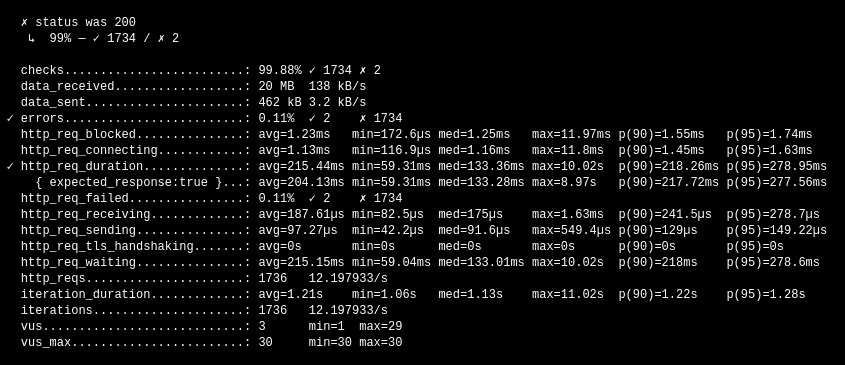

# 您的应用程序在扩展时性能是否相同？K6 负载测试

> 原文：<https://medium.com/codex/does-your-application-perform-the-same-as-it-scales-k6-load-testing-f46c7b4a5257?source=collection_archive---------14----------------------->


埃里克·范·迪克在 [Unsplash](https://unsplash.com?utm_source=medium&utm_medium=referral) 上的照片

最近在工作中，他们让我测试一下**发生了什么事情**如果我们的 [*HTTP API*](https://k6.io/docs/using-k6/http-requests/) 不得不**处理许多对它包含的不同*端点*的请求**。也许如果你生活中没有做过 [***负载测试***](https://en.wikipedia.org/wiki/Load_testing) ，首先想到的可能是自己制作脚本，用自己配置的请求数测试响应时间。我也有同样的想法，但幸运的是**有解决方案**已经想好了。

我寻找不同的解决方案，直到我找到了最适合我需要的工具[***K6***](https://k6.io/)*。为什么我选择这个选项，而不是其他同样众所周知的，会给我们另一个好时光。可选地，你可以看看 [***火炮***](https://artillery.io/) 因为它与 [***K6***](https://k6.io/) 履行相同的领域，但它比 [**更简单**](https://k6.io/docs/using-k6/http-requests/) ，至少对我来说。*

*尽管我在这些性能测量问题上没有什么经验，我还是决定记录自己如何使用 [***K6***](https://k6.io/) 语法定义测试。*

*我做一个简短的插入语来提及这个工具**不仅**用于测量[***HTTP API***](https://k6.io/docs/using-k6/http-requests/)的性能，它还用于 [**比可以直接使用的**多得多的****](https://k6.io/docs/using-k6/protocols/) 类型的 API 或**资源**。*

*请记住，即使我们已经用 JavaScript 编写了测试，它也不会是执行这段代码的运行时节点。除此之外，这个工具没有使用什么来**构建**我们的代码是最纯粹形式的[***web pack***](https://webpack.js.org/)。这就是为什么如果我们带着其他测试框架如[***Jest***](https://jestjs.io)或[***Mocha***](https://mochajs.org/)的**心态来，我们**将无法**利用与 ***NodeJS*** 有某种依赖关系的**模块**。***

*一个非常常见的情况是试图使用 [*dotenv*](https://www.npmjs.com/package/dotenv) 这样的包，这些包可以在 [npm](http://npmjs.com/) 的公共注册表中找到，但尽管如此，我们还是必须**使用这些包的改编版本**用于[***web pack***](https://webpack.js.org/)(如果有的话)。如果你需要使用这个包，我们可以使用名为[*dotenv-web pack*](https://www.npmjs.com/package/dotenv-webpack)的改编。*

*通过这种方式，我们将能够生成一个包，这样 k6 实例就可以执行它，并给我们一个带有测试结果的输出。别忘了遵循 [*k6 安装指南*](https://k6.io/docs/getting-started/installation/) 。*

*在生成我们的 [*package.json*](https://docs.npmjs.com/cli/v7/configuring-npm/package-json/) 文件及其相应的脚本和依赖项之后，我们将通过运行以下命令为我们的测试生成输出:*

```
*npm install --quiet
npm start*
```

*看看[***NodeJs******钩子***](https://docs.npmjs.com/cli/v7/using-npm/scripts) 就明白这次的“*start”*命令是怎么工作的了。基本上，当调用“*start”*脚本时，通过启动以下名为“ *bundle* 的脚本，将自动**执行“ *prestart* ”脚本，该脚本也将**先前执行**命令“ *prebundle* ”。***

*值得一提的是" *set:unix:source:env* "脚本的存在，因为它将负责使用 ***WebPack*** 进行构建，以找到名为" *URL* "的环境变量。为此我们将不得不生成一个 ***。env*** 文件包含以下内容:*

**

*通过这种方式，我们可以**知道**每秒有多少**请求**我们的 *API* 能够**无误地处理**。这将有助于我们了解如何自动扩展基础架构，以适应我们的需求。*

*这是一个使用[***【K6】***](http://k6.io)进行测试的简单示例，但是如果您想了解更复杂的测试情况，请不要犹豫给我们留下评论。现在是测试您的 API 的时候了🔥*