# 基于 CNN 的犬种分类器

> 原文：<https://medium.com/codex/dog-breed-classifier-using-cnn-4f408d04ff86?source=collection_archive---------18----------------------->

# **简介:**

如果你有一个应用程序来对狗的品种进行分类，以便在你的社交圈里不辜负你对狗的了解，这不是很酷吗？嗯！你来对地方了。

在这里，我们将介绍几种图像分类技术，看看它们的效果如何。CNN 模型将被喂食狗的图像和人的图像。在狗的情况下，我们的模型将预测它的品种，而如果它遇到人类，它将告诉我们与人类最相似的品种。

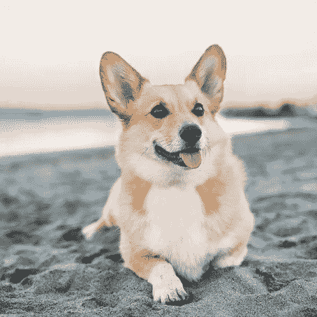

图一:你好，胡曼，我是一只柯基。你喜欢我吗！是的，你知道。

为了开发这样一个模型，我们使用了 Kaggle 提供的[狗数据集](https://s3-us-west-1.amazonaws.com/udacity-aind/dog-project/dogImages.zip)和[人类数据集](https://s3-us-west-1.amazonaws.com/udacity-aind/dog-project/lfw.zip)。分为训练( **6680** )、验证( **835** )、测试( **836** )数据集的 **8351** 张狗图像，以及 **13233** 张人脸。

我们将通过下面的步骤，最终实现一个健壮的算法，从人的图像中检测狗，并将它们分类到它们的品种中。

为了开发这样一个模型，我们使用了 Kaggle 提供的狗数据集和人数据集。大约有 **8351** 张狗的图像，分为训练(6680)、验证(835)和测试(836)数据集，以及大约 **13233** 张人类图像。

在训练数据集中，我们有图像数量最多的**阿拉斯加雪橇犬**(**77)**和图像数量最少的 Xoloitzcuintli(**26**)&挪威布洪德( **26** )。

**准确性**恰好是判断我们的模型的正确度量，因为我们的目标是在狗和人脸的情况下正确预测狗的品种，并丢弃不属于该类别的狗和人脸。由于精度符合分子中的**真正比率**和**真负比率**，因此认为模型具有良好的精度是合理的。然而，我们也不希望狗被检测为人/不是狗，反之亦然，这可以使用 **Precision** 进行总结，它对更大的**假阳性率进行惩罚。**

我们将通过下面的步骤，最终实现一个健壮的算法，从人的图像中检测狗，并将它们分类到它们的品种中。

*   [第一步](https://viewooizm3ck72.udacity-student-workspaces.com/notebooks/dog-project/dog_app.ipynb#step1):探测人类
*   [第二步](https://viewooizm3ck72.udacity-student-workspaces.com/notebooks/dog-project/dog_app.ipynb#step2):探狗
*   [第三步](https://viewooizm3ck72.udacity-student-workspaces.com/notebooks/dog-project/dog_app.ipynb#step3):创建一个 CNN 对狗的品种进行分类(从头开始)
*   [步骤 4](https://viewooizm3ck72.udacity-student-workspaces.com/notebooks/dog-project/dog_app.ipynb#step4) :使用 CNN 对狗的品种进行分类(使用迁移学习)
*   [第五步](https://viewooizm3ck72.udacity-student-workspaces.com/notebooks/dog-project/dog_app.ipynb#step5):创建一个 CNN 对狗的品种进行分类(使用迁移学习)
*   [步骤 6](https://viewooizm3ck72.udacity-student-workspaces.com/notebooks/dog-project/dog_app.ipynb#step6) :最终算法
*   [步骤 7](https://viewooizm3ck72.udacity-student-workspaces.com/notebooks/dog-project/dog_app.ipynb#step7) :测试算法

# 检测人类:

我们将尝试两种不同的算法来检测人脸。OpenCV 和 MTCNN。该算法识别人脸，并在人脸周围绘制边界框。让我们带您看一下实现过程。

OpenCV 是一个 python 库，它利用了 [**基于 Haar 特征的级联分类器**](https://docs.opencv.org/master/db/d28/tutorial_cascade_classifier.html) 。它使用各种过滤器/内核提取特征，然后应用 **Adaboost 算法**来惩罚不好的特征。下面是上述算法的一个实现—

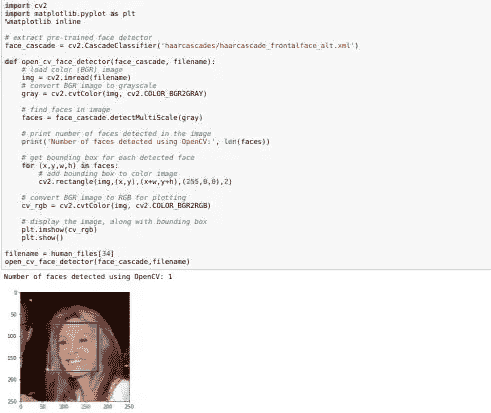

图 2:打开 CV 实现来检测人脸。

OpenCV 的 Haar-Cascade 实现对人类图像的 **100%** 预测正确，而对狗图像的 **12%** 预测不正确。

[**MTCNN**](https://towardsdatascience.com/how-does-a-face-detection-program-work-using-neural-networks-17896df8e6ff) (多任务级联卷积网络)是我们将测试的另一个用于检测人脸的分类器。它包括三个卷积网络(P-Net、R-Net 和 O-Net ),负责其在实时检测中的鲁棒性。

让我们回顾一下它的性能，并检查一下它的实现—

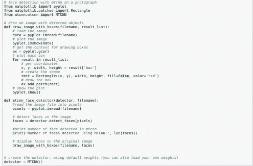

图 3:检测人脸的 MTCNN 实现。

现在，我检查了人脸检测的实现。事实证明，MTCNN 是检测模糊图像的更好选择。

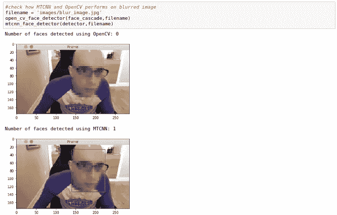

图 5: MTCNN 与 OpenCV 在人脸检测方面的比较

然而，当我们在狗的图像上评估 MTCNN 算法时，数字是不同的—

尽管它完美地检测到了所有人脸，但大约有 **23%** 的狗图像被检测为人，这比 OpenCV 实现要大得多。这表明 MTCNN 中的**假阳性率**比 OpenCV 中的大。

# 检测狗:

为了检测狗，我们将使用一个预先训练好的 [**Resnet-50**](https://towardsdatascience.com/understanding-and-coding-a-resnet-in-keras-446d7ff84d33#:~:text=The%20ResNet%2D50%20model%20consists,over%2023%20million%20trainable%20parameters.&text=Our%20ResNet%2D50%20gets%20to,in%2025%20epochs%20of%20training.) 模型。这个网络已经在 [ImageNet](https://image-net.org/) 数据集上进行了训练。因此，我们将通过直接加载模型和权重来利用它。

在我们将图像输入 Resnet-50 模型之前，我们必须将它们(图像的预处理)重新整形为 Keras 可以接受的张量(一个 **4D 数组)**。

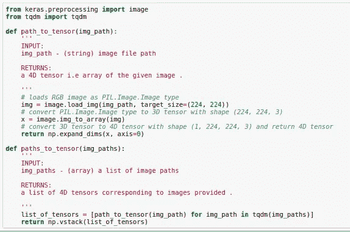

图 6:预处理图像数据

接下来是预测。即使在进行预测之前，我们也必须对输入图像进行一些额外的处理。感谢 **Keras preprocess_input 函数**为我们完成了这项工作。它将 RGB 图像转换为 BGR 图像，并附带一些标准化步骤。你可以点击查看完整的步骤[。](https://github.com/keras-team/keras/blob/master/keras/applications/imagenet_utils.py)

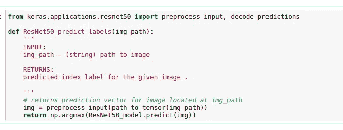

图 7:预测输入图像的标签。

对应于狗的类别出现在**151–268**之间的索引标签([字典](https://gist.github.com/yrevar/942d3a0ac09ec9e5eb3a))的连续序列中。所以，如果预测的类标签落在这个范围内，就是狗。

Resnet-50 型号在这方面的表现相当显著。使用 Resnet-50 模型，狗和人脸的图像都被正确标记。

# 创建一个 CNN 对狗的品种进行分类(从头开始):

现在我们有了在图像中检测人类和狗的功能，我们必须设计一种从图像中预测品种的方法。在这里，我们将尝试创建我们的卷积神经网络，并在我们的狗数据集上进行训练。

让我们看一下实现和架构。

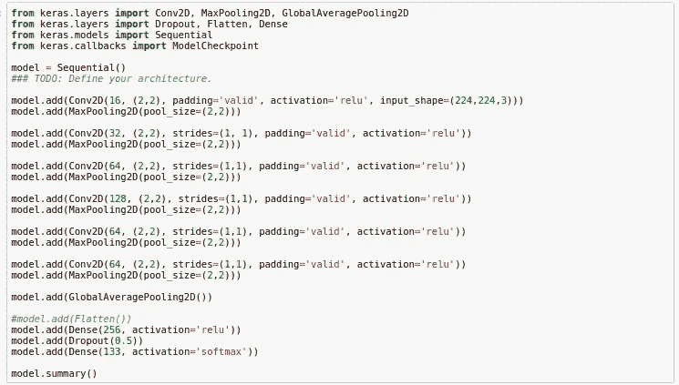

图 8:狗品种分类器的 CNN 实现(Scratch)。

我们已经为最初的几个层使用了 **Conv2D** 和 **MaxPooling** 的组合，随后是**globaveragepool2d**、一个 **Dropout** 和一个 **Dense** 层。

我们来看看模型的总结。

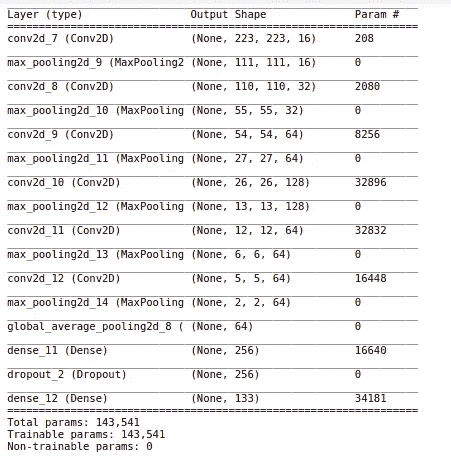

图 9:模型总结

请注意，其他突破性模型具有更深的层次，并且是在更大的数据集上训练的。相比之下，上述 CNN 模型要浅得多，因此预计不会产生合理的准确性。

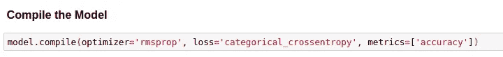

图 10。模型编译

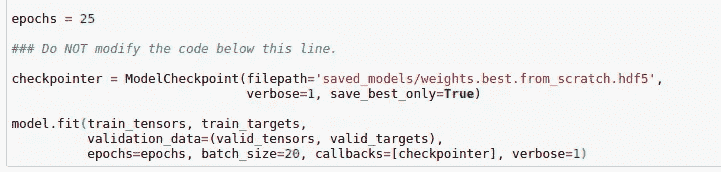

图 11:模型训练

我们已经在 25 个时期上训练了模型，批次大小为 20。使用的优化器是 **rmsprop** 。使用该模型获得的准确度和精确度分别为 **15.5%** 和 **14%** 。

# 使用 CNN 对狗的品种进行分类(使用迁移学习):

上面的模型没有给出一个理想的精度，事实上，甚至没有接近它。谢天谢地，我们有了另一个概念**转移学习**来帮助我们。在这里，我们可以在不牺牲准确性的情况下减少训练时间。这是因为我们只需训练最后几层，并利用已经训练好的 CNN 模型的权重，在这种情况下，CNN 模型是 [**VGG-16**](https://towardsdatascience.com/step-by-step-vgg16-implementation-in-keras-for-beginners-a833c686ae6c#:~:text=VGG16%20is%20a%20convolution%20neural,vision%20model%20architecture%20till%20date.&text=It%20follows%20this%20arrangement%20of,consistently%20throughout%20the%20whole%20architecture.)

我们使用 VGG-16 的最后一层作为我们模型的输入。它被用作作为**下载的特征提取器。npz 文件**，它后来被用于训练我们的模型。(注意:您可以在 VGG-16 的顶层训练您的特征提取器，然后在以后使用它进行训练。)

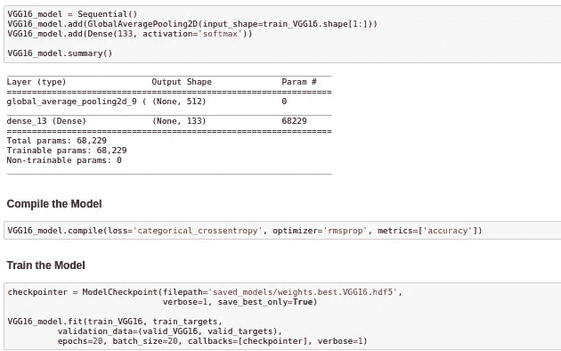

图 13: VGG 16 CNN 模型。

VGG16 模型的上述实现产生了 **45.5%** 的准确度，远远好于我们自己的 CNN 模型。

# 创建一个 CNN 对狗的品种进行分类(使用迁移学习):

接下来，我们将在为各自架构下载的瓶颈特性上训练更多的模型( **Resnet-50，InceptionV3)** 。就实现而言，它将完全类似于 VGG-16 模型。区别在于架构。

我们创建了一组函数来构建架构、编译和训练模型，以及报告准确性和热图。

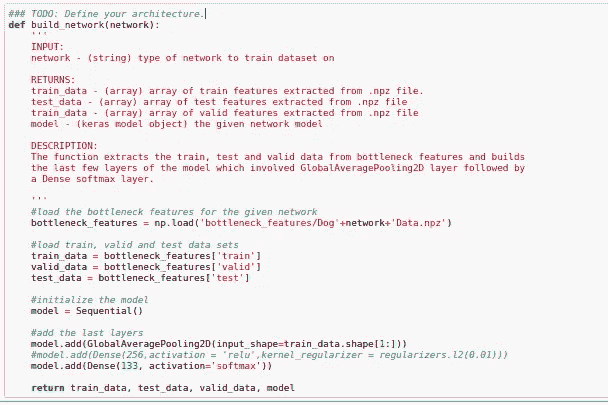

图 14:构建架构

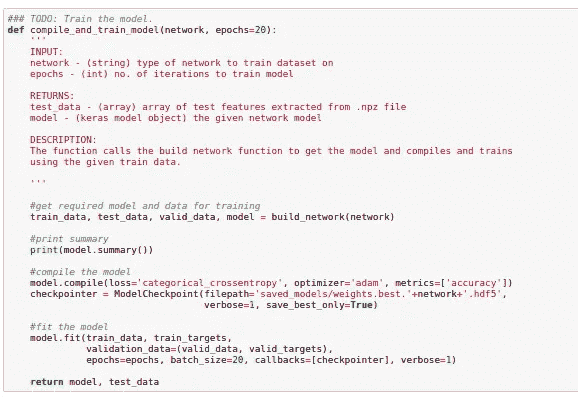

图 15:编译和训练模型。

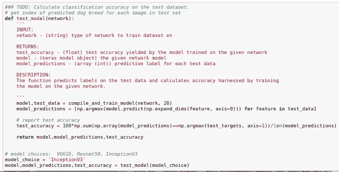

图 16:测试模型的准确性。

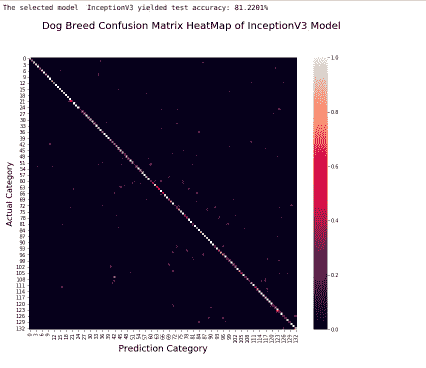

图 17:犬种预测的 Inception V3 模型的热图

所以，我们用 **InceptionV3** 网络来训练我们的模型。从上图可以明显看出，这是一个更好的热图，大部分预测沿着对角线。它产生了 81.2%的**的准确度和 84%的**的精确度。****

# ****最终算法:****

****我们已经建立了一个人脸检测器、一个狗检测器和一个狗品种分类器。接下来，我们必须将所有这些放入一个算法中，该算法将拍摄图像并预测狗的品种(如果是狗的话),如果是人的话，则预测最相似的品种。****

****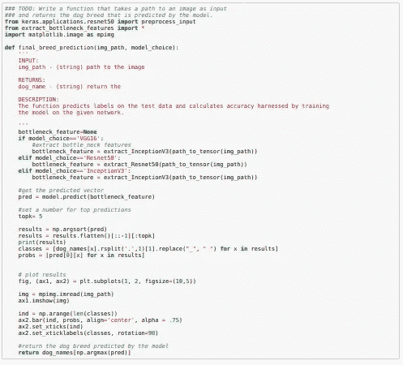****

****图 18:狗的品种预测****

****这里我们取 softmax 分类器预测的最大概率对应的指标，报为最终品种。此外，我们绘制了 5 个顶级犬种的图，以及它们对于给定输入图像的 softmax 概率。****

****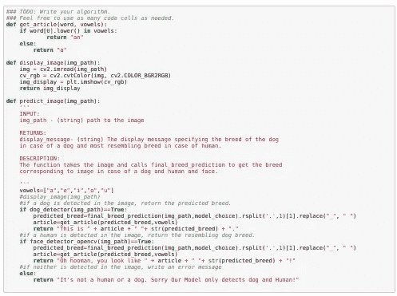****

****图 19:最终算法。****

****上述函数获取一幅输入图像，如果图像是狗和人脸，则通过调用 **final_breed_prediction** 方法来预测狗的品种/类似狗的品种。最后，它显示相应的信息。****

# ****测试算法:****

****现在，我们进入了测试模型性能的最后一步。让我们尝试一些图片来验证这一点。****

****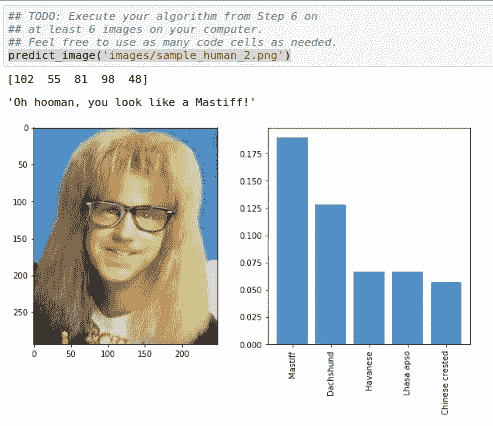****

****图 20:样本人类图像 _1****

****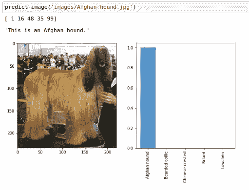****

****图 21:阿富汗猎犬****

****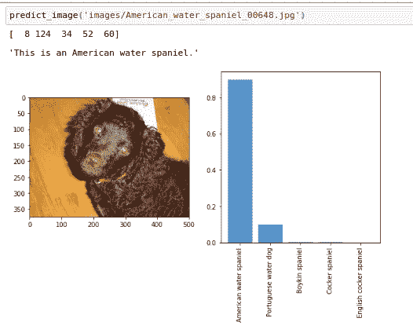****

****图 22:美国水猎犬****

****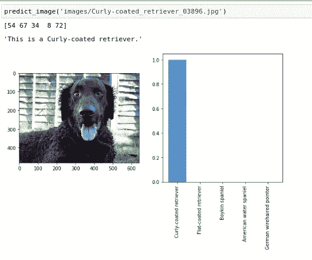****

****图 23:卷毛寻回犬****

****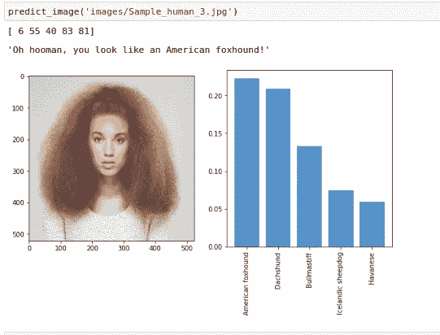****

****图 24:样本人类图像 _2****

****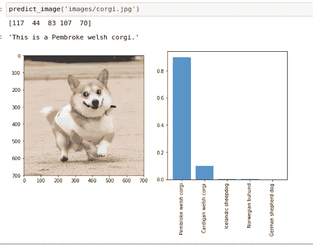****

****图 25:彭布罗克威尔士柯基犬****

****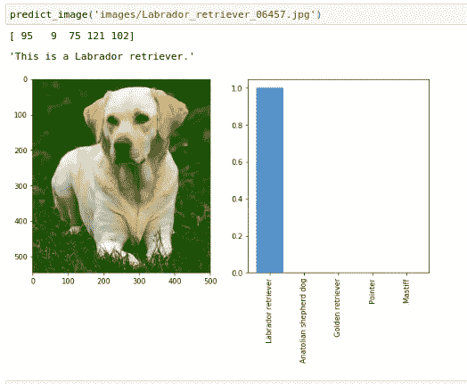****

****图 26:拉布拉多猎犬。****

****这里，我们在 5 幅狗的图像和 2 幅人的图像上检查了我们的模型的预测。它准确地预测了所有 5 张狗图片的品种。然而，在人类图片的情况下，预测并不完全令人信服。****

# ****结论:****

****我们通过检测人脸和狗的图像开始了这个旅程。然后我们从头开始构建了一个 CNN 架构，由于我们讨论的原因，它甚至不能很好地执行。接下来，我们测试了基准模型 **VGG16(准确率:45%)** 、 **InceptionV3(准确率:82%)、**和 **Resnet50(准确率:81%)** ，通过对它们进行针对我们的训练数据提取的瓶颈特征的训练，它们在预测狗品种方面相当不错。****

****此外，我们还观察到，增加时期的数量并没有改善验证损失。因此，在 **20 次迭代**中，我们可以实现最好的验证损失和准确性。考虑到我们只有 **6680** 幅训练图像，我们将**的批量大小保持为 20，**并且在 10 的范围内增加或减少不会对我们的准确度产生太大影响。****

****在 CNN 架构的情况下，我们观察到增加太多的层不能提高精度。所以我们为我们的最终模型保留了 1 个全局平均池 2d T21 层和一个密集的软最大层。它产生了最好的准确性。****

****然而，仍然有改进的余地。最近开发了各种其他先进的人脸检测方法，例如 Mask-CNN，它可以降低我们在 MTCNN 的实现中观察到的**假阳性率**。通过增加训练数据可以使提取的瓶颈特征更加丰富。这不仅有助于增加训练数据，而且将创建更丰富的图像表示，这可能有助于提高准确性。****

****无论如何，这是你的犬种分类器，你可以在这里查看完整的实现。请评论，你对上述策略有何感想，或者你是否找到了更好的策略。在那之前，继续做你可爱的胡曼吧！****