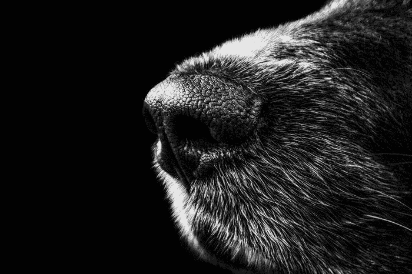

# 狗对人工智能诊断设备——谁赢了？

> 原文：<https://medium.com/codex/dogs-versus-ai-powered-diagnostic-devices-who-won-47bf89aef866?source=collection_archive---------7----------------------->

## [法典](http://medium.com/codex)

*研究人员开发了一种微型诊断设备，其嗅觉传感器的功能比狗的鼻子强 200 倍。*

照片由 [Pixabay](https://www.pexels.com/@pixabay?utm_content=attributionCopyText&utm_medium=referral&utm_source=pexels) 从[像素](https://www.pexels.com/photo/black-and-white-animal-dog-fur-65928/?utm_content=attributionCopyText&utm_medium=referral&utm_source=pexels)拍摄

我们听说过[狗能嗅出癌症](https://journals.sagepub.com/doi/abs/10.1177/1534735405285096)——这是一项不足为奇的技能，因为它们有超过 2 亿个嗅觉感受器(比人类多 40 倍)，每个感受器都比我们鼻子里的强 1 万倍。狗的…