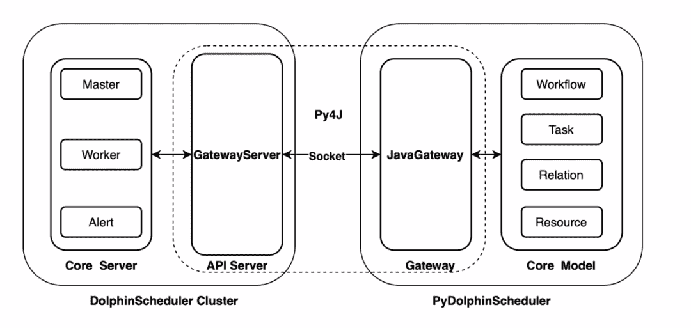

# DolphinScheduler 可以用 Python 脚本调度工作流！

> 原文：<https://medium.com/codex/dolphinscheduler-can-schedule-workflows-with-python-scripts-a882fdd2d862?source=collection_archive---------3----------------------->


> 随着 2.0.5 版本的发布，Apache DolphinScheduler 增加了 Python API 函数，使用户能够通过 Python 脚本安排工作流，以创建、更新和调度工作流。那对 Python 用户来说就方便多了！

Apache DolphinScheduler 是一个分布式、高可扩展、可视化的开源工作流任务调度框架，适用于企业级应用案例，为可视化的任务操作、工作流调度以及整个数据处理过程提供可视化的解决方案。

Apache DolphinScheduler 提供了丰富的组件，允许用户调用 MR、SageMaker、DMS、DataSync 等 AWS 服务，以及 Spark、Flink、Hive 等私有部署的服务；它还为核心调度场景提供了工具，如失败重试、失败警报、任务 SLA、复杂依赖处理等。；它还提供了丰富的调度功能，如外部资源文件管理、集群物理机资源监控；以及用于外部监控的各种度量。

# Dolphin 调度器 Python API

使用 Python API，用户可以通过 Python 脚本来安排工作流，以创建、更新和调度工作流等。



## 安装

您可以通过 pip 轻松方便地安装 PyDolphinScheduler:

```
python -m pip install apache-dolphinscheduler
```

## 奔跑

我们提供了现成的示例，用户可以使用以下命令运行 Python API:

```
wget https://raw.githubusercontent.com/apache/dolphinscheduler/dev/dolphinscheduler-python/pydolphinscheduler/src/pydolphinscheduler/examples/tutorial.py
python tutorial.py
```

# Python API 函数

Python API 提供了我们可以在 DolphinScheduler Web UI 中直接操作的所有功能，比如工作流创建、任务创建、工作流调度、资源文件实用程序、参数传递等。目前支持 DolphinScheduler 中大部分任务类型，用户可以通过 Python API 体验 DolphinScheduler 的大部分核心功能。

如果我们想要通过 DolphinScheduler Python API 创建并运行 DolphinScheduler 工作流，我们需要首先启动 DolphinScheduler 服务，该服务可以在[https://dolphin scheduler . Apache . org/Python/dev/start . html # start-Python-gateway-service](https://dolphinscheduler.apache.org/python/dev/start.html#start-python-gateway-service)找到，以检查它是如何安装和运行的。本文主要带你领略 Python API 的魅力，所以我们将重点讲解 Python API 任务。

# 例子

这是一个如何使用 Python API 运行 DolphinScheduler 工作流的例子。我们需要从官网下载资源，做一些计算。

**概述**

以下是我们代码的概述。在这个脚本中，用户需要下载 DolphinScheduler 源代码，然后找到最大的文件和最常见的文件扩展名。要做到这一点需要三个步骤。所有的步骤在 DolphinScheduler 中都叫做“任务”，我们要完成的整个工作叫做“ProcessDefinition”。

除了这 3 个主要步骤，我们还有一些额外的步骤来准备我们的环境，并确保主要步骤正常工作。比如我们需要创建一个新的目录来保存从官网获取的资源，并保证传入的压缩包不与现有环境冲突。下载资产后，我们需要压缩它，并从 tarball 中提取内容。

```
from pydolphinscheduler.core.process_definition import ProcessDefinition
from pydolphinscheduler.tasks.python import Python
from pydolphinscheduler.tasks.shell import Shell
download_dir = "/tmp/demo"
store_dir = "dolphinscheduler"
download_link = "https://github.com/apache/dolphinscheduler/archive/refs/heads/dev.zip"
file_name = download_link. split("/")[-1]
def largest_size():
     from pathlib import Path
     download_dir = "/tmp/demo"
     store_dir = "dolphinscheduler"
     result = (None, 0)
     paths = Path(download_dir).joinpath(store_dir).glob("**/*")
     for path in paths:
         # skip is path is directory
         if path.is_dir():
             continue
         file_size = path.stat().st_size
         if result[0] is None or file_size > result[1]:
             result = (path.name, file_size)
     print(result)
def most_frequently():
     from pathlib import Path
     download_dir = "/tmp/demo"
     store_dir = "dolphinscheduler"
     ext_cnt = {}
     paths = Path(download_dir).joinpath(store_dir).glob("**/*")
     for path in paths:
         # skip is path is directory
         if path.is_dir():
             continue
         ext = path.suffix
         ext_cnt[ext] = ext_cnt[ext] + 1 if ext in ext_cnt else 1
     print(max(ext_cnt.items(), key=lambda p: p[1]))
with ProcessDefinition(
         name="top_ten_size_files",
         tenant="zhongjiajie",
) as pd:
     prepare = Shell(
         name="prepare_dir",
         command=f"mkdir -p {download_dir}; rm -rf {download_dir}/*"
     )
     download = Shell(
         name="download_resources",
         command=f"wget -P {download_dir} {download_link}"
     )
     compress = Shell(
         name="compress_tar",
         command=f "cd {download_dir}; unzip {file_name} -d {store_dir}"
     )
     largest_file = Python(
         name="largest_file",
         definition=largest_size,
     )
     most_type = Python(
         name="most_type",
         definition=most_frequently,
     )
     prepare >> download >> compress >> [
         largest_file,
         most_type,
     ]
     pd. run()
```

# 下载资源

在这个任务中，我们使用 shell 命令 wget 从 GitHub 下载资源，我们可以简单地使用 PyDolphinScheduler 的内置 shell 将 wget 命令传递给 parameter 命令。

您可以看到，我们在这里使用了名为 download_dir 和 download_link 的 Python 变量，以使我们的代码可维护。实际运行的命令是 wget-P/tmp/demo[https://github.com/apache/dolphinscheduler/archive/refs](https://github.com/apache/dolphinscheduler/archive/refs)/heads/dev . zip。完成后，DolphinScheduler 源代码将被下载到目录/tmp/demo。

```
download = Shell(
     name="download_resources",
     command=f"wget -P {download_dir} {download_link}"
)
```

## 下载资源前后我们需要做什么？

正如我们在概述中提到的，我们需要在从官方网站下载资产之前或之后经历一些额外的步骤。对于环境准备，我们使用单个 shell 任务来确保下载目录存在，并且目录中没有其他资源文件。传递命令 mkdir-p/tmp/demo；参数命令的 rm -rf /tmp/demo/*(注意我们在这里也使用 Python 变量)。我们必须压缩。然后将它们解压缩到一个特定的目录，这样我们就可以在这个路径上运行一些 Python 代码。

```
prepare = Shell(
     name="prepare_dir",
     command=f"mkdir -p {download_dir}; rm -rf {download_dir}/*"
)
compress = Shell(
     name="compress_tar",
     command=f "cd {download_dir}; unzip {file_name} -d {store_dir}"
)
```

## 计算最大的文件

我们使用 Python 任务来统计 DolphinScheduler 源代码中最大的文件和最常用的文件类型。如你所见，我们还需要命名 Python 任务，这里我将其命名为 maximum _ file，然后将函数传递给 Python 任务的参数定义。**这一步的核心逻辑来自于最大尺寸函数**。在这个函数中，我们通过 pathlib 库遍历源代码目录并找到最大的文件。使用一个名为 result 的元组来存储命名文件及其大小，最后打印结果，结果将显示在控制台上。

```
def largest_size():
     from pathlib import Path
     download_dir = "/tmp/demo"
     store_dir = "dolphinscheduler"
     result = (None, 0)
     paths = Path(download_dir).joinpath(store_dir).glob("**/*")
     for path in paths:
         # skip is path is directory
         if path.is_dir():
             continue
         file_size = path.stat().st_size
         if result[0] is None or file_size > result[1]:
             result = (path.name, file_size)
     print(result)
largest_file = Python(
     name="largest_file",
     definition=largest_size,
)
```

## 计算最常出现的文件类型

这里的方法对于最大的文件是相同的，我们使用 Python 任务，用 most_type 作为名称，most _ frequently 作为定义。为了找到最常用的文件类型，我们创建了一个字典来保存所有文件扩展名。然后使用 pathlib 库遍历源代码。在这个过程中，注意跳过没有扩展名的目录和文件，从字典中找到最常用的值。

```
def most_frequently():
     from pathlib import Path
     download_dir = "/tmp/demo"
     store_dir = "dolphinscheduler"
     ext_cnt = {}
     paths = Path(download_dir).joinpath(store_dir).glob("**/*")
     for path in paths:
         # skip is path is directory
         if path.is_dir():
             continue
         ext = path.suffix
         # skip file without suffix
         if ext == "":
             continue
         ext_cnt[ext] = ext_cnt[ext] + 1 if ext in ext_cnt else 1
     print(max(ext_cnt.items(), key=lambda p: p[1]))
most_type = Python(
     name="most_type",
     definition=most_frequently,
)
```

## 设置任务相关性

设置完成后，我们需要声明任务的依赖关系。不用说，我们应该先运行准备任务，因为没有压缩包就无法进行压缩，所以我们需要将任务下载设置为压缩的上游。另一个计算可以并行运行，所以我们将它们都设置在压缩任务的下游，我们使用语法 sugar compress >> [largest_file，most_type]在这里，可以在一个语句中设置两个或多个依赖项。

## 快跑！

将以下代码添加到脚本的末尾，以将工作流和任务提交给 DolphinScheduler，并在默认情况下触发它们。

```
pd. run()
```

完成所有工作后，您可以在 Python 控制台中运行代码并观察结果。之后，您可以在 DolphinScheduler UI 中看到正在运行的工作流和任务，默认为

```
http://127.0.0.1:12345/dolphinscheduler.
python3 demo.py
```

# 摘要

在这里，我们介绍了什么是 DolphinScheduler 及其最近添加的 Python API 特性，并展示了如何使用 Python API 来构建包含多个任务的工作流，如何设置任务，以及如何将任务提交给 DolphinScheduler。

您可以在任务中找到 Python API 支持的所有任务。有关 DolphinScheduler Python API 的更多信息，请参考[本文档](https://dolphinscheduler.apache.org/python/dev/index.html)。

📌📌欢迎填写[这份调查](https://www.surveymonkey.com/r/7CHHWGW)来反馈您的用户体验或您对 Apache DolphinScheduler 的想法:)

【https://www.surveymonkey.com/r/7CHHWGW 