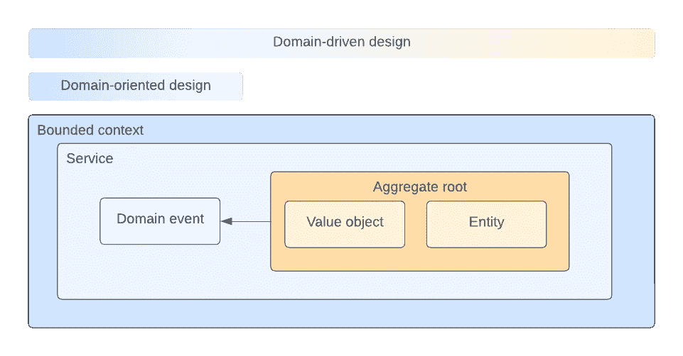

# 领域驱动设计(DDD)还是仅仅面向领域设计(DOD)？

> 原文：<https://medium.com/codex/domain-driven-design-ddd-or-just-domain-oriented-design-dod-9098abecd456?source=collection_archive---------3----------------------->

> 极简主义的 DDD 方法

领域思维是我的软件工程中最有影响力的工具之一。在一个精心制作的领域设计中经历创建 DDD 风格的微服务的过程改变了我的职业生涯。一旦你睁开眼睛，就无法挽回了。在后来的所有项目中，我感觉自己又回到了核心领域驱动原则。然而，DDD 并不总是被允许/需要/适用的。但是我发现一种更轻量级的方法对你的软件项目几乎是普遍有益的。我称之为面向领域而不是领域驱动。

# 面向领域或领域驱动的设计

所以让我们来看看轻量级 DDD 方法是什么样子的。在过去十年中，面向微服务的现代云原生软件平台已经变得很常见。在我的咨询生涯中，组织要求非微服务解决方案的情况很少见。领域思维开始流行，因为微服务的组织需要方向。

一些团队借此机会利用 DDD 工具来塑造他们的景观。我也是。这种架构风格给了我快乐、理解、自信和对代码的欣赏。深深引起了我的共鸣。创建可理解的集合是一件优雅的事情。然而，在某些情况下，成熟的 DDD 可能并不适合:

*   小型或简单的项目
*   实验阶段(使其成本过高)
*   团队中有太多初级开发人员
*   无状态软件(无服务器/lambda)

尤其是最后一条让我很不爽，因为我是无服务器的超级粉丝。当然，有可能创建一个类似聚合的解决方案，但是我还没有遇到一个令人满意的解决方案。那么，在代码层面没有了 DDD，我们还剩下什么呢？

我相信，即使不采用 DDD 方法，将你的问题空间全部带入代码，你仍然可以做到，**面向领域**。

那么为什么是面向领域的呢？我需要一个词来描述一种在系统级别(服务、通信和有界上下文)上受 DDD 启发的方法，而不把人们引入代码级别的 DDD 式思维，就像集合一样。下面的可视化描述了面向领域作为整个 DDD 光谱的一部分。

# 面向领域设计的利弊

在工程中，每个决定都有权衡。架构都是关于决策的，所以让我们回顾一些优点和缺点。

## **优势**

*   工程团队更容易理解(DDD 可能很难学)。
*   仍然保留着 DDD 的建筑组织/建筑特色。
*   更容易被你的工程社区接受。

## **缺点**

*   缺少代码级的 DDD 构造，以优雅的方式编纂业务规则。
*   错过代码级的构造可能会使领域语言变得更糟糕(可以增加补偿和设计)。

# 总结

作为一个术语，面向领域的设计可以帮助您标记高层次的 DDD 意图。在现代微服务实现中将 IT 环境组织到域中有很大的好处，不管代码级实现如何。