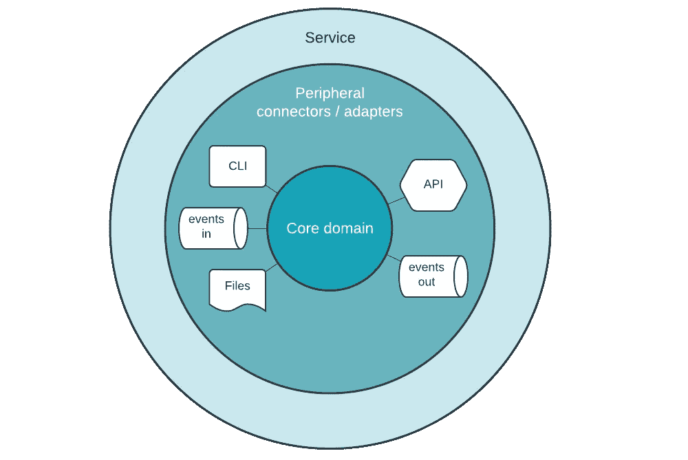

# 面向 IT 经理的领域驱动设计

> 原文：<https://medium.com/@kevin-van-ingen/domain-driven-design-for-it-managers-285d92e723c1?source=collection_archive---------7----------------------->

*工程经理和其他技术领导者关于领域驱动设计以及如何在您的组织中实施它的指南*。*如果你是一名 IT/工程经理、企业架构师、开发经理，或者从事任何与现代软件工程相关的工作，这个博客是为你准备的。我写的有点像对话，所以它展示了我在这个领域与同行的对话。*

DDD —是您的软件和组织的最佳切割工具

## 领域呢-有什么隐语吗？

领域驱动设计、领域导向、领域驱动开发，或者简而言之，领域驱动是软件工程设计发展前景的常见表述。我称之为视角，因为我认为最好解释为一种看待事物的方式。人们可以把一个大型软件系统看作是半独立领域的组合。

## **什么是领域驱动，它看起来像什么？**

领域驱动设计是 Eric Evans 在他的著名著作《领域驱动设计:解决软件核心的复杂性》中创造的一种设计风格。我会在文末进一步列出更多文献。与使用它是什么的抽象定义相比，更容易说明为什么和如何使用它。

> DD 是一种高级架构风格

对于架构师/设计师来说，领域可能是软件生态系统最基本的分解。对于零售商，可以是产品目录、采购、仓储等领域。

> DDD 是一种低级的执行风格和策略

对于开发人员来说，它的核心是为如何设计系统提供了一个指导方针(实现风格)。可以说是一种架构模式。它提供了一个指导方针，将您的开发项目组织到代码级别。这种工作方式的一个关键概念是，它旨在将最复杂的业务逻辑捕获到一个核心“模型”中。其中模型可以被看作是程序性的抽象。抵押计算器的计算模块就是一个很好的例子。

表达这种风格的最简单的方式是，它将注意力集中在解决方案领域的核心部分，并以最少的样板文件将它们放在开发的中心。连接和其他附加物可以被视为外围连接器和适配器。可部署的服务提供核心域和外围层，以便交付其价值。

DDD —核心模型与服务视角

此外，DDD 非常关注这个核心“模型”(实现策略)的语义。它规定要缩小企业谈论其过程和规则的方式与我们在软件中表示它们的方式之间的差距。

当我们缩小这样的服务时，我们将开始看到它所在的域。这可能不是唯一的服务。理想情况下，您指定一个团队作为所有者(以支持 DevOps 生态系统)。服务的组合——团队也是如此——也需要紧密结合。

DDD——服务加起来就是域名

## 为什么域驱动最近开始流行了？

虽然大约二十年了，现代技术架构(微服务/云)和社会技术结构(devo PS/敏捷)现在已经联合起来允许这种构建方式。相反，像敏捷、DevOps 和云这样的系统变化需要一个匹配的架构策略来使团队发挥作用。

其中一些车手需要一种新的思维方式，这种思维方式可能也发生在你的车队中。

*   工程团队规模的不断扩大要求以一种有意义的方式进行分工(提供一个创造性和生产性的空间)
*   团队被要求更快更频繁地交付，这推动了对自治和与其他团队分离的渴望。
*   IT 团队/公司一直在增长，创造了比以往更复杂的平台。
*   当单个服务变得更小(微服务)时，系统之间的连接性爆炸，我们分发软件的能力增长(云)导致复杂性激增。

## 你应该在你的公司里推广领域驱动的思想吗？

这是****的大问题**。先说一些不好的方面。这是有成本的。域驱动不是简单的开关。人们将需要接受教育、被说服、获得经验，这是一个学习的旅程(通常是一条崎岖不平的道路)。你可能需要做一些组织重组。团队需要重新调整到正确的领域和价值流。之后，您还需要调整架构。我们现在知道这将是一项投资。让我们看看它带来了什么。**

> **领域驱动会让你花钱。但问题总是:“忽略领域驱动会让你花更多的钱吗？”。**

**当你面临扩展或交付问题时，领域驱动肯定可以成为积极变化的代理。我发现许多组织和工程师喜欢其他一些正面的威胁。**

*   **DDD 不仅帮助创造软件。它将帮助你构建组织，并指导你创建独立的部门和团队。这是我所知道的最好的功能性千篇一律的方法来分割你的组织。我知道很多经理对如何在团队中合理分配工作有很大的疑问。我们都知道集中式团队不能满足他们的需求，而特色团队有如此多的依赖，他们几乎不能给他们的客户提供新的东西。**
*   **DDD 扩展到企业级。扩展到几十个团队，您仍然可能在基于 DDD 的设计中做得更好。所以，把它当作一个增长的助推器，就像你的其他投资一样。如果管理层像选择云供应商和推荐合作伙伴一样，只花一小部分精力在这个决策上，我们就可以避免很多痛苦。**
*   **DDD 将使创建促进团队，使功能团队更容易。无论这些是授权团队、平台团队，还是复杂组件的专家，许多经理都在集中和分散的团队中挣扎，并且很难让他们的团队流程正确。**
*   **我们的工程师面临着巨大的技术变革，重写的频率越来越高。DDD 把你的生意放在核心位置，用花哨的技术装饰它(如果你对如何阅读关于[六角形建筑](https://en.wikipedia.org/wiki/Hexagonal_architecture_(software))感兴趣的话)。这使得重写最新最好的消息总线、API 层或数据库技术变得更加容易。**
*   **DDD 让你的公司在候选人看来很不错。这表明你很重视工程学。当您工作的组织与业务相一致时，它将为成功的软件交付提供一个富有成效的环境。自主性、交付速度和适当管理的依赖性提供了长期和富有成效的职业生涯。**

## ****在领域驱动的场景中，什么东西会让人感觉不自然？****

**随着敏捷的兴起，我们已经把早期交付放在了我们的愿望清单上。然而，全 DDD 将集中一个团队的努力，首先交付一个核心模型。在第一轮演示中，核心模型看起来不会像一个华而不实的应用程序。然而，它将提供大量的学习和比你在一个完整周期的 MVP 迭代(前端，后端)中得到的更快的迭代。这会让人觉得我们没有加快速度。但是光着身子。在具有复杂领域的项目中，交付浅层(但是完整周期)迭代的压力可能会要求团队学习慢下来。**

## ****关于领域驱动，有哪些常见的错误观点？****

**在 DDD，有很多关于“T6”模式的讨论。这在很大程度上解释了 DDD 的重要性。然而，我发现人们可能会将模型误解为数据结构(就像关系模型一样)。然而，模型与数据在存储时如何表示关系不大。模型是代表核心业务逻辑的代码。**

**此外，领域驱动的采用不应该非黑即白。不久前，我写了一篇关于[领域定位](https://medium.com/codex/domain-driven-design-ddd-or-just-domain-oriented-design-dod-9098abecd456)的博客，讨论了主要采用高级设计概念的选项。当然，它不会给你带来代码级采用的巨大好处，但是它是帮助你组织你的 it 环境的好方法。**

## **现在去哪里？**

**那里有一些很棒的资源。阅读 Eric Evans 的原著从来都不容易，但是人们认为 Vernon Vaughn 的《领域驱动设计精粹》这本书是一个很好的开端。如果你在数据领域，一个受欢迎的新成员是扎马克·德赫加尼的*数据网*，它也受到了 DDD 的影响。《领域驱动设计的模式、原则和实践》这本书可能是一个不错的下一站。当然，有一天你需要深入到最初的工作中:*领域驱动设计:在软件的核心解决复杂性。***

**首先，我会建议开始与你的高级工程师交谈。有些人肯定会受到 DDD 的影响，甚至经历过。**