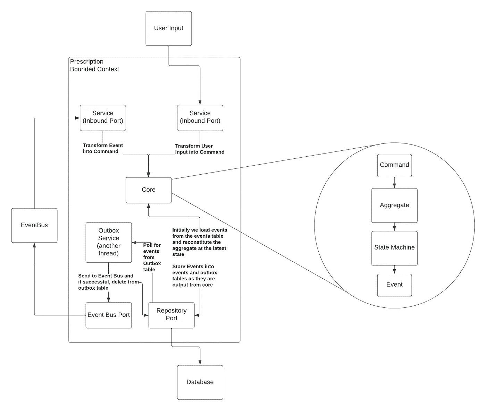
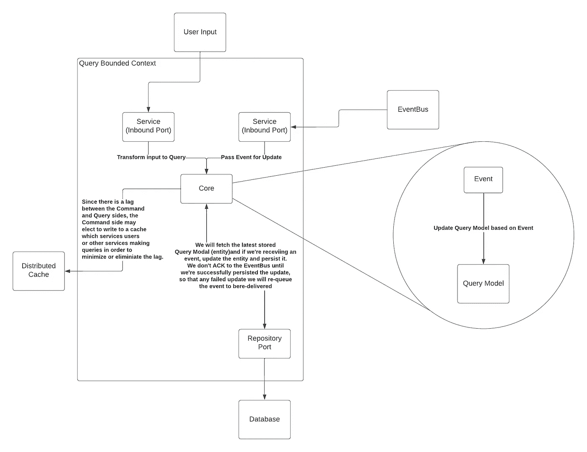

# 域、命令和状态机。

> 原文：<https://medium.com/codex/domains-commands-and-state-machines-oh-my-d250928b249d?source=collection_archive---------8----------------------->

最近，伴随着大量关于命令、询问和责任分离的故事的算法令我受宠若惊(CQRS)。虽然它在分布式系统和扩展系统领域是一个很好的模式，但我发现大多数文章都没有抓住要点，解释最多是最少的，或者缺乏“让它成为现实世界”,因为很难从作者的结论中得出如何在工作中使用它。同样，我们看到许多人将活动采购与 CQRS 联系在一起，认为这是一对充满活力的搭档——然而人们忽略或没有恰当地解决两者结合的负面影响(也没有提供任何缓解措施)。

接下来，我希望在本文中展示一个混合架构，它结合了领域驱动设计(DDD)、CQRS、es、状态机和六边形架构的各个部分。我将尝试完整地规划我的组织，我对这样一个系统的利弊的直觉，对这样一个系统的缺点提供潜在的缓解，以及尝试提供一个真实世界的例子(包括代码和解释)。这篇文章的结构如下:

*   词汇表:术语介绍
*   六角形建筑的合理化
*   命令端
*   查询端
*   代码中的真实示例
*   结束语

# **词汇表——术语介绍**

我试着用通俗易懂的语言来定义下列术语的含义:

**有界上下文** —特定的领域区域，可能跨越一个或多个实体(或*集合*)。例如，金融系统可能具有“信用卡”有界上下文的概念，除了包含信用/借记的“交易”实体之外，该上下文还包含“信用卡”实体本身。这些往往是很大的微服务/应用边界，但是它们也可能涉及其他边界环境(例如，在信用卡的情况下，金融系统中的客户档案可能与银行边界环境共享)。

**领域** —当我们谈到领域时，我们谈论的是我们系统的“核心”——包含驱动我们系统的业务逻辑的技术独立数据模型(*实体*)。我喜欢将这些业务规则包含为状态机。

**实体** —系统的核心，对单一概念(如事务)进行建模，该概念不包含与序列化/反序列化相关的逻辑，也不包含如何与系统的其他部分(如数据库、消息总线等)对话的逻辑。)

**聚合**——我将稍微偏离经典的领域驱动设计定义，认为聚合是一个由系统中一系列事件组成的*实体*。传统上，聚合是指实体的集合(例如，信用卡聚合将包括交易向量)。然而，我倾向于发现这混淆了水，并不代表*我*想要如何从这些片段中组成一个 API(例如，我会分别调用不同的技术，从查看信用卡信息和交易)。

**端口** —代表我们的应用程序对系统的外部依赖性的接口。有两种变体:*进站*和*出站*。入站端口用于将来自用户、消息总线或其他微服务的输入转换成我们领域可以理解的内容。出境港口

**适配器** —一个端口的具体实现。例如，对于名为“TransactionRepository”的出站端口，我们可能有一个名为“PostgresTransactionRepository”的具体实现

**命令—** 在系统中，一个描述对一个实体所做的改变的对象。例如，在前面提到的金融系统中，我们可能有一个名为“MakePayment”的命令来支付我们的信用卡余额。

**查询—** 系统内描述查询模型(*实体)查询的对象。*

**事件—** 域处理一个命令的结果。例如，一个名为“MakePayment”的命令可能会导致一个名为“PaymentMade”的事件，其有效负载描述了如何更改信用卡的先前余额。

**状态机**——将*命令*映射到*事件*的函数集合，同时提供业务规则和验证。

**服务—** 将*入站*端口映射到*出站*端口的对象。例如，名为“HTTPTransactionService”的服务会将 HTTP 输入映射到*域*，然后将结果*事件*输出到 SQL 数据库。

**查询模型—** 专门为查询优化的数据模型(*实体*)。这可能不包括*命令*侧*集合*的所有字段。

**域转移对象** —我将它与*域访问对象互换使用。*一类实体，专门用于序列化来自系统外部的数据，然后通过`Into`特征/接口转换成*实体。这将倾向于从数据库(如 SQLCreditCard)序列化，并转换为我们核心的实体 CreditCard。类似地，当接收到来自 HTTP 输入的请求时，我们可能有一个 RESTCreditCard，它会转换为 CreditCard。*

**Upcaster**—Upcaster 是一个函数，它可以获取旧版本的事件，并将它们转换/“upcast”到事件的新版本。这允许我们在保持向后兼容性的同时发展事件。

**应用—** 系统中的一个软件，包含一个*有界上下文*和一个或多个与该上下文相关的*服务*。

# 六角形建筑的合理化

有很多比我更好的作者来讨论六角形建筑的血淋淋的技术细节:

*   [https://netflixtechblog . com/ready-for-changes-with-hexagonal-architecture-b 315 EC 967749](https://netflixtechblog.com/ready-for-changes-with-hexagonal-architecture-b315ec967749)
*   [https://medium . com/ssense-tech/hexagon-architecture-每层楼总有两面-bc0780ed7d9c](/ssense-tech/hexagonal-architecture-there-are-always-two-sides-to-every-story-bc0780ed7d9c)
*   [https://alistair.cockburn.us/hexagonal-architecture/](https://alistair.cockburn.us/hexagonal-architecture/)

我在这里的合理化将是我倾向于在软件中重视什么，以及为什么六边形架构对齐。当我编写软件时，我经常会寻找以下内容的组合(它们的顺序会根据系统的需要而改变):

*   表演
*   正确性
*   进化能力
*   延长

作为一名数学家，我倾向于高度重视正确性，但我也坚信系统的长寿。六边形架构允许我们构建我们的系统，使得领域——我们的业务规则和逻辑——与基础设施完全分离。这意味着，随着我们的增长、规模和计算的性质发生变化，这些基础设施的变化仅限于代码库的一部分，不会改变我们“开展业务”的方式。这与我认为的可空性之后的第二个十亿美元的软件变更错误——重写系统相一致。我看到大多数初创公司以震耳欲聋的速度超大规模发展，但在碰壁后，他们不得不付出高昂的努力/成本来重写系统。我在大型金融机构、政府职位和许多其他行业的同事中也同样听说过这种现象。除此之外，我相信做一个好的软件管家，让代码库比你发现的更好。出于长寿的原因——这样代码库可以尽可能长，并避免潜在的昂贵的重写——以及将一些东西交给我的继任者。

# 为什么选择事件源 CQRS？

我发现，在分布式系统中，您希望确保自己有能力快速恢复并独立扩展每个部分。事件源为我们提供了一个不可变的事件日志——这意味着我们可以阅读我们的日志，并在任何时间点重建系统状态。对于测试系统和确保错误修复，以及防止“一生一次”的系统故障来说，这是一个非常重要的属性。

类似地，CQRS 允许我们分离应用程序的两个最基本的方面——写和读数据。在大型系统中，有时我们可能希望在高峰时段扩展写入或读取，但不是两者都要。或者，我们可能有一段时间需要两者兼顾。或者我们只需要永久缩放一边。谈到独立扩展，CQRS 为我们提供了适应这些场景的灵活性。

# 命令端

对于我们应用程序的*编写*部分，我倾向于从三个主要部分来看:

*   服务——命令是如何输入到我们的应用程序中的
*   核心——我们如何接收这些命令，从事件中重组*集合*,执行业务逻辑，并决定发出哪个事件
*   适配器——我们如何保存数据？我们如何向系统中的消息代理发送消息？我们如何保证数据的完整性？

对于第一部分，*服务*，我们实际上只是从一些方法转换输入，并确保我们可以重新构成一个集合。例如，一个基于 HTTP 的服务会将一个 JSON 有效负载转换成一个*命令*，然后请求数据库通过读取之前为该实体标记的所有事件来加载*集合*(实体)的最新状态。该命令将被传递给 aggregate，aggregate 将构建一个包含业务规则、验证和逻辑的本地*状态机*，并对其执行*命令*。这个*状态机*的输出是一个*事件，*标志着实体是如何改变的。

然后，服务将接收结果，并继续将其存储到 *events* 和 *outbox* 表中。最后，服务将获取我们之前构建的内存中的*聚合*，并在将*聚合*作为 JSON 有效负载返回给调用者之前对其应用最新事件。

这里的第二个部分，我们的核心或者说*域*，仅仅是从之前的事件记录中构建的。作为优化，我们可以选择创建事件的*快照*，它告诉我们进入快照的最后一个事件。然后，当重新构建*聚合*(实体)时，我们加载自快照创建以来的最新快照和事件。另一方面，当我们发展事件模式时，我们可以提供*事件升级器*,以便旧的存储事件在被应用于重构之前通过转换被*升级到*新的事件类型。这个重组的*集合*然后被交给*命令*，并且将针对状态机执行该命令。状态机接受上下文(当前实体)和*命令*来确定要返回的正确*事件*。由于状态机只能是单个事件，并根据命令执行的状态作出不同的响应(转换方式),因此状态机有助于防止逻辑错误或边缘丢失。

现在，对于这里的第三块，你会注意到我说的*服务*存储到了*事件*和*发件箱*表，但是没有在消息总线上发送出去。这种插入发生在一个事务中——以避免状态的不一致，其中通过存储在*事件*表中，在下一次调用中有效地更新了*集合的*状态，但是*事件*永远不会进入*发件箱*表进行发送。这也防止了发送事件，但不保持状态的相反情况。通过在单个事务中写入这两个表，我们确保能够对事件进行排队以便发送和保持状态。在另一个线程中——无论是真正的线程还是多路复用到一个线程上的绿色线程——我们偶尔会轮询*发件箱*表，并运行一个事务，该事务会将事件发送到事件总线，只有在成功的情况下才会将其从数据库中删除。

现在，这里有几个要识别的故障场景及其严重性:

*   读取*发件箱*表的线程将事件发送到事件总线，但在从表中移除之前死亡。在这种情况下，我们可能在事件总线上发送了一个重复的**事件。有两种方法可以减轻这种情况——我们可以假设我们将总是接收消息*至少一次*，而不是*正好一次*并相应地编程。同样，我们可以通过让我们的消息代理在一个时间窗口内重复删除事件来减轻这一点——例如，卡夫卡和 NATS 都支持这一点**
*   我们收到了用户的输入，但是我们在坚持之前死去。我们只是向用户返回一个错误，并要求他们重试操作。没有伤害，就没有犯规。
*   我们已经接收了用户输入并存储了事件，但未能返回给用户。那么用户将会收到一个错误，可能是通过构造状态机来重试他们的命令，这是一个可以接受的场景。请记住，在分布式系统中，目标不是不要求用户重新执行可能失败或可能没有失败的操作，而是保护我们数据的完整性(我们就是这样)。
*   如果我们正在*拍摄快照*，我们将无法持久保存快照。这是相对良性的，我们在下一个*命令时重新尝试快照。*这只是意味着我们将 N+1 个事件而不是 N 个事件放入快照。当然，持续故障(数以百计/数以千计的事件)对于系统来说可能是个问题(从性能角度来看)，但应该很容易通过日志/指标/跟踪/连续分析来监控。

另一件需要注意的事情是，我们能够独立扩展写入，如前所述。如果我们注意到我们正在接收大量的信用卡交易或 CreatePrescription *命令*，我们可以扩展这个服务，而不需要扩展它的查询端——处理查询交易或查询处方。

# 查询端

对于我们应用程序的*查询*方面，我倾向于分成两部分来看:

*   服务—查询如何执行，以及事件如何转换和应用为查询模型更新
*   适配器——我们如何从缓存中获取数据？我们如何获取和更新数据库？

一个重要的注意事项是，因为*查询*与*命令*端是分开的，所以我们可以选择一个数据库——比如关系数据库，它针对*查询*端的*读取*进行了优化，而另一个数据库——比如 Cassandra——它针对*命令*端的*写入*进行了优化。

对于第一部分，类似于*命令*端，我们将输入转换成系统的查询。这可能看起来像是将 HTTP 输入转换成查询。这可能与让*服务*在接收到存储库时调用“fetchAllPrescriptions”方法一样简单。您可能希望在输入和最终执行之间插入一个*查询*数据模型，尽管这取决于用户偏好。同样，您的*查询*应用程序将监听来自*命令*端的事件总线事件，以便更新*查询模型* ( *实体*)。这意味着服务在接收到事件后，将获取最新的*查询模型*，根据事件更新它，并持久化它。

对于第二部分，我们简单地考虑如何从数据库和潜在的缓存中获取数据。这可能涉及到选择针对读取优化的数据库。高速缓存是一个*优化*，用于缩短在*命令*端接收输入和从*查询*端接收输入之间的延迟。

现在，这里有几个要识别的故障场景及其严重性:

*   *命令*端未能将某些内容填充到缓存中，或者缓存被过早刷新(或者我们用完了缓存中的空间)。我们可以通过查询*查询模型*，在*事件总线*中寻找模型的任何事件，并快速应用它们并返回给用户，从而潜在地提供一种缓解。这可能会导致(没有确认)事件被重新传递，因此我们会持续下去(这里也可能有一个更新缓存的故事)，但是有很多方法可以提供对缓存失败的“回退”。同样，如果业务允许的话，我们可能会决定服务于一个*陈旧的*读取，因为我们知道数据会在以后更新。潜在地，通过经由 *Webhooks* 或一些其他消息接口向客户端发送更新，可以减轻读取的*陈旧性*。
*   我们收到了一个事件，但未能将更新持久化到模型中。因为我们直到持久性发生时才确认消息，这可能意味着我们只是试图多次处理该事件(降低资源的有效使用，但确保数据完整性)
*   一个用户发送了一个*查询*，但是我们没有响应。没有伤害，就没有犯规。我们告诉用户重试。

# 代码中的真实示例

这仍然是一个正在进行的工作(WIP ),很快就会到来。请回来查看，有机会我会提供一个公开的 GitHub 链接。我计划提供一个电子处方服务的例子。

编辑:Rust 命令端在这里。查询方，测试，和其他生活质量改善待定:[https://github.com/cawfeecoder/cqrs](https://github.com/cawfeecoder/cqrs)

编辑 2: Typescript 命令端在这里。查询方，测试，和其他生活质量改善待定:[https://github.com/cawfeecoder/cqrs-ts](https://github.com/cawfeecoder/cqrs-ts)

# 结束语

您已经从这篇文章中了解了我喜欢如何围绕大规模容错系统进行设计和组织。然而，我还想指出以下几点:

*   虽然适配器试图使这在技术上独立于基础设施，但是您对基础设施的选择可能会影响您在处理故障场景方面如何决定编码
*   在诸如 Lambda/serverless 这样的系统中，您可能会发现自己将每一方都分解成许多更小的、连贯的部分，这些部分基于事件并且更加依赖于您的基础设施
*   缓存策略本身就是一篇文章(也是一个非常深入的研究领域)。我在本文中提到缓存掩盖了提供有效缓存的所有考虑因素
*   这是一个对我来说非常成功的架构，在满足新的业务需求和随着组织需求的变化(在规模、成本和性能方面)而发展方面，它为我提供了大量的灵活性。根据您的使用情况，您的里程数可能会有所不同。这需要更大的前期成本以获得更长的潜在寿命和更好的长期开发人员/入职体验。
*   发件箱模式可以被交换为变更数据捕获模式
*   上面的架构完全依赖于为回滚提供补偿动作的 Saga 模式。如果您需要两阶段提交(2-PC)或尝试、提交、取消(TCC ),架构可能会发生变化

# 未来的工作

*   谈论这样一个架构师的测试策略(提示:它更倾向于依赖单元测试)
*   谈论在这样的系统中的部署策略