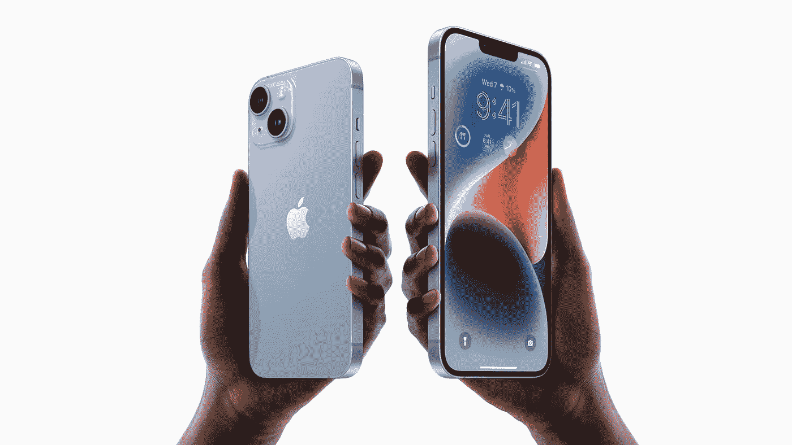
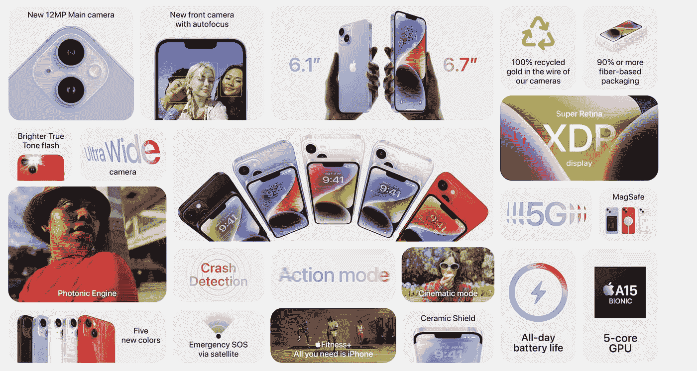
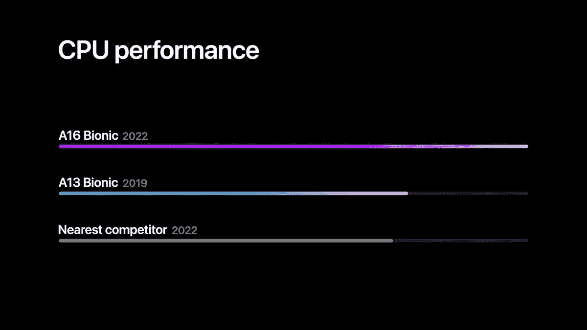

# 别慌，苹果的 iPhone 14 还在坚持去年的芯片

> 原文：<https://medium.com/codex/dont-be-alarmed-apple-s-iphone-14-is-sticking-to-last-year-s-chip-b0a344c26fd7?source=collection_archive---------3----------------------->

## 这不仅仅是利润和削减成本

来源:苹果。

苹果在 Far Out 活动上宣布的 iPhone 14 和 14 Plus 大家都很熟悉。

如果你认为去年的 iPhone 13 几乎没有什么变化，即使看一眼续集的规格表，你也会被原谅。虽然电池(据报道长达 26 小时)和相机(捕获的光线多 49%)得到了显著的升级，但其他方面几乎没有变化。iPhone 14 有相同的凹槽，相同的 60 Hz 显示屏(799 美元的犯罪)，最重要的是，相同的 A15 仿生芯片。

嗯，几乎相同的 A15 仿生。

iPhone 14 借鉴了去年的高端 iPhone 13 Pro，这是一款 A15 仿生产品，带有一个额外的 GPU 核心(总共 5 个)，以进一步提升图形性能。得益于耗电更少的屏幕和硬件优化，基本款 iPhone 14 的电池寿命比价格更高的 14 Pro 更长也就不足为奇了。

但是 iPhone 14 Pro 得到了真正的升级，配备了新的摄像头，A16 仿生处理器，以及丝绸般光滑的 120 Hz 显示屏上的一个药丸形状的凹槽。虽然 999 美元的价格标签是一颗难以下咽的药丸，但 14 保留了其前代产品 799 美元的价格，几乎没有任何表现。

但这就是为什么旧处理器不是一个坏主意。

来源:苹果。

## iPhone 14 的旧 A15 仿生芯片仍然是一个发电站

苹果不是第一个重新使用旧处理器的制造商。这种趋势已经在 Android 领域发展了一段时间。但是，尽管小米等 Android 智能手机制造商一直在使用去年的芯片以中端价格提供旗舰性能，但苹果并没有走这条路。这是因为苹果的旧芯片仍然可以与高通的最新芯片相媲美。

一个典型的例子是，苹果在活动中展示了一张模糊的图表。我开玩笑的。

谢天谢地[基准](https://nanoreview.net/en/soc-compare/qualcomm-snapdragon-8-gen-1-vs-apple-a15-bionic)是个东西。

数字不会说谎。去年的 A15 Bionic 功能强大，击败了高通的骁龙 8 Gen 1 等新芯片，这些芯片在 2022 年的大多数安卓旗舰产品中都能找到。苹果的硬件和软件之间的紧密结合意味着 iPhone 14 可能会与竞争对手的手机一起发展很多年。虽然我担心它将收到的更新数量，但此举也可能意味着去年的 iPhone 13 将在一段时间内保持相关性。

然而，性能并不是唯一的标准。定价同样重要。

来源:苹果。

## 一年的优化设计使 A15 仿生更容易制造

这是自 2008 年的 iPhone 3G 以来，苹果首次没有将 iPhone 升级到新的处理器。虽然我不会把现在和 2008 年的经济放缓相提并论，但 2022 年的情况也不会很好。

随着通货膨胀推高了制造商和消费者的价格，苹果公司设法达到了与去年 iPhones 相同的价位，这是一个奇迹。这一胜利的一部分可以归功于苹果公司决定大规模生产它已经有经验的芯片 A15 Bionic。随着[硅短缺](https://www.theregister.com/2022/04/29/apple_silicon_shortages_and_c19/)远未结束，苹果保证其满足这个假期需求的能力是明智之举。

虽然我仍然怀疑这家科技巨头在定价方面的信心，但苹果尽力在高端竞争对手中保持竞争力。

当然，iPhones 缺乏折叠显示屏和新颖的摄像技术。但是在可靠性方面，没有人可以挑战库比蒂诺巨人的优势。

A15 仿生机器人的速度仍然足够快，几乎可以应付你扔向它的任何东西。

苹果决定升级组件，为其大多数客户提供最大价值。电池和摄像头升级绝对是明智的选择。花 899 美元购买更大的 6.7 英寸 iPhone 14 Plus 是苹果多年来都没有提供的选项。

人们仍然喜欢 iPhone 14 的“如果没坏，就别修”设计。2022 年，iPhone 4 风格的平板屏幕和铝轨依然引人注目。我只是希望 iPhone 14 的内部不会一成不变。