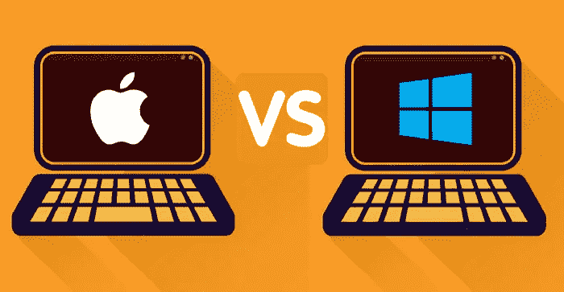

# 不要买 Mac，PC 价格已经下降了 50%,原因如下！

> 原文：<https://medium.com/codex/dont-buy-a-mac-pc-prices-have-gone-down-50-and-here-s-why-522e8088080c?source=collection_archive---------13----------------------->

上周，现在被称为“CryptoWinter”的这个星期对 PC 市场产生了疯狂的影响，仅在过去的几天里，某些部件(即显卡)的价格就下降了其原始价值的 50%以上，原因如下！

来源——代码

随着大型加密投资组合被抹去，在这种情况下，根据彭博的说法，是尼科尔·维森特…