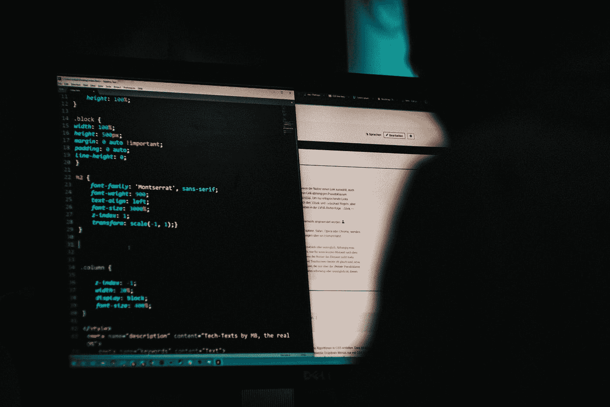

# 不要让网络攻击毁了你的生活:保护自己的 12 种方法

> 原文：<https://medium.com/codex/dont-let-cyber-attacks-ruin-your-life-12-ways-to-protect-yourself-50f0c559d2d8?source=collection_archive---------39----------------------->

## 不要让网络攻击毁了你的生活！用这 12 个简单的步骤保护自己。阅读全文。

米卡·鲍梅斯特在 [Unsplash](https://unsplash.com?utm_source=medium&utm_medium=referral) 上的照片

随着技术的进步，犯罪分子利用技术的方式也在进步。事实上，网络犯罪现在是世界上最常见和最有利可图的犯罪之一。当……