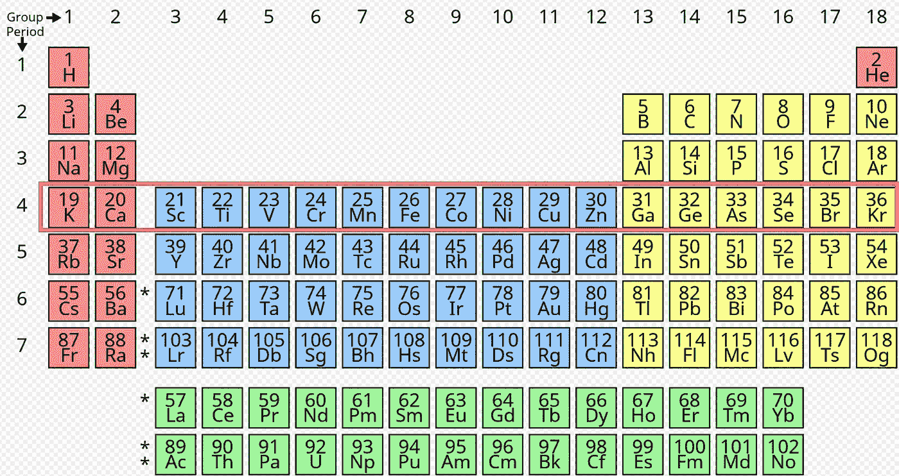
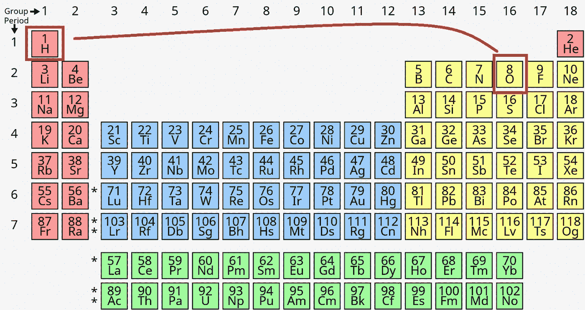
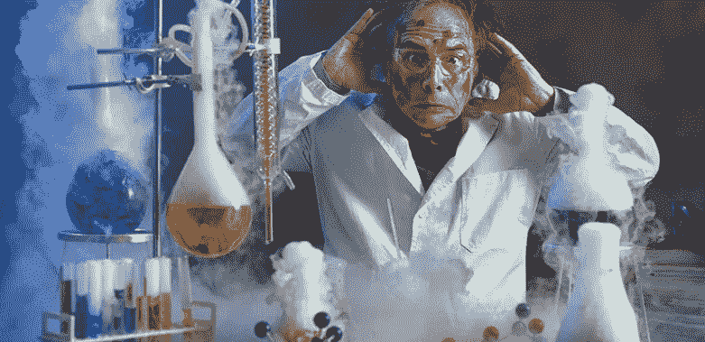
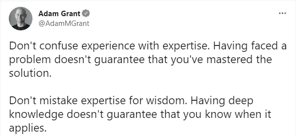

# 不要因为糟糕的面试过程而失去好的候选人

> 原文：<https://medium.com/codex/dont-lose-good-candidates-because-of-bad-interview-process-522b29df2aed?source=collection_archive---------4----------------------->

作为团队领导，我有一个很好的机会同时参与招聘过程的两个方面:我在招聘，我定期作为候选人参加面试。

作为一名面试官，同时被面试，让我能够从两个方面比较这个过程，以正确地回顾和建立最有效的面试过程(从我的角度来看),应该只满足两个目标:

*   让面试过程对候选人来说很舒服
*   让面试过程有效地发现所需的人才

结果，我把所有处理过的面试按照“面试满意度量表”进行了分类。为了使这种比较易于阅读和技术不可知论者，我在这里使用“元素周期表”知识作为比喻。

# 0:提醒“元素周期表”第四行所有元素的正确顺序

常见，真的？我需要用手机记住 10 秒钟就能找到的信息吗？

这完全是静态的，与现实世界的信息无关。除了作为面试问题，你在实践中使用过这些信息吗？

我参加的一些面试过程就是为了问几十个类似的问题——不停地问问题和回答，就像你是某种智力游戏的一部分一样。这个恼人的过程——这样的面试过程的结果只谈面试准备的成功(像备考)，而不谈你的经历和你进一步的动力。

作为一名面试官，我也不希望应聘者在考试中自我感觉良好。首先，这看起来非常不专业——只有一个可能答案的问题限制了交谈的可能性，因此认出一个经验丰富的工程师的机会非常小。还有，潜意识里觉得自己在考试，让我有压力。每下一个错误的答案都会成倍地减少我们调整关系的机会——这已经是一种预构建的师生状态。你所需要的——尽快完成考试。

# 1:在周期表中排列元素的可能原因是什么？

化学作为一门科学是非常复杂的。你不可能什么都知道，也不应该知道。这是一门不断发展的科学，由许多子类型组成，每个月都有新的发现。但是这门科学的主要目标——基于独立元素之间的反应和相互作用来理解我们宇宙的结构。

在接受采访时，我不仅想把焦点放在我投资的技能上，还想放在我为什么选择一个特定的进化载体上。你不是在选择 Java 语言——你是在选择这种语言所属的生态系统。

如果你是一名工程师，你应该了解行业目标。您应该了解不同类型的问题以及解决这些问题的常见模式。为什么微服务模式不是银弹，像散列表这样的特定数据结构如何解决特定的性能问题？为什么区块链是安全关键系统的良好选择？

Jamstack，Mean-stack，Mern-stack，ELK-stack，TIG-stack。它们都有使用的主要原因。这些是针对特定问题子集的成熟解决方案。没有必要了解每一个，但是高层次的了解非常重要。

作为一名面试官——问这类问题是为了分享你对不断变化的世界的理解，以及你在这个领域有多自在。这允许讨论选择一个特定发展方向的当前背景和原因。

# 2:氢和氧的化学区别是什么？

这听起来很有趣。您是否因为炒作、当前趋势、缺乏领域和上下文知识而使用某些技术、实用程序、语言或框架？您了解这些差异以及每种技术旨在解决的问题类型吗？你打算用氢作为任何化学反应的主要元素吗？或者可能已经存在具有所需属性的元素？

低代码和无代码开发现在并不是一个新的时髦词。这是 PaaS、SaaS、IaaS 提供商和开源贡献进入技术栈的自然演变。您不需要为常见问题编写代码，只需使用业内成熟的解决方案。你编写的任何代码都有支持的代价，你重用的任何库/解决方案都有得到他人支持的好处。

如果面试官有关于根本不用写代码就能解决常见问题的问题，例如使用云托管服务，这是非常积极的。

面试时，我想找到“懒惰”的候选人，他们致力于用尽可能少的代码来寻找常见问题的解决方案。解决业务问题不仅仅是编码。

# 3:当氢和氧混合时会发生什么，为什么？

这已经是一个隐藏着复杂性的问题了。根据学校的化学课程，这是非常明显的，但是在什么条件下发生这个反应是非常重要的。如果你知道唯一的理论——你将无法识别这个问题的主要意思。只有经历过，你才能揭示这种复杂性。作为一名工程师，你应该为现实世界的挑战做好准备，而不是理论上的战斗。

当 React 和 Angular 独立支持 2 个页面时，我可以将一个微前端称为解决方案吗？如果将一个大型整体部署为 3 个副本，中间有负载平衡器，那么我的架构是否尊重微服务思维？这里没有严格的是/否答案，除非你提出额外的问题。回答问题后也没有严格的答案。

这种类型的问题可以充分展示你的经历。不仅要“用什么”，还要“怎么用”。问这样的问题——你，首先，给候选人增加额外的权重，你调整你的立场。这已经是伙伴讨论，但不是面试官-候选人的关系。

# 这种反应的顺序应该产生这个结果，但是我得到了不同的结果。为什么？帮我找错误。

快速发现问题——这是一项非常大的才能。理解代码的味道——这也是一个很大的天赋。这种经验使你能够从长远的角度出发，制定出具有坚实基础和稳健性的解决方案。

这不仅仅是关于代码——你可能会被要求找出 UX 不正确的行为或 CD 不一致。这不是关于 QA 技能——这是关于产生干净的代码和架构的动机，在可以改变的时候尽早发现可能的错误，让其他人相信处理债务的必要性，等等。

这类问题能让双方进行良好的对话并分享经验，因为并不总是存在唯一正确的解决方案。通常，任何解决方案都是不同方面的权衡或组合，并不总是一帆风顺。这主要是 100%的合作伙伴讨论，没有不信任的感觉。你有时间用你的经验来解决业务问题，即使这些是理论问题。

# 结论

在招聘过程中，除了在正确的时间找到正确的人来解决当前的业务挑战之外，没有其他原因。

知识、专长和其他才能只是这类人的良好指标，但不是首要要求。候选人——首先，是一个未来的合作伙伴，他有热情和强烈的愿望通过消除前进道路上的障碍来帮助企业发展。不要因为面试过程不好而失去优秀的人。