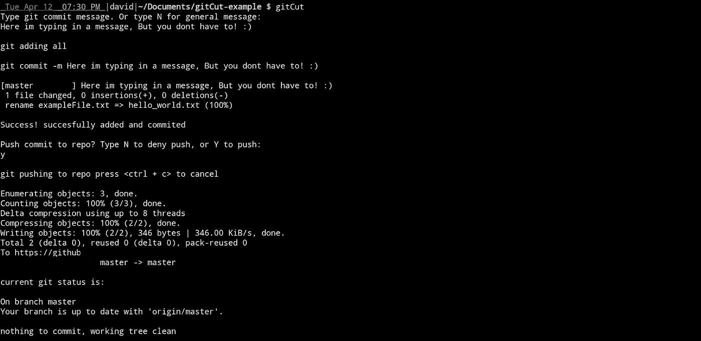

# 不要再用 Git 了，直到你看完这篇文章！

> 原文：<https://medium.com/codex/dont-use-git-again-until-you-read-this-article-b0cc1918c353?source=collection_archive---------12----------------------->

# **Git 的问题**

如果你和我一样，经常使用 git 上传文件和数据到你的远程仓库，这真的很简单，只需要几个**命令。首先完成修改，然后从 git add 开始，然后是 git commit(带消息)，然后是 git push。三个命令？为什么这么多？当然，一定有一个更简单的命令可以在一个命令中完成这三项任务。**这引起了我的思考，所以我建立了自己的 git 快捷命令(称为 Git Cut ),在一个简单、小巧、易于使用的命令中完成了这三个功能。****

# 没有人喜欢使用多个命令

首先我想谈谈如何实现 git 添加、git 提交，然后用其他方式实现 git 推送(**仍然很麻烦**)。人们已经找到了类似 git add 这样的命令。& & git commit -m“消息”，或者 git commit -am“消息”，甚至配置 git 别名。现在所有这些似乎都很难使用。因此，我创建了一个简单的命令，可以集这三种功能于一身。

# Git 添加、提交和推送(gitCut)

GitCut(我自己创建的 bash 脚本)解决了这个问题。看着！

首先让我们检查目录中有哪些文件。

现在让我们对目录进行更改。

现在我们可以使用 gitCut 了！如您所见，系统会提示我们是否要添加 git 消息，以及是否要将其推送到远程 repo。如果您不添加消息，默认消息将是“一般更新”。

**如您所见，这比运行多个命令要容易得多。只需运行 gitCut，然后输入一条消息(如果你想的话),并键入 y 或 n 来推送或不推送。**

# 这个很棒的脚本可以在这里找到！

如果你喜欢这个 bash 脚本，请确保在 https://github.com/Davidfree2/BASH[查看它](https://github.com/Davidfree2/BASH)

**感谢阅读**！如果你喜欢阅读这样的文章，一定要给我一个关注。也想知道我最近在忙什么？**点击** [**查看我在 https://github.com/Davidfree2**](https://github.com/Davidfree2)**或者点击我的个人网站**[**http://davidesquerra.com/**](http://davidesquerra.com/)