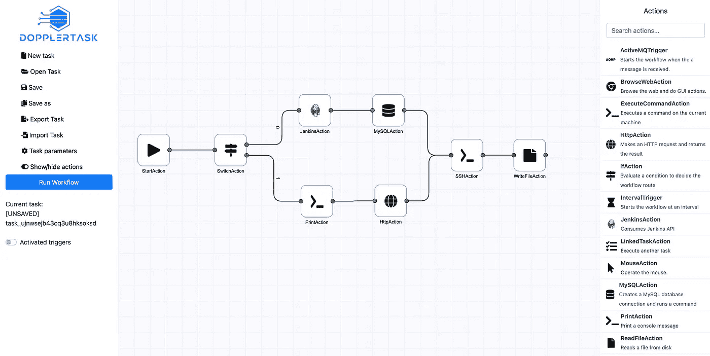
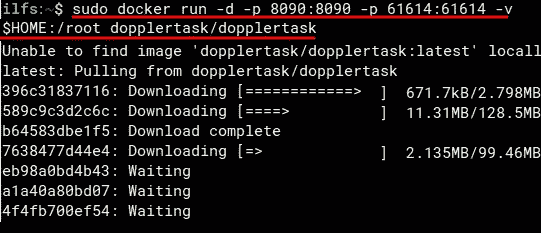
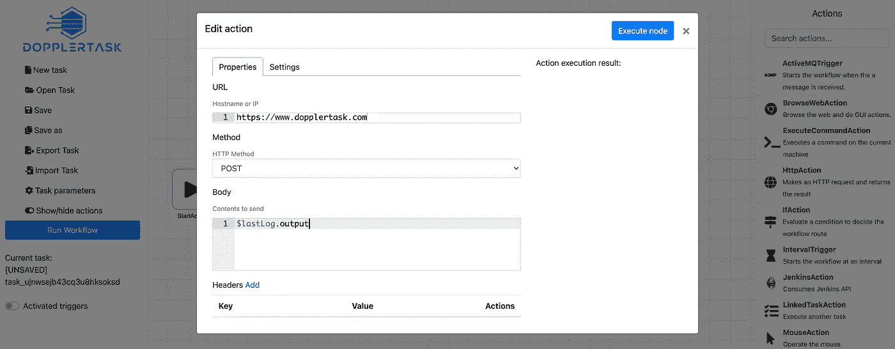
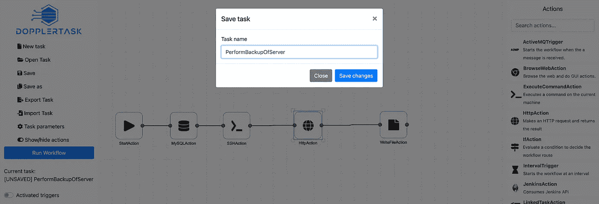
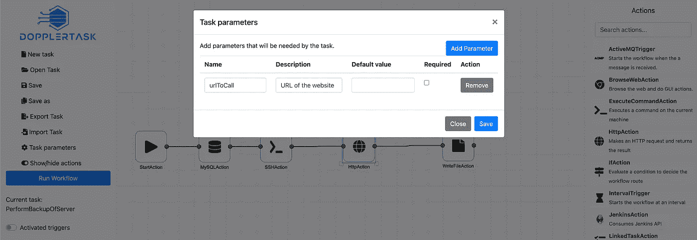

# DopplerTask——革命性的开源自动化工具

> 原文：<https://medium.com/codex/dopplertask-a-revolutionary-open-source-automation-tool-b69e8167aba1?source=collection_archive---------1----------------------->

**DopplerTask** 是一款**免费开源的任务自动化工具，最初是为开发者**打造的。在这里，您可以自托管该工具来自动化各种任务。无论是一堆 bash 脚本还是只是远程启动你的汽车，你都可以实现自动化。您可以在这里直观地将您的任务定义为工作流，并将其设置为自动驾驶。它支持许多动作和脚本，您可以将它们组合在一起创建一个完整的工作流。您可以使用它自动执行多项任务，然后从一个统一的界面管理它们。

从发出 HTTP 请求到数据库操作，都可以做到。您可以运行系统命令，甚至执行浏览器操作。它提供的任务构建器非常具有交互性，并支持在节点的帮助下创建拖放式工作流。您可以导入和导出任务，并在 DopplerTask 的多个实例中使用它们。目前，您可以使用 Docker 在本地或 VPS 上部署它。

那里有许多自动化平台，但它们大多是付费版本或提供非常有限的免费计划。为了不限制自动化，您可以托管您的工具。DopplerTask 是你会喜欢的工具之一。在撰写本文时，该工具支持大约 30 种操作，并且正在扩展。如果你是程序员或者开发者，那么你肯定会喜欢这个。

因为 [DopplerTask](https://dopplertask.com/) 是一个自托管工具，所以，你需要一个 Linux 服务器或 PC 来安装它。安装很容易，因为它有一个现成的 Docker 映像。或者，如果您是程序员，那么如果您愿意，也可以手动部署它。

# 安装 DopplerTask

只要确保你的 Linux 电脑或 VPS 上安装了 Docker。如果你正在使用 DigitaOcean，那么在创建 Droplet 时，你必须从工具链中选择 Docker。这将节省你通过繁琐的 Docker 守护进程手动安装。

只需打开终端，然后简单地运行下面的命令来下载和安装多普勒任务。等待安装完成，因为这需要几秒钟的时间。

`docker run -d -p 8090:8090 -p 61614:61614 -v $HOME:/root dopplertask/dopplertask`

安装结束后，您只需在浏览器中访问 DopplerTask 的主 UI。在地址栏中输入“ ***localhost:8090*** ”即可。您将直接进入工作流构建器来创建自动化。

# 使用 DopplerTask 创建任务自动化

右侧面板给出了自动化的所有模块。您只需点击其中任何一个即可添加到工作流构建器中。它还支持节点编辑，所以你可以加入多个块，如果你想的话。您在工作流程中添加或包含的每个块都需要进行配置。它支持的一些自动化模块如下。

*   MySQL 动作:通过这个，你可以选择在 MySQL 数据库上执行数据库任务。您可以向双方提出请求；本地和远程 MySQL 数据库实例。
*   **鼠标动作**:该动作操作鼠标。有了这个，你可以移动鼠标光标到一个特定的位置，甚至模拟鼠标点击。
*   **浏览器动作**:有了这个，你可以浏览网页，做 GUI 动作。
*   SSH 动作:通过 SSH 连接到远程服务器。
*   **脚本动作**:运行脚本。
*   **等待动作**:用于在自动化工作流程中添加延迟。
*   **HTTP 操作**:这个模块将帮助您执行 HTTP 请求。您可以使用它进行 API 调用，比如 GET、POST 和 PUT 请求。它支持自定义标题，您可以在请求期间指定要发送的自定义正文。
*   **执行命令动作**:使用该模块执行系统命令。

选择块之后，是时候配置它们了。点击一个模块，然后配置页面会弹出。根据您选择的模块，您必须指定相应的参数。例如，如果您选择了 MySQL block，那么您将必须指定数据库连接参数。如果选择 HTTP request maker，则必须指定请求类型和端点。DopplerTask 非常灵活，允许您用 Javascript 或 Velocity 编写脚本，这些脚本将在自动化运行时进行评估。

类似地，您可以配置其他模块并保存更改。单击 save 按钮，通过给任务命名来保存任务。事情就这么简单。

如果您想要指定一些任务参数，那么您也可以指定它们。这些用作自动化的输入变量，可以在任何操作中读取。如果您想要导出自动化，那么您也可以这样做。当您导出任务时，它会以 JSON 格式保存它。

这样，您就可以承载、设置和使用 DopplerTask。非常快速和容易地创建无限的任务。它将高效地执行所有任务，你可以在它的 GitHub 库上阅读更多关于高级用法的内容。还有一个 CLI 与之交互，并提供了使用说明。

# 革命性事物的开始

如果你正在寻找一个开源的自托管自动化工具，那么 DopplerTask 是一个非常好的选择。试试吧，我相信它不会让你失望的。使用和安装的过程非常简单。它所支持的自动化块的集合很好，我希望它们在即将到来的更新中添加更多的选项。如果你是一名开发人员或程序员，那么你也可以为它的发展做出贡献。