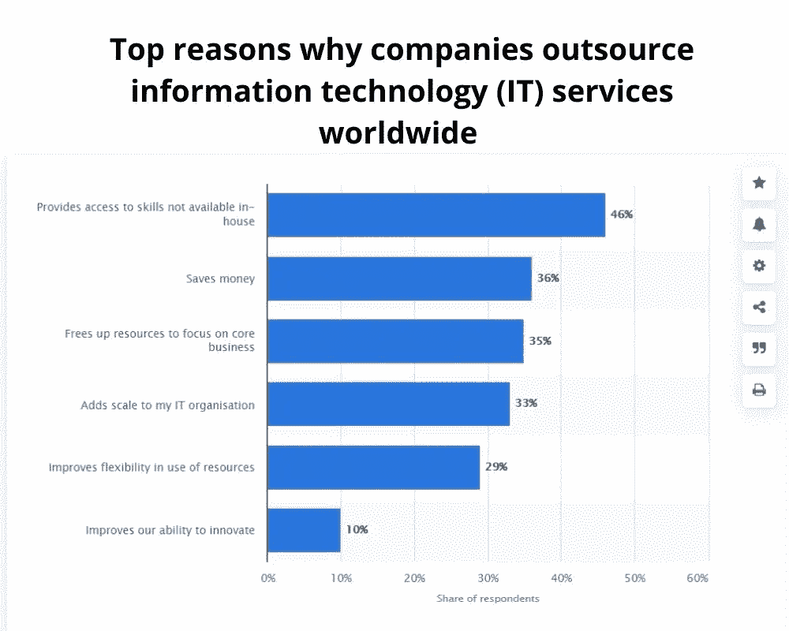

# 外包 Android 应用开发的注意事项

> 原文：<https://medium.com/codex/dos-and-don-ts-of-outsourcing-android-app-development-17916b726a6?source=collection_archive---------9----------------------->

如今，Android 应用程序开发是一项大业务。如果你想进入这个领域，将你的应用程序开发外包给海外开发者或提供商可能会很有诱惑力。然而，如果你在不知道自己在做什么的情况下这样做，你的项目很快就会变成一场噩梦。

外包，或者找其他人来做你本来可以做的工作，是一种节省时间和削减成本的合法方式——除了编辑或开发应用程序，你还有其他事情要做。然而，在为您的项目选择开发人员时，有一些重要的注意事项需要考虑。

许多小企业尝试构建应用程序，迈出了外包的第一步。这似乎是一个从招聘开发人员中缓解现金流的绝佳机会，但它也可能是一项不稳定的业务。

你可能会问自己:

*   **为什么我会外包而不是雇佣员工？**
*   **雇佣内部人员不是更容易吗？**

嗯，在某些情况下，是的。大多数情况下，不会。

**原因如下**

来源: [Statista](https://www.statista.com/statistics/948977/technology-outsourcing-top-reasons-globally/)

雇用一名全职员工涉及各种费用，包括福利、税收和设备，但他们还是会时不时地要求加薪！

这意味着，如果你正在寻求对开发项目支出的更多控制——但仍需要帮助编写应用程序——外包可能适合你。

此外，德勤的以下统计数据将让你更深入地了解为什么外包是你的企业的理想选择:

*   ***59%的企业将外包作为削减成本的工具。***
*   ***87%的企业与其外包合作伙伴保持着健康的关系。***
*   ***57%的企业将外包作为加强关注关键业务目标的工具。***
*   ***47%的商业企业通过外包解决产能相关问题。***
*   ***31%的企业通过外包提升服务质量。***

我们可以继续下去，但当你已经决定外包你的 Android 应用程序开发项目时，这又有什么意义呢？让我们来讨论与之相关的重要事实。

外包最重要的一点是知道你将外包什么任务&不外包什么任务。如果你的组织雇佣了另一个团队来开发一个应用程序，而没有预先明确定义期望，那么双方都可能在以后遭受误解或失望。

当你考虑外包你的应用程序开发时，这里有一些事情你应该知道，以确保它顺利进行。我们开始吧！

# 你如何选择你理想的开发人员团队？

如今，找到一个开发团队是最基本的。然而，如何选择适合自己的团队呢？

在决定使用哪个团队时，您应该考虑以下四个因素:

*   声誉，
*   费率，
*   正确的位置，&
*   正确的技术堆栈。

务必通过 Skype 或任何其他视频会议资源与您雇佣的团队进行沟通，因为这样更容易理解他们的技术组合等。

同样，各国的费率也各不相同。例如，印度的平均时薪是 15-30 美元/小时，远低于美国的 30-60 美元/小时。

平均费用也取决于你的预算和项目的规模。你应该总是问经验，投资组合，看看他们以前做过的例子。

# 寻找合适的移动应用开发公司

要找到一家优秀的 Android 应用开发公司，首先要寻找在你的行业中有经验的知名公司。虽然查看他们过去的工作是必要的，但你希望根据你的项目雇用他们。

确保你**选择了一个具有良好沟通技巧的团队**(人们面临的最常见的问题是沟通不畅)。最后，在签署任何协议之前，确保你觉得和他们一起工作很舒服。

如果可能的话，至少和他们团队中的一个开发人员直接交谈，以确保你们在同意合作之前相处融洽。这三个建议将帮助你开始为你的下一个项目雇佣优秀的开发人员！

管理远程团队面临多重挑战。因此，让我们来看看外包移动应用程序开发的首要注意事项。

# Android 应用程序开发的必做之事，有真实的例子

**做:分析你的移动应用需求**

在你开始寻找最能帮助你的自由职业者或代理人之前，考虑你项目的每一个角落。您需要确定您的应用程序是否需要任何**数据库、网络服务集成、视频聊天功能、照片存储功能**等。

接下来，整理出一个清晰的项目范围，包括任何潜在的设计资产(即模型)。掌握所有这些细节会让你知道你所提议的是可行的还是不可行的，这样你就可以避免浪费时间或者陷入 Android 开发者的开发周期中。

这个过程一开始可能看起来很繁琐，但最终当你的应用程序正确满足你的所有要求时，这是值得的。

**例如**，如果你计划在你的应用程序中存储照片，一定要[雇佣有整合 Google Play 服务或其他照片存储解决方案经验的安卓应用程序开发者](https://www.pixelcrayons.com/hire-android-developers)。

如果你雇佣了一个没有这方面经验的人，你会发现自己以后不得不修改部分代码。使用设计资产也将节省时间，因为你已经为 Android 开发者绘制了所有的视图，使他们更快地开始你的项目。

*提前做好一切准备也有助于在调整出现时避免时间延误。*

做:研究你的应用程序的目标受众

由于不同的人口统计数据在一个应用程序中寻找不同的服务，因此做好研究以选择合适的开发者至关重要。

此外，当你选择了目标受众，一定要在你的项目简介/构思阶段提到他们。通过这种方式，开发团队将通过搜索资源来更好地为您的目标客户做准备。

**例如，**如果你的应用是为 30 多岁的女性开发的，你需要专门寻找那些有经验的开发人员来满足这些人群的需求。这个想法是要注意一些关键的东西，比如颜色主题、用户界面设计、用户友好性等等。，提升 app 的 UX。

**做:在开发人员中寻找经验&技能组合**

外包项目缺乏合格的、有经验的开发人员。在你的泳池中寻找经验。一个好的开发者会马上告诉你他们是否能构建出你想要的东西，或者他们是否能，但是这会花费你更多的时间或者成本。

具体询问他们在 Android 开发方面的**经验，**无论是移动设备、手表、电视，还是你打算采取的任何方向。在把你有价值的工作托付给他们之前，确保他们已经完成了那个领域的项目。

来源: [**码爸**](https://www.codersdaddy.com/)

外包 android 应用程序开发的最大问题是找到知道如何有效使用其所有功能的人，所以如果可能的话，专注于让专家处理你的项目。

**例如，**如果你正在创建一个消息应用程序，确保他们已经创建了带有聊天室的应用程序，或者至少以前参与过聊天室。寻找与你的项目相关领域的经验。

寻找与你的项目相关领域的经验。

他们不需要成为每个领域的专家，但是如果你想要一个物有所值的高质量产品，他们应该在 android 开发的某个方面展示他们的专业知识。

**Do:咨询工程保修& NDA**

当你考虑雇佣外包应用开发公司时，你应该在他们的协议中寻找 NDA(保密协议)条款。它将保护你的知识产权。

您还想了解您的项目是否有**保修期。如果有，是多久？如果他们在这段时间内没有达到特定的里程碑会发生什么？延长保修期有补偿吗？这两件事让你在外包的后期不会头疼。**

例如，NDA 条款可以帮助阻止开发者未经许可分享你的想法。例如，如果你计划为护士开发一个社交网络应用，NDA 可以阻止开发者未经同意发布他们的应用。

如果事情出了差错，它也有助于保护您的业务。假设他们没有完成你 app 的开发。这一条款至关重要，因为它让你在两种情况下都有优势。开发人员花几个月甚至几年的时间来完成项目并不罕见。

你需要一个合适的系统，这样如果他们拖延开发或者为他们不能完成开发找借口，你就有权利解雇他们或者在保修期内获得补偿。

# 不要 Android 应用程序开发，与现实生活中的例子

**不要:选择价格而不是质量开发商**

低价报价很容易诱惑你，但你会以多种方式为此付出代价。雇佣一个时薪较高但能为你提供高级服务的人比雇佣一个时薪较低但不能提供基本开发服务的人要好。

请记住，外包软件开发不像从 Craigslist 购买家具——质量是有代价的。

**例如，**如果你分别以**$ 10/小时**和**$ 20/小时**的价格雇佣两名开发人员，那么这位 **$10** 的开发人员在为你的项目编码时，将会比以**$ 20/小时**的价格多工作 50%的时间来赚取他们的日工资。如果你重视你的时间和内心的平静，你应该在前期投入更多，并找到一个高质量的开发人员，他将交付同样可维护的优秀代码。

**不要:忽视安卓应用的技术栈**

并不是所有的技术都是一样的，这就是为什么知道你要进入什么是很重要的。你可以花大价钱购买一个在一件事情上做得很好的技术组合，或者一个在很多事情上都做得很好的技术组合。归结起来就是寻找功能和成本之间的最佳平衡。

但是一定要做好选择，因为如果你不睁大眼睛去看，你最终可能会付出太多，或者满足于不太理想的东西。

Android 技术堆栈由许多不同的东西组成，但许多企业更喜欢用 Java 开发应用程序。Java 是一种已经存在了几十年的编程语言，Sun Microsystems 在 1996 年创造了它。

另一方面，你可以使用 Kotlin，这是 JetBrains 为 Android 开发的一种相对较新的开源编程语言。

## **这是一张描绘 Kotlin v/s Java 的信息图**

两者很相似，但又有很大的不同，其中一个可能比另一个更适合您的项目。两者都有优点和缺点，所以决定哪一个是最好的将取决于你的团队的需求。

**例如，**如果你很匆忙，想找一种能让你更快推广应用的语言，那么 Kotlin 比 Java 更重要。相比之下，如果你正在开发一个简单的应用程序，那么 Java 是一个被证明是优秀的选择。

记住，决定你的 Android 应用的技术栈也将帮助你选择合适的开发人员和技能。不利的一面是，你需要先进的技术技能来选择理想的技术堆栈——利用**免费咨询安卓应用开发公司**来为你的应用选择最佳的技术堆栈。

**不要:与开发团队有沟通的隔阂**

您最不希望的就是与您的开发团队不同步。你的产品经理和开发人员之间的沟通差距可能会导致发布延迟、期望落空和客户投诉。

避免沟通障碍的方法是在整个开发过程中不断交谈。如果事情没有按预期发展，保持沟通渠道畅通，这样你们可以一起找到解决方案。

**例如，** [雇佣应用开发者](https://www.pixelcrayons.com/hire-app-developers)**通过**通话、实时聊天、视频会议、虚拟会议、**等方式为你提供正式&非正式的交流方式。，在您的业务中实现无缝集成。**

****不要:不与开发团队讨论时区****

****

**根据您所在的位置，安排电话或面谈可能并不容易。请确保你清楚你的外包公司的时区，以便他们可以相应地计划他们的团队。**

**此外，请注意东部标准时间(EST)和太平洋标准时间(PST)之间的差异。大多数人最方便的时间是美国东部时间或太平洋标准时间。如果你选择，试着使用东部时间，因为与太平洋标准时间相比，在那个时区的工作时间会有更少的干扰。**

****例如，**如果你在太平洋标准时间(PST)的三藩市，你将很难与来自印度的开发团队安排电话或面谈，因为他们提前了五个小时。**

**要根据你的工作日程安排电话，你必须等到他们时间的上午 10 点，这意味着你要到下午 5 点才开始工作。你可以在午餐时间继续工作，但结果会损失很多生产力。**

**这也意味着如果有任何关于 bug 或文档的问题需要在周五晚上 8:00 澄清，你将不得不等到周一下午才能解决它们。**

**因此，最好要求外包团队在你觉得合适的时区定期开会。**

# **包扎**

**第一印象是至关重要的，所以确保你和你的开发者有一个好的开始。明确你的项目目标，但要接受建议。**

**如果你和一个独立的开发者一起工作，花点时间建立关系——这样会有回报的。如果你在交流或理解专业术语方面有困难，请随时提问！**

**[印度的 Android 应用程序开发公司](https://www.pixelcrayons.com/mobile-app-development/android-development)希望他们的客户在工作中获得快乐&当这种事情发生时，你们双方都是赢家。**

# **常见问题**

## **问题:我应该从一个专业的 Android 开发者那里得到什么服务？**

****回答:**你必须知道你的 android 开发者在什么时候提供什么样的服务。警惕那些给出一概而论答案的开发者，就像我们可以做任何事情一样！或者任何你需要的。优秀的 android 开发公司会给出一个可靠的回应，看起来有点像这三个类别:**

*   ****设计:**我们的设计团队专门为屏幕尺寸在 5-6 英寸和 10-12 英寸之间的所有设备上运行的应用程序进行材料设计。我们的设计师非常擅长创建漂亮的 UI/UX 流，同时对应用导航的 Android 惯例非常敏感。**
*   ****开发:**一旦决定了一个设计，我们的开发人员会单独审查每个 UI 元素，然后利用精益设计原则将其实现到代码中。它保护了我们客户的时间，而不牺牲他们最想要的应用程序的可用性或功能。虽然任何软件开发很少是没有错误的，但我们为测试我们生产的每一行代码而自豪。**
*   ****测试/QA:** 我们运行自动化测试来捕捉逃避单元测试的 bug，并在必要时抽查一些手动 QA 检查。完成后，所有的测试结果都可以提供给我们的客户，所以如果有任何问题，你可以自己验证哪里出了问题，而不是依赖别人的话。我们承担的每个项目都提供这种价值包，无论项目大小，因此您总能洞察事情的进展情况。**

****注:**以上回答并不详尽，主要是给你一个思路，热情的开发公司或开发人员应该出现什么样的专业交流。**

## **问题:关于外包安卓应用，你还有其他建议吗？**

****回答:**除了提问，详细说明你想要什么是个好主意。列出你需要的东西，并给出例子。如果你的应用程序中有一些特殊的功能，而这些功能在类似的应用程序中并不常见，确保你从一开始就清楚地表达了这些功能。**

**在参与任何项目之前，确保你询问其他人关于他们类似项目的经验。**

## **问:我需要律师或法律代表为我起草合同吗？**

****答:**不，你不需要律师或法律代表。这看起来似乎是一件可怕的事情，但是如果双方(客户&开发人员)同意并签署合同，并遵守其条款，一切都会好的。**

## **问题:开发一个安卓应用需要多少钱？**

****回答:**根据所需内容的不同，构建一个 app 的成本会有很大差异。有很多因素比如你的想法有多复杂，你需要多少屏幕和功能等等。**

**一般来说，开发一个简单的应用程序需要花费**16000 美元或更少，**而更复杂的应用程序可能需要花费**50000 美元**或更多。货比三家&从不同的公司获得大约 3 个报价，比较价格和提供的服务。**

****检查我们的服务:****

**[**Web 应用开发服务**](https://www.codersdaddy.com/website-app-development-company-agency) **，** [**手机应用开发服务**](https://www.codersdaddy.com/mobile-app-development) **，** [**印度 UI UX 设计服务**](https://www.codersdaddy.com/ui-ux-design-service-company) **，** [**印度 IT 员工扩充服务**](https://www.codersdaddy.com/it-staff-resource-augmentation) **，** [**网站维护&支持服务**](https://www.codersdaddy.com/website-app-maintenance-support) **，** [**在印度雇佣 Android 应用开发者**](https://www.codersdaddy.com/hire-developer-engineer-programmer/android-app)**[**在印度雇佣 iPhone 应用开发者**](https://www.codersdaddy.com/hire-developer-engineer-programmer/ios-iphone-app)**[**在印度雇佣 PHP 开发者**](https://www.codersdaddy.com/hire-developer-engineer-programmer/php-web)**[**在印度雇佣 Python 开发者**](https://www.codersdaddy.com/hire-developer-engineer-programmer/python)**[**在印度雇佣. Net 开发者**](https://www.codersdaddy.com/hire-developer-engineer-programmer/dot-net)**[**数字营销服务**](https://www.codersdaddy.com/digital-marketing-agency-company-firm)**[**印度 SEO 服务**](https://www.codersdaddy.com/seo-service-company-agency-firm)**[**印度 ORM 服务**](https://www.codersdaddy.com/online-reputation-management-service-company)**[**SEO 内容写作服务**](https://www.codersdaddy.com/content-writing)**[**雇佣印度 React 开发者**](https://www.codersdaddy.com/hire-developer-engineer-programmer/react-js)**[**雇佣印度区块链开发者**](https://www.codersdaddy.com/hire-developer-engineer-programmer/blockchain)**[**雇佣印度以太坊开发者**](https://www.codersdaddy.com/hire-developer-engineer-programmer/ethereum) **。**************************