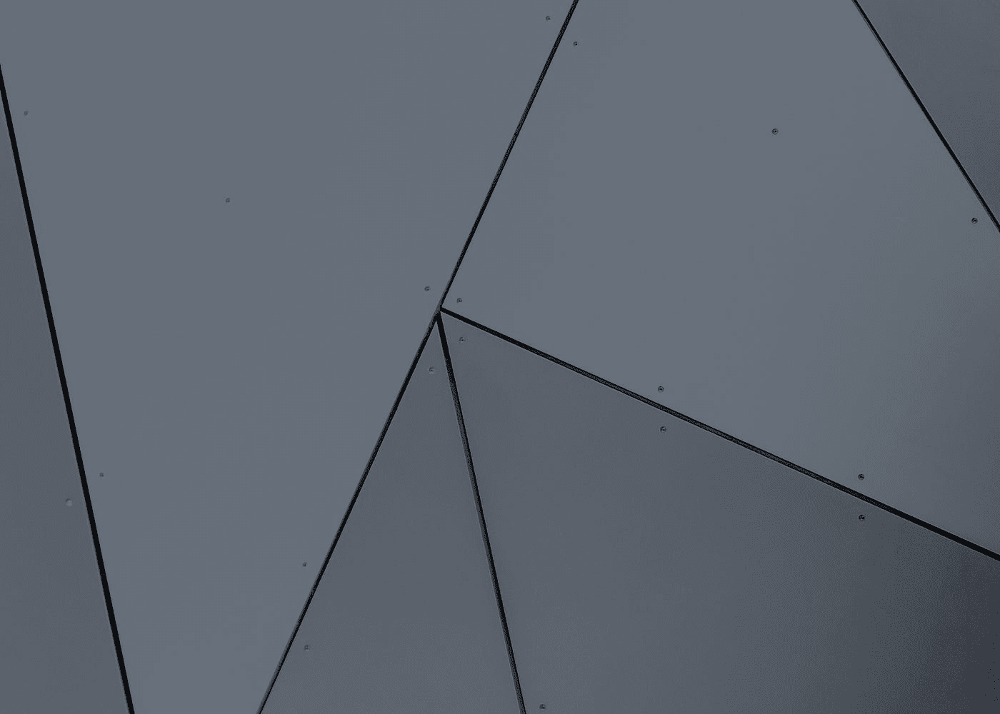

# 带 NumPy 的点积

> 原文：<https://medium.com/codex/dot-products-with-numpy-d199375423bb?source=collection_archive---------3----------------------->

斯科特·韦伯在 [Unsplash](https://unsplash.com?utm_source=medium&utm_medium=referral) 上拍摄的照片

## 介绍

根据数学家的说法，**点积**或标量积是一种运算，它采用两个等长的数字序列(又名**向量**)并返回一个数字(又名**标量**)。向量 A 与向量 B 的点积象征性地记为 ab。

从代数上来说，它是序列中每一项(也就是向量的元素)的乘积之和。如果你没有…