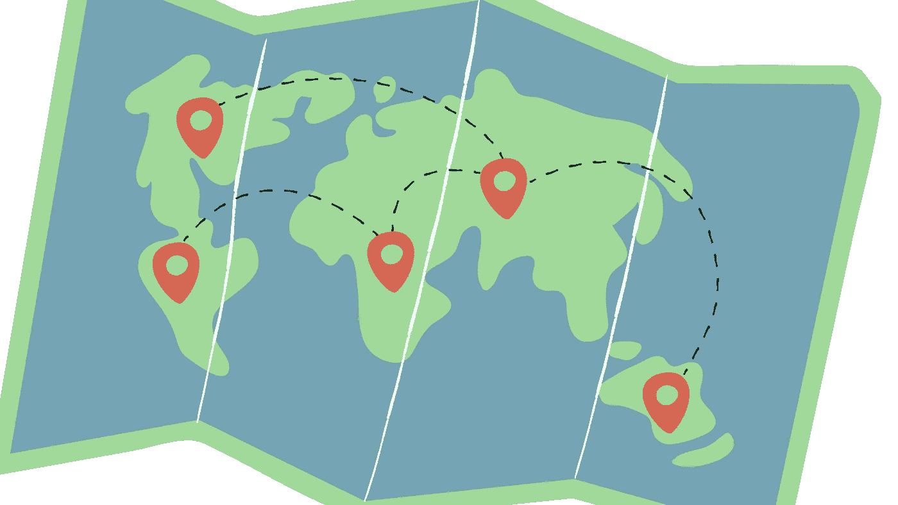

# 旅行日志:React 原生应用

> 原文：<https://medium.com/codex/dotravel-log-react-native-app-5182fbe9ffc1?source=collection_archive---------10----------------------->

在过去的两个月里，我学习并制作了我的第一个 React 原生应用。我探索了裸露的工作流程和世博路线。在这个令人敬畏的旅程中，我在生态系统中遇到了许多很酷的东西，如 redux、react-redux-persist、storybook 等等。然而，更重要的是，我开发了一个我认为很好的工作流程来帮助从头脑风暴到出版的所有开发步骤。在接下来的系列文章中，我很乐意记录并分享这个过程。

没有进一步做…

# 第一天:头脑风暴

# 第一步:总体思路

旅行日志是一个小项目，在我的脑海里已经有一段时间了。我不知道它到底是做什么的，但是我有一个想法(我通常是这样开始一个新项目的)。我脑中的问题陈述是这样的“我喜欢到处旅游；有时我会骑上自行车，去一两个小时外的任意地点，随心所欲地轮流去。这样做的时候，我大概走过了半个城市的道路。但如果我一直跟踪的话，我会知道的。不知道有没有适合我这种人的小众 app？”

我希望你同意，下一个合乎逻辑的步骤是谷歌搜索，一个简单的谷歌搜索导致他的网站列出了几个旅行日志应用程序。所有的应用程序都有一些我想要的元素。因此，我做了进一步的调查，这让我了解到已经做了什么，我可以在我的旅行日志应用程序中包含什么。

通常，这是我大多数项目夭折的地方。如果已经存在的东西不够不同，我为什么还要去创造它呢？但是如果你的目的是学习，你还是应该继续下去。这就是我们在这里所做的。我们正在学习和分享经验。

**关键要点:**不要多此一举。

现在，让我们进入下一步，用比 kinda 更好的术语来确定我们正在构建的东西。

# 步骤 2:具体细节和特征

我希望这个应用程序允许人们按需记录他们的旅行。

*   **，**旅行，就我们的目的而言，可以定义为一次简单的从家到工作单位的公共汽车旅行，一次有趣的夜间骑自行车旅行，或者一次环球度假旅行:任何涉及大约 50 米或更大的显著位置变化的运动。
*   **日志**表示在地图上标记路线，并可选地添加图片和/或声音，以及沿途结交的相关熟人。这些数据可以备份到用户的 google drive 或应用程序的后端。
*   **按需**意味着尽管应用程序需要后台位置访问才能工作，但用户应该能够在需要时轻松禁用跟踪。

为了完成上述任务，该应用程序将主要有两个屏幕:一个主屏幕和一个旅行日志屏幕。最重要的是，底部将有一个简单、干净的导航栏，可以在这两个页面之间平稳切换。

在主屏幕上，会有突出显示的行程。这些旅行可以由用户或应用程序使用某种度量标准来选择。在旅行日志屏幕上，会有一个可以放大和缩小的世界地图。当应用程序加载时，它会放大到最近一次旅行的位置。在这张放大的地图上，会有标明的路线，显示不同的旅程。标记的不透明度表示旅行的频率。用户可以点击这些红色路线来添加或查看相关的备忘录、图片和人物。

这种清晰描述应用程序的习惯将非常有助于创建技术规范、时间表、可交付成果以及文档。由于这个项目非常小，这些事情可能意义不大，但习惯是可以转移的。

**简而言之，**

1.  **光秃秃的最小特征**

*   位置跟踪和图形与日期的要求
*   选定位置的相关备忘录和图片

**2。MVP 特点**

*   主屏幕上的旅行集锦
*   相关的熟人

**3。更多功能**

*   可选备份
*   邀请朋友
*   看朋友的旅行
*   分享旅行备忘录
*   飞行地理定位
*   更多

在接下来的几天里，我们将尝试至少完成最基本的需求，然后你可以用各种方式来处理这些需求。

敬请关注第二天！请随意留下您的评论、经历和任何您想要的东西。