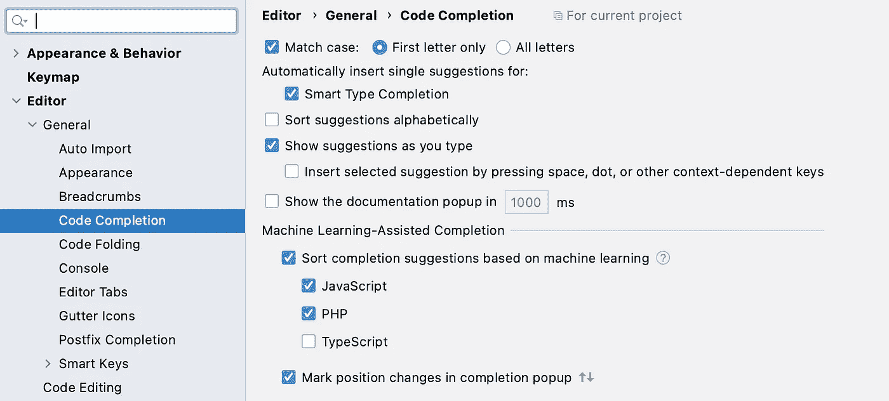

# 在 PHPStorm 中速度加倍

> 原文：<https://medium.com/codex/double-your-speed-in-phpstorm-5756d42cdd28?source=collection_archive---------3----------------------->

## [法典](http://medium.com/codex)

这是一个很大的要求，但你真的能加倍你的速度吗？

> 是的*—约翰·巴林杰

# tabnine —免费和付费版本

TabNine 是一个使用机器学习和一些神奇的人工智能来分析你使用 GPT2 的代码的工具。对我来说，索引非常快，当我编码时，建议不会导致任何速度变慢。

更神奇的是，我的代码不会离开我的机器(在 Pro 版本中，你可以卸载到云中，这可能是较慢的 windows 机器所需要的)。

它是做什么的？一般来说，它可以自动提示整行代码。

我的一个常见任务是获取登录用户的 Account 对象。在 Symfony 中，我们通过用户得到这个，通话时间有点长。

*$ account = $ this->getUser()->get account()；*

下面是 tabnine 自动完成我如何获得$account 变量

那真是超级快。我现在发现，我可以从代码中的任何地方自动完成复杂的函数，而不必找到代码并重新实现我需要的调用。

我已经节省了很多时间。

## 对于 tabnine pro 用户

如果您选择订阅 tabnine，您还可以在每次自动完成时看到更多的建议。免费帐户仅限于 100 个文件和基本建议

他们还提供了一个非常有趣的特性，你可以把 ML 的工作卸载到他们的云上。

多行建议是如何工作的？我不确定，我刚刚发现这个特性(当我弄清楚的时候我会更新这篇文章)。

# PHP 风暴机器学习

在“设置”中浏览了一下后，PHP Storm 还提供了 PHP、Javascript 和 Typescript 的 ML 模型。默认情况下，这是我关闭的。(它也可能保持关闭状态)。

你可以在
下找到这个*偏好>编辑器>通用>代码完成*

那么 PHP 风暴在我们的小例子中进行得如何呢？如果您查看我的自动完成，最上面的结果是 tabnine，但是 PHPStorm 找不到正确的下一个命令。

## 茶代码

我今天碰到了这个，茶码。这是一个针对不同编程语言的文本扩展器解决方案，对样板代码有很大帮助。

[https://www.apptorium.com/teacode](https://www.apptorium.com/teacode)

# PHPStorm 实时模板

没那么快，我已经为我的 IDE 付过钱了，还不错

在 PHPStorm 中，我们有很多可以使用的实时模板(文本扩展模板)。

*首选项>实时模板> PHP*

它们工作得很好，但是你也要和“自动完成”做斗争，它会阻止你跳到下一个占位符。

在下面的演示中，我需要按“esc ”,所以“enter”会将我移动到下一个占位符。

点击“回车”移动到下一个占位符。如果您的自动建议处于活动状态，请按 esc 键。

# 后缀完成

我非常不喜欢 PHP 的一点是操作符语法。

*PHP*to lower(' JOHN ')；
*vs*
*JavaScript*‘约翰’。托洛尔()

有了后缀完成，你可以让这不那么痛苦。

*首选项>编辑器>常规>后缀补全(针对 PHP 和 JavaScript)*

欣赏您可以用来快速编写代码的可能选项的简短列表。

下面是一个使用后缀完成在变量末尾调用函数的简短示例。“更低”是我创造的一个选项。

快速下放管柱和 var_dumping

## 这对 Javascript 也非常有效。

*myvar . log【tab】***→***console . log(myvar)*

# 鱼壳— PHP 相关

每个人都喜欢它们的壳，但除非你是海龟，否则就考虑鱼吧。

fish 最大的特点就是超级强大的自动完成功能。鱼以两种方式做到这一点。

*   它会记住你输入的每一个命令，智能自动提示命令(它会根据当前文件夹显示不同的命令)。
*   它可以自动建议常用工具的参数。例如，键入“git [tab]”，它会给你一个 git 命令的填充列表，如“添加”、“责备”、“提交”、“合并”等。包括求助！

鱼壳自动完成-只需点击“标签”

如果你想走得更快，就去找❤️

# 进一步建议

如果你有一个建议/插件可以添加到这里(最好是 PHP Storm 相关的),可以加速你的开发过程，把它添加到评论区。

*结果可能因开发者而异