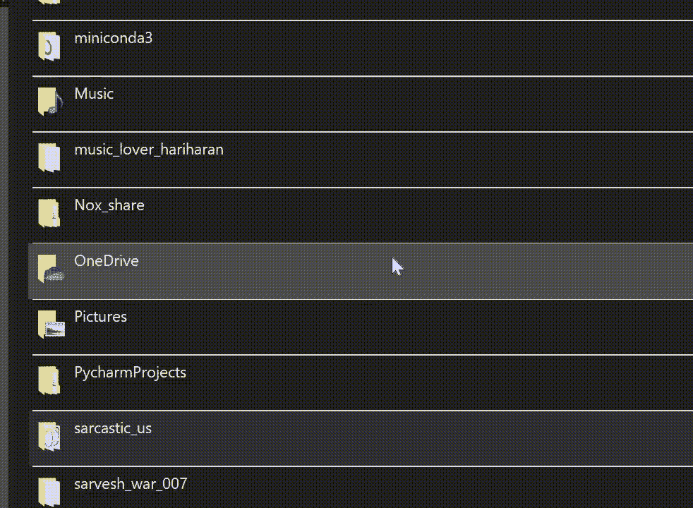

# 使用 Python 在几秒钟内下载 Instagram 展示图片

> 原文：<https://medium.com/codex/download-an-instagram-display-picture-within-seconds-using-python-d75d25bcb1?source=collection_archive---------4----------------------->


[来自像素](https://www.pexels.com/photo/close-up-of-smart-phone-248533/)

如果你试图从 Instagram 下载一张展示图片，你可以尝试使用一些网站来下载，但最终会有很多错误，一些网站会要求你等待 3 到 10 分钟，一些网站不会工作😕。所以，在这种情况下我来帮你。

嘿，大家好。欢迎回到我的另一个博客。今天，我要告诉你如何使用 Python 下载一个 Instagram DP。请确保合乎道德地使用你在这里学到的东西。因此，没有任何进一步的麻烦，让我们开始吧。

# 关于包裹

我们知道 Python 是一种很酷的编程语言，有很多包，这里我们要用其中的一个: ***INSTALOADER。***

*Instaloader* 模块是一个 Python 包，具有良好定义的功能来废弃 Instagram，其功能可以用作命令行实用程序。*安装程序*不仅可以用于下载 Instagram 展示图片，还可以下载其他信息，例如:

*   帐户的过帐
*   故事
*   IGTV
*   帖子评论
*   个人资料信息
*   故事集锦

# 该过程

首先，我们需要下载软件包，为此，请根据您使用的操作系统在 Windows 或相应的终端中打开您的命令提示符，并键入代码

```
pip install instaloader
```

安装完成后，打开您喜欢的代码编辑器，使用代码导入包

```
import instaloader
```

要下载显示图片，首先我们必须为包创建一个实例

```
dp = instaloader.Instaloader() #I'm using a variable dp
```

为了下载 DP，我们将使用函数“download_profile”

```
dp.download_profile("sarcastic_us")
```

使用“download_profile”功能，我们可以下载许多东西，例如用户发布的所有帖子、他的个人简介以及许多东西。

# 输出:



在上面的 gif 中，你可以看到我已经下载了著名的 Instagram 页面讽刺我们的简介。你可以看到这个文件总共有 891MB，它包含了讽刺我们在他的 Insta 页面上发布的所有帖子，几乎不到 3 分钟就下载完了。

***注意*** *:只有特定的 Instagram 账号是公开的，才能使用该功能。*

进入我们关于下载个人资料图片的话题，我们必须使用另一个参数“profile_pic”

```
dp.download_profile("sarcastic_us", profile_pic = True)
```

使用上面的代码，您下载了全部的个人资料和个人资料图片，但是，使用这个参数，您不能将它用于私有的 Instagram 个人资料。

要下载私人账户的资料图片，我们必须使用另一个参数

```
dp.download_profile("sarcastic_us", profile_pic_only = True)
```

当参数“profile_pic_only”设置为 True 时，它将只下载帐户的个人资料图片，无论是私人的还是公共的，都没有关系。

最后，我们得到了我们想要的输出，这是我们需要的图片。jpg”文件。


# 结论

有了这个，我们可以下载 Instagram 展示图片。

大家继续关注。要想在你的邮箱里看到我的故事，请订阅我的时事通讯。感谢您的阅读！不要忘记留下你的掌声，分享你的回答，并与朋友分享。