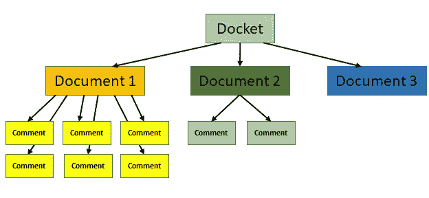
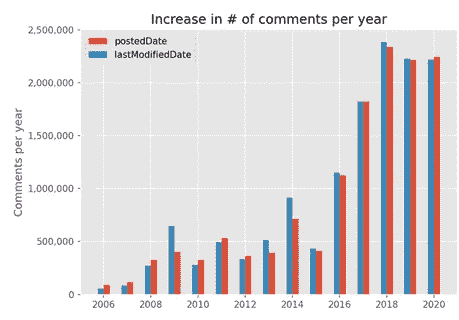

# 使用简单易用的 Python 包装器为 Regulations.gov API 下载公众意见

> 原文：<https://medium.com/codex/downloading-public-comments-with-a-simple-to-use-python-wrapper-for-the-regulations-gov-api-7affe8a4dadc?source=collection_archive---------13----------------------->

Python 包装器:[https://github.com/willjobs/regulations-public-comments](https://github.com/willjobs/regulations-public-comments)

**TL；博士**:我为 Regulations.gov API 的 v4 创建了一个 Python 包装器，极大地简化了从 Regulations.gov 下载公众意见的过程。您可以在命令行使用它(不使用任何 Python)来下载给定摘要或摘要上的所有公共评论，或者使用一点 Python 来进行定制查询(例如，下载过去一个月中关于任何 EPA 法规的所有评论)。这可能是第一个简化 Regulations.gov API 第 4 版使用的公开包装器。

在美国，当联邦机构提出新的法规时，他们需要经过正式的审查过程。通常，这包括规则制定提案通知(NPRM)、公众意见征询期、公众意见回复和最终规则(见[本](https://www.regulations.gov/about)、[本](https://www.regulations.gov/learn)和[本](https://crsreports.congress.gov/product/pdf/RL/RL32240))。公众意见允许个人和组织提供额外的背景、支持信息和对提议的法规的意见(或删除)，尽管它们不被视为对法规的“投票”。

数据的结构如下:与给定的提案法规相关的所有材料都包含在一个**摘要**中。每个摘要可能包含一个或多个各种类型的**文档**(通知、提议的规则、规则、支持&相关材料及其他)，公众可以对任何文档发表评论。注释与文档相关，而不是与摘要相关。



2003 年，公众意见流程第一次以电子方式提供，这导致参与度大幅上升。



web 界面允许用户使用搜索词搜索摘要、文档和评论，并根据机构、文档类型、发布日期和评论到期日期等进行过滤。对摘要的搜索也可以通过各种其他标准来过滤。

[2012 年](https://sunlightfoundation.com/2012/02/23/regs-dot-gov-gets-an-api/)创建了一个公共 API 的 1.0 版本，允许用户以编程方式从 Regulations.gov 下载评论(参见 [v1 文档](https://web.archive.org/web/20120921002013/https://www.regulations.gov/docs/Regulations_Gov_API_User_Guide.pdf))。从那以后有了几次更新，API 的 v4 于 2020 年 9 月发布[。这个 API 的最新版本还增加了用户上传评论的功能。](https://regulatorystudies.columbian.gwu.edu/new-regulationsgov-api)

API 是非常[有据可查的](https://open.gsa.gov/api/regulationsgov/)，有例子和明确的参数和响应规范。尽管如此，还是有一些问题。例如，`postedDate`过滤使用`yyyy-mm-dd`格式，而`lastModifiedDate`过滤使用`yyyy-mm-dd hh24:mi:ss`格式。此外，`lastModifiedDate`过滤器使用东部时区，但是响应中返回的值使用 UTC，如果您不知道并试图对多个请求分页，这可能会造成不匹配。另一个例子:当您试图过滤特定文档的评论时，您必须使用文档的`objectId`(API 返回的内部标识符)，而不是它的`documentId`。

分页机制也很棘手:每个“页面”(一个请求)最多允许 250 个“项目”(注释、文档或摘要)，一个查询最多可以访问其中的 20 个页面，每个查询总共有 5000 个项目。然而，如果您正在查询(例如)过去两年中所有关于 EPA 相关法规的评论，该怎么办呢？API 会将您限制在 5，000 个条目以内，即使评论的数量肯定会比这多(在本例中，[超过 80，000 个](https://www.regulations.gov/search/comment?agencyIds=EPA&postedDateFrom=2019-07-01&postedDateTo=2021-07-01))。如文档示例中所述，处理这种情况的方法是:

1.  像往常一样构造查询，按`lastModifiedDate`排序。
2.  在第一页之后，每个后续请求应该将`page[num]`设置为等于当前页码。
3.  在最后一页(第 20 页)，记录最后一项的`lastModifiedDate`。
4.  重复步骤 1-3，现在添加一个过滤器，使`lastModifiedDate`大于或等于步骤 3 中记录的`lastModifiedDate`。您必须将日期和时间设置为大于*或等于*，因为可能会有评论在同一时间发布(例如，如果它们被批量上传或被系统人员修改)。然而，这确保了您将获得重复，所以您必须自己处理它们。

最后，一个 API 键(可以在 [API 文档页面](https://open.gsa.gov/api/regulationsgov/)上请求)被限制为每小时不超过 1000 个请求。Python 包装器通过检测请求错误并每 20 分钟自动轮询一次来处理这种限制，直到 API 键的限制被重置(有时请求会在 60 分钟之前重置)，此时请求会继续。

每小时 1000 个请求可能听起来很多，但事实证明，为了获得给定评论的文本，您必须单独访问它。上面关于一次获取 250 个项目的描述只能让您获得每个项目的一些“标题”信息，而您最感兴趣的可能是“细节”信息。为了更好地理解这一点，在 API 文档的最底部有一个 Schemas 部分，它列出了给定项返回的所有数据属性。“Comment”项是我上面描述的分页过程返回的内容，它只包括`agencyId`、`documentType`、`highlightedContent`、`lastModifiedDate`、`objectId`、`postedDate`、`title`和`withdrawn`。注释的实际文本存在于模式的“CommentDetail”项中，在`comment`属性中，由`commentId`一次访问一个。

在我攻读硕士学位期间，我的工作是作为 NLP 课程的一个项目开始的，随着我的代码库的形成，我意识到我从使用 API 中学到的经验可能对其他人有用。在我开始这个项目之前，我花了大量的时间搜索 GitHub 和 Google，看看我是否可以基于其他人的工作进行构建，但是似乎没有 API v4 的现有包装器。我发现阳光实验室([一个现已解散的组织](https://sunlightfoundation.com/2020/09/24/a-note-from-the-sunlight-foundations-board-chair/))的回购，然而他们的代码最后一次更新是在 2015 年，不再工作。我发现的另一个 repo 最后一次更新是在 2020 年 1 月(这意味着它针对 v3 API)，将自己描述为“准系统工具”，并需要手动编辑 Python 文件才能下载给定 docket ID 的注释。因此，由于没有预先存在的针对 v4 API 的代码库，我构建了自己的代码库。

# 命令行快速入门

开始使用这段代码最简单的方法是使用命令行。要么克隆整个回购，要么[下载 comments_downloader.py](https://raw.githubusercontent.com/willjobs/regulations-public-comments/master/comments_downloader.py) 。它用的是 Python 3；你还需要`pandas`库(如果你还没有，运行`pip install pandas`，或者`conda install pandas`，如果你已经安装了 Anaconda 或者 miniconda)。命令行方式允许您下载给定文档(由`documentId`指定)或 docket(跨所有文档，由`docketId`指定)的所有注释。除了 ID 之外，您还需要指定您的 API 密钥，您可以在[Regulations.gov 文档页面](https://open.gsa.gov/api/regulationsgov/#getting-started)上注册。注意:本文档中所有的`DEMO_KEY`实例都应该替换为您的 API 密钥。这些评论将被下载到当前目录下的一个以格式`YOUR-ID-HERE.csv`命名的 CSV 文件中。例如:

```
# download all comments for docket FDA-2021-N-0270 (across all its documents)
python comments_downloader.py --key DEMO_KEY --docket FDA-2021-N-0270

Downloading comments for docket ID FDA-2021-N-0270...
2021-07-18 16:26:30: Getting documents associated with docket FDA-2021-N-0270...

Found 1 documents...
2021-07-18 16:26:31: Writing 1 records to document_headers_162630.csv...Done
2021-07-18 16:26:31: Removing any duplicates in the CSV...
2021-07-18 16:26:31: Done. Removed 0 duplicate rows from document_headers_162630.csv.
2021-07-18 16:26:31: Finished: approximately 1 documents collected

Done----------------

******************************
2021-07-18 16:26:31: Getting comments for document FDA-2021-N-0270-0001...

2021-07-18 16:26:31: Getting objectId for document FDA-2021-N-0270-0001...Got it (0900006484a930da)
2021-07-18 16:26:31: Getting comment headers associated with document FDA-2021-N-0270-0001...

Found 188 comments...
2021-07-18 16:26:31: Writing 188 records to comment_headers_162631.csv...Done
2021-07-18 16:26:31: Removing any duplicates in the CSV...
2021-07-18 16:26:32: Done. Removed 0 duplicate rows from comment_headers_162631.csv.
2021-07-18 16:26:32: Finished: approximately 188 comments collected

Done getting comment IDs----------------

2021-07-18 16:26:32: Getting comments associated with document FDA-2021-N-0270-0001...

2021-07-18 16:26:32: Gathering details for 188 comments...
2021-07-18 16:27:03: Writing 188 records to FDA-2021-N-0270.csv...Done
2021-07-18 16:27:03: Finished: 188 comments collected

Done getting all 188 comments for document FDA-2021-N-0270-0001----------------

DONE retrieving all 188 comments from 1 document(s) for docket FDA-2021-N-0270----------------
```

类似地，要下载一个*文档*的所有注释，您可以在命令行指定`--document`和文档 ID(即您在 URL 中看到的那个):

```
# download all comments for document FDA-2009-N-0501-0012
python comments_downloader.py --key DEMO_KEY --document FDA-2009-N-0501-0012

Downloading comments for document ID FDA-2009-N-0501-0012...
2021-07-20 20:11:09: Getting objectId for document FDA-2009-N-0501-0012...Got it (09000064847f0822)
2021-07-20 20:11:09: Getting comment headers associated with document FDA-2009-N-0501-0012...

Found 10 comments...
2021-07-20 20:11:10: Writing 10 records to comment_headers_201109.csv...Done
2021-07-20 20:11:10: Removing any duplicates in the CSV...
2021-07-20 20:11:10: Done. Removed 0 duplicate rows from comment_headers_201109.csv.
2021-07-20 20:11:10: Finished: approximately 10 comments collected

Done getting comment IDs----------------

2021-07-20 20:11:10: Getting comments associated with document FDA-2009-N-0501-0012...

2021-07-20 20:11:10: Gathering details for 10 comments...
2021-07-20 20:11:12: Writing 10 records to FDA-2009-N-0501-0012.csv...Done
2021-07-20 20:11:12: Finished: 10 comments collected

Done getting all 10 comments for document FDA-2009-N-0501-0012----------------

Done getting all 10 comments for document FDA-2009-N-0501-0012----------------
```

一个重要的注意事项:这个代码不下载附件(pdf，Word 文档等。).但是，我将列`attachmentLinks`添加到输出中，它包含给定评论的任何附件的 URL 的管道分隔(|)列表。鉴于[给定文档上几乎 30%的评论](https://github.com/willjobs/public-comments-project/tree/main/blogposts/post5#pipeline)是“附加的”评论，其中评论主体中的文本类似于“参见附加的评论”，这是一个相当大的信息量，因此对于一些项目来说，使用本专栏中的 URL 可能是必要的。

值得注意的是，以上两个例子都返回了少量的评论。如果您查询的摘要或文档有超过 1，000 条评论，您将达到 API 键的速率限制，并且将不得不等待一个小时来重置速率限制。代码将自动为您处理这些，等待并每 20 分钟检查一次，看看您是否又收到了 1，000 个请求。有可能[联系服务台](https://www.regulations.gov/support)每小时获得多达 2000 个请求，每个用户最多两个密钥。

对于 90%的用例来说，命令行可能就是所有需要的，因为人们通常只对特定清单上的注释感兴趣。然而，对于定制的查询，例如一次下载许多摘要的评论，或者在 SQLite 数据库中检索结果。db)代替 CSV，可以用 Python。

# 使用 Python 进行自定义查询

存储库中的 Jupyter notebook[examples . ipynb](https://github.com/willjobs/regulations-public-comments/blob/master/Examples.ipynb)演示了如何使用 comments _ downloader.py 这是获取更多示例的好地方。注意使用这段代码需要`pandas`库。

使用代码的第一步是导入它并创建一个`CommentsDownloader`类的新实例(用在[https://open.gsa.gov/api/regulationsgov/#getting-started](https://open.gsa.gov/api/regulationsgov/#getting-started)获得的 API 键替换`DEMO_KEY`:

# 示例 1:

在第一个例子中，我们可以将我们的注释下载到 SQLite 数据库*和*CSV 中，为每个数据库指定我们自己的文件名(或者，您也可以只导出到 SQLite 或 CSV):

结果与您在命令行中得到的结果相同。在 CSV 上使用 SQLite 数据库有几个好处:可以在其上运行 SQL(包括连接等。)，您可以添加约束，并且可以保证注释字符串中的字符不会影响 CSV 导入。(代码尽最大努力避免 CSV 的这个问题:引号字符用双引号括起来，换行符用空格替换，这样 CSV 中的每一行都是一个“记录”)。另一个很大的好处是你可以把来自摘要、文档和评论的数据都存储在一个地方。例如，当下载给定摘要上的所有评论时，关于文档的标题信息将存储在`documents_header`表中，评论标题将在`comments_header`表中，关于每个评论的细节(包括评论的文本)将在`comments_detail`表中。这与命令行输出相反，命令行输出只会将`comments_detail`表的等价物输出到 CSV。完整的数据库模式在这里是。

# 示例 2

要下载与多个摘要(或文档)相关联的所有注释，下面的搭建工作得很好(注意，如果我们指定了一个 CSV 文件名，则所有摘要的注释将包含在一个 CSV 文件中):

# 旁白

值得注意的是，上面三行非`print`代码中抽象出了多少东西。通常没有办法直接从`docketId`转到注释，因为 API 中可用的过滤器只允许按文档过滤注释。因此，首先使用`docketId`查询每个 docket 的文档，使用`documents`端点(而不是上面使用`gather_headers`时的`dockets`):

然后，您可以使用下载到`EPA_water_documents.csv`中的文档头来查询它们的相关注释，但是您首先需要从该文件中获取每个文档的`objectId`。这是因为 API 通过文档的`objectId`而不是`documentId`过滤评论(我猜是因为后端的数据问题，实际上有多个文档具有相同的`documentId`；我见过一些罕见的`documentId`的怪异行为。然后，您可以使用这些`objectId`来获取评论，与上面类似:

最后，有了这些注释头，您可以使用`EPA_water_comments_header.csv`中的每个`commentId`通过访问“Details”端点来收集每个注释的完整数据:

注意，如果您使用的是 SQLite，而不是四处浮动的四个单独的 CSV 文件，那么您将拥有一个将所有这些数据存储在同一位置的数据库。

# 示例 3

最后，一个(稍微)更复杂的自定义查询示例:假设我们想要下载所有与包含术语“水”的 EPA 摘要相关的评论，这些评论是在 2017 年 1 月 1 日到 2020 年 12 月 31 日之间发布的。我们的第一步是在 2017 年 1 月 1 日和 2020 年 12 月 31 日之间获得带有“水”的`searchTerm`和`lastModifiedDate`的摘要标题:

以上结果将 353 条记录(dockets)下载到文件 [EPA_water_dockets.csv](https://willjobs.com/blog/assets/EPA_water_dockets.csv) 。现在你要做的就是:

更多关于 Regulations.gov 及其 API 的信息，你可以访问[官方文档](https://open.gsa.gov/api/regulationsgov/)，或者查看我在硕士期间为一个项目写的[博客帖子](https://github.com/willjobs/public-comments-project/tree/main/blogposts)。特别是，[的帖子 1](https://github.com/willjobs/public-comments-project/tree/main/blogposts/post1) 有一个关于[web 界面](https://github.com/willjobs/public-comments-project/tree/main/blogposts/post1#web)和评论示例的部分，而[的帖子 2](https://github.com/willjobs/public-comments-project/tree/main/blogposts/post2) 比这篇帖子更详细地介绍了 API 和一些观察结果。此外，你可以查看这个代码的文档。

*原载于 2021 年 7 月 22 日 https://willjobs.com*[](https://willjobs.com/blog/downloading-public-comments)**。**