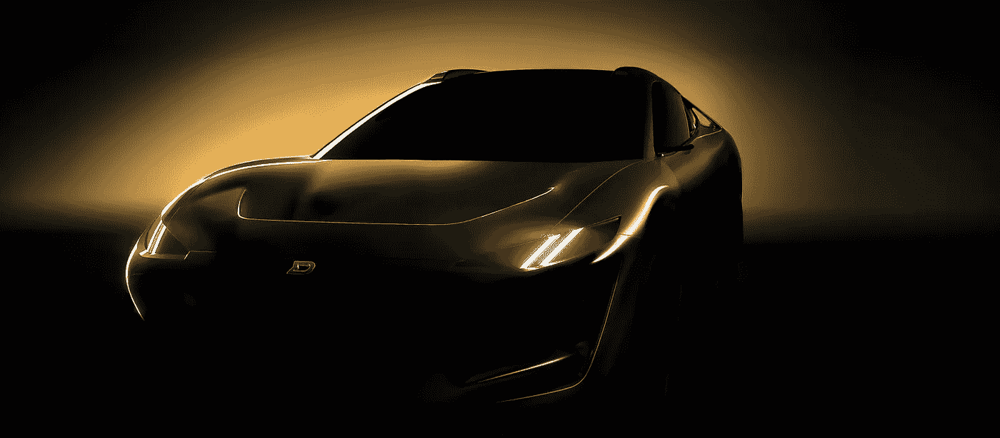

# 龙:超级跑车的真正定义！

> 原文：<https://medium.com/codex/dragon-the-true-definition-of-a-hypercar-7eacb68d07a0?source=collection_archive---------20----------------------->

## 德拉科汽车公司正在寻求扩大运输的定义！

[龙的影子揭示(德拉科媒体)](https://assets.website-files.com/5d42433702c7536df3627046/62bca2ac9fbb9460e046494e_Drako_Side4.jpg)

德拉科汽车公司最近推出了“龙”，它将电动**超级汽车**带到了一个新的高度。想象一辆电动运动型多用途车，每个车轮上都装有马达，具有巨大的扭矩和动力。这款四驱概念车能够…